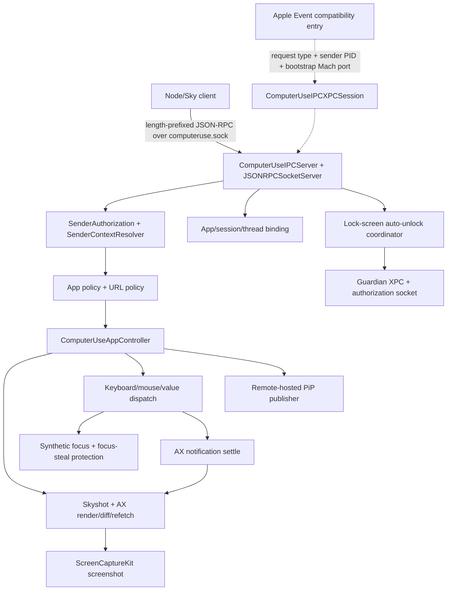

# 原生 SkyComputerUseService 内部结构

## 范围与证据等级

本章针对本机签名的 `SkyComputerUseService` `26.710.1000387` 做 Swift/Mach-O
静态分析。分析只使用 `nm`、`otool`、`strings`、`codesign`、`dwarfdump`
和 Swift demangle；不修改二进制、不绕过签名，也不采集用户应用内容。

| 等级 | 含义 |
|---|---|
| `D1` | 方法或函数级 Swift 符号直接存在 |
| `D2` | 类型、字段、属性、协议或元数据符号直接存在 |
| `D3` | 导入、链接依赖、Info.plist、签名或常量字符串直接存在 |
| `I1` | 由多个 `D1-D3` 证据组合得到的静态调用关系推断 |

静态符号能证明代码被编入当前二进制，但不能单独证明某分支在一次实际请求中执行。

## 总体调用地图



图中的节点由直接符号支持；节点之间的箭头是 `I1`，表示接口、字段和方法签名
组合出的最窄静态解释，不等价于反编译后的逐指令调用图。

## 模块/类/方法索引

| 模块 | 关键类/方法 | 静态上下游 | 等级 |
|---|---|---|---|
| IPC server | `ComputerUseIPCServer.init(jsonRPCSocketURL:)`, `start`, `handleEvent`, `stop` | native pipe JSON-RPC -> auth/policy -> executable request | `D1-D3 + I1` |
| XPC/Apple Event bridge | `ComputerUseIPCXPCSession.listener`, `sendRequestWithTypeName`; `handleEvent` | Apple Event bootstrap -> temporary XPC session -> server | `D1-D3 + I1` |
| sender auth | `ComputerUseIPCSenderAuthorization`, `ComputerUseIPCSenderContextResolver` | audit token/process identity -> authenticated sender context | `D2-D3 + I1` |
| app policy | `CodexAppServerComputerUsePolicyProvider`, `cachedPolicy` | app descriptor -> allow/deny decision | `D2-D3 + I1` |
| AppController | `prepareToInteract`, `updateSkyshot`, action methods | policy-approved target -> AX/input/screenshot lifecycle | `D1-D2 + I1` |
| AX render/diff/refetch | `SkyshotOperation.captureAXTree`, `UIElementRenderDifference`, `refetchTree` | focused context + previous revision -> current/diff tree | `D1-D2 + I1` |
| screenshot | `captureScreenshot`, `writeScreenshotToFile` | ScreenCaptureKit image -> optional Skyshot attachment | `D1-D3 + I1` |
| input dispatch | `click`, `sendClick`, `performKeyboardAction`, `setValue`, `selectText`, `scroll` | valid target/coordinate -> AX or synthetic input | `D1` |
| focus protection | `SyntheticAppFocusEnforcer`, `SystemFocusStealPreventer` | activation/event taps -> protected target focus | `D1-D2 + I1` |
| settle | `waitForUIToSettle`, `updateSkyshotSettlingIfNeeded` | action -> AX notifications/debounce -> next tree cache | `D1-D2 + I1` |
| URL policy | `ComputerUseURLBlocklistCache`, `EventStreamURLPolicyRecordFilter` | current window URL -> continue or stop | `D2-D3 + I1` |
| session binding | `CodexComputerUseSessionTracker`, `onCodexTurnEnded` | conversation/app target + thread/turn -> lifecycle cleanup | `D1-D2 + I1` |
| PiP | `RemoteHostedPIPContentPublisher.publishWindowStream` | window/AX geometry -> separate XPC presentation stream | `D1-D3 + I1` |
| lock screen | `prepareForRequest`, `withUnlockGuard`, authorization socket | thread-bound request -> guarded unlock/relock | `D1-D3 + I1` |

## 1. IPC Server 与传输边界

`ComputerUseIPCServer.init(jsonRPCSocketURL:)`、`start(...)` 和 `stop()` 是服务端
生命周期入口。`start` 同时接收权限检查、认证后准备、app-used、turn-ended 和
无客户端终止回调；服务对象还持有 `xpcSessions: [UUID:
ComputerUseIPCXPCSession]` 与按 PID 监控退出的 `clientExitSources`。`D1-D2`

主路径判断：已单独复现的 shipped Node client 使用 `computeruse.sock` 上的四字节
长度前缀 JSON-RPC；本二进制中的 `ComputerUseIPCServer(jsonRPCSocketURL:)`、
`jsonRPCSocketServer` 字段和 `CodexComputerUseIPC-2` 与之对应。因此当前 Node
主路径是 native pipe -> JSON-RPC socket server -> request dispatch，不要求先建立
`ComputerUseIPCXPCSession`。前半段是相邻协议 fixture 的动态/源码证据，本章补足
服务端静态锚点。`D1-D3 + I1`

备用路径判断：`ComputerUseIPCServer.handleEvent:withReplyEvent:`、
`ComputerUseIPCXPCSession.listener:shouldAcceptNewConnection:` 与
`sendRequestWithTypeName:requestData:codexMetadataData:withReply:` 都有方法级符号。
再结合“从 Apple event 获取 XPC bootstrap Mach port、request type、sender PID”
的错误字符串，最窄解释是 Apple Event 负责 bootstrap/identity，随后通过临时 XPC
session 传请求。这条路径被编入当前构建，但不是 shipped Node native-pipe 客户端的
主入口。`D1-D3 + I1`

## 2. Sender Authentication

`ComputerUseIPCServer` 直接持有 `ComputerUseIPCSenderAuthorization` 与
`ComputerUseIPCSenderContextResolver`。sender context 区分 `parentIdentity` 和
`responsibleIdentity`，并携带 client type、MCP runtime 与
`allowsLockScreenAutoUnlock`。`D2`

导入的 `audit_token_to_pid`、`SecTaskCreateWithAuditToken`、
`SecCodeCopyGuestWithAttributes`、`SecCodeCopySigningInformation`，加上
responsible team/signing/bundle/executable 四个诊断键，支持如下认证链：
audit token -> PID -> responsible/parent process identity -> Team ID、signing ID、
bundle ID 校验。具体 allow rule 的布尔表达式无法仅由这些静态符号恢复。`D3 + I1`

## 3. App Policy 与 URL Blocklist

`CodexAppServerComputerUsePolicyProvider`、`cachedPolicy`、`allowed_bundle_ids` 和
`denied_bundle_ids` 表明 app policy 由上游策略提供者缓存后供请求路径查询。`D2-D3`

URL 层有 `ComputerUseURLBlocklistCache`、`EventStreamURLPolicyRecordFilter`、
`isURLBlocked`、每窗口 latest URL 状态，以及明确的终止文案
“Computer Use stopped due to encountering a disallowed URL”。因此 URL policy
不是仅用于日志过滤；它具备终止 Computer Use 的 fail-closed 行为。`D1-D3`

app allow/deny 与 URL blocklist 是两个独立门：前者约束目标应用，后者约束应用内
当前 URL。它们都位于实际输入分派之前，是最符合现有接口的静态主路径解释。`I1`

## 4. AppController、AX 与 Screenshot

`ComputerUseAppController` 绑定 application target、bundle ID、PID、
`ApplicationUIElement`、running application、窗口表、当前 AX tree 和 focus
enforcer。核心观察入口是：

- `updateSkyshot(treeCache:disableAXDiffing:skipScreenshot:)`
- `updateSkyshotSettlingIfNeeded(disableAXDiffing:)`
- `SkyshotOperation.capture(...)`
- `captureAXTree(...)`
- `captureScreenshot(imageSize:)`

`SkyshotOperation` 把 AX tree、可选 screenshot、URL 和 focused element context
组装成 capture；截图由 `ScreenCaptureKit`、`SCScreenshotManager` 与
`writeScreenshotToFile` 支撑。`D1-D3`

AX 增量链由 `UIElementRenderDifference`、`UIElementTreeRevision`、
`isAXTreeDiffingEnabled` 和 `continuingFrom` 参数支撑。若元素失效，
`RefetchableSkyshotAXTree.refetchElementIfNeeded` 会借助 invalidation monitor
和旧 tree 重新查找等价元素；候选不唯一时明确失败，而不是任取一个。`D1-D3`

因此当前观察主路径可概括为：focused context -> AX extraction -> 与上一 revision
做 diff -> 按需要截图 -> 生成 attachment。全量 AX 是 diff 超预算、无基线或显式
禁用 diff 时的备用输出。`I1`

## 5. Input Dispatch、Focus Protection 与 Settle

输入接口直接暴露 click、coordinate click/drag、mouse move、mouse down/up、
scroll、keyboard action、set value、select text 和 secondary AX action。`D1`

元素输入先经 `prepareToInteract` / `refetchElementIfNeeded` 恢复有效 AX target，
再由 `ApplicationUIElement.sendClick`、AX value/action 或键盘事件执行。对 WebView
或非前台 app，`syntheticallyActivateIfNeededForSendingClick` 与
`SyntheticAppFocusEnforcer` 维持目标 app 的 active/focus 认知。`D1 + I1`

`SystemFocusStealPreventer` 持有 keyboard/event taps 和 disallowed thief process，
并提供菜单 dismissal suppression。这是一条显式的焦点保护路径，不只是“点击前
activate app”。`D1-D2`

动作后的稳定等待由 `ApplicationUIElement.waitForUIToSettle` 承担，可选择纳入
scroll events；AppController 的 `needsUISettleBeforeSkyshot` 和
`updateSkyshotSettlingIfNeeded` 将 settle 后 tree cache 交回下一次 Skyshot。
`D1-D2 + I1`

## 6. Session Binding

`CodexComputerUseSessionTracker`、IPC session UUID、AppController 的 `chatID`，
以及 PiP/lock-screen API 的 `threadID`、`turnID` 共同表明服务同时维护 transport
session、应用控制 session 和 Codex thread/turn 三层身份。`D1-D2`

`onCodexTurnEnded` 回调进入 IPC server，lock-screen coordinator 用相同 thread ID
回收 lease，PiP stream 以 thread ID + turn ID 发布。由此可以确认 thread/turn
不是只用于遥测，而是生命周期绑定键。`D1 + I1`

静态证据不足以证明 `codex.app_session_id` 与每一种请求字段的精确映射；fixture
只保存字段名，不保存真实 session 值。`D3`

## 7. Remote-hosted PiP

PiP 路径包含 content publisher、stream、producer、renderer、window lookup、
content fence 和 window geometry observer。publisher 是 `NSXPCListenerDelegate`，
维护 `streamsByPresentationID`，并通过
`publishWindowStream(threadID:turnID:windowID:)` 或 checkerboard fallback 发布。
`D1-D2`

stream 保存 focus restore target，window renderer 监听 AX window created/resized/
destroyed/focus changed，并在 source resize settled 后更新。PiP 自身使用独立 XPC
连接；这不应与主 Computer Use 请求 transport 混为同一条连接。`D1-D3 + I1`

## 8. Lock Screen

锁屏链由 `LockScreenAutoUnlockCoordinator` 统一编排 controller、monitor、
overlay presenter、physical input monitor 和可选 guardian。请求进入时以 thread ID
准备 unlock，turn ended 时回收状态，并限制每个 locked episode 的尝试次数。`D1-D2`

`SystemLockScreenController` 通过 loginwindow AX tree 定位密码字段，Authorization
plug-in 经固定 Unix socket
`/tmp/com.openai.sky.CUAService/LockScreenLoginAuthorization.sock` 消费一次授权
attempt。guardian 则是独立 app，通过 Mach bootstrap rendezvous 交付 XPC endpoint。
`D1-D3`

检测到物理输入时，guardian 会 fail closed：立即 relock、保持 overlay 到 settle
完成，并抑制自动解锁直到用户手动解锁。这一结论有完整错误/状态字符串直接支持，
不是仅由类型名推断。`D3`

## 可重复生成

```bash
bash scripts/native-symbol-map.sh
```

生成：

- `fixtures/native/metadata.tsv`
- `fixtures/native/symbols.tsv`
- `fixtures/native/transport-evidence.tsv`
- `fixtures/native/symbol-map.md`

脚本逐项断言 20 个关键方法/类型锚点与 transport 证据。版本漂移或符号被裁剪时会非零退出，
避免把旧 fixture 静默当成新构建结论。
