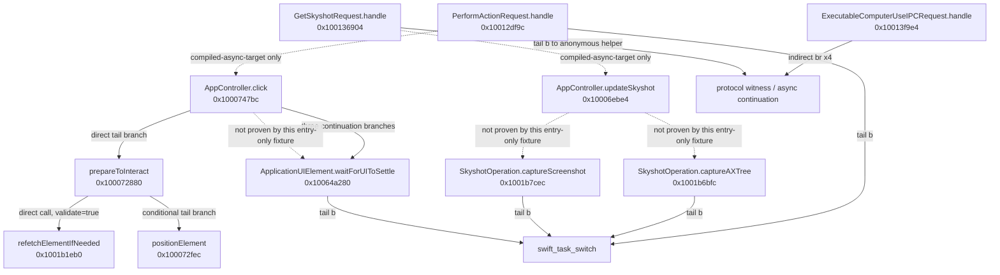

# SkyComputerUseService 函数级静态调用图

## 范围

本章分析本机 `SkyComputerUseService` `26.710.1000387` 的关键 Swift async
入口和 bounded continuation：

1. `ExecutableComputerUseIPCRequest.handle`
2. `ComputerUseIPCAppPerformActionRequest.handle`
3. `ComputerUseIPCAppGetSkyshotRequest.handle`
4. `SkyshotOperation.captureAXTree`
5. `SkyshotOperation.captureScreenshot`
6. `ApplicationUIElement.waitForUIToSettle`

后续 bounded disassembly 已继续覆盖 `updateSkyshotSettlingIfNeeded`、
`prepareToInteract`、`positionElement`、element click、scroll dispatch 和相关
continuation。没有直接 branch 证据的关系仍不提升为调用边。

脚本不启动服务、不 attach 进程，也不反汇编完整 `__text`。每个 fixture 的结束
地址都是 `LC_FUNCTION_STARTS` 中紧邻的下一个函数起点。

## 固定二进制

| 项目 | 值 |
|---|---|
| Bundle | `com.openai.sky.CUAService` |
| Version | `26.710.1000387` |
| Architecture | `arm64` |
| UUID | `9E40FA2F-FC6C-3EE2-824A-E4975CA022AD` |
| SHA-256 | `27b547d17a11f6f697ee62bfc20e5da6fab3f39848d40191c132b09ae8f68f58` |

## 证据口径

| 标签 | 含义 |
|---|---|
| `direct-bl` | 当前 entry range 内存在 ARM64 `bl <固定地址>` |
| `direct-tail-b` | 当前 entry range 末端存在 `b <固定地址>` |
| `indirect-branch` | `br/blr` 经寄存器分发，静态入口无法唯一命名 target |
| `compiled-async-target` | 方法符号和 `...FTu` async function pointer 都存在，但本批 entry range 没有到它的直接 branch |

`compiled-async-target` 不是调用边。它只说明该 target 被编入相同二进制，并且
Swift 为它生成了 async function pointer。

## 入口边界

| ID | Entry | End | 大小 | 入口作用 |
|---|---:|---:|---:|---|
| `ipc_request_dispatch` | `0x10013f9e4` | `0x10013fab0` | 204 B | 通用 `ExecutableComputerUseIPCRequest.handle` |
| `perform_action_request` | `0x10012df9c` | `0x10012dff8` | 92 B | action request async 入口 |
| `get_skyshot_request` | `0x100136904` | `0x100136974` | 112 B | get skyshot request async 入口 |
| `skyshot_capture_ax_tree` | `0x1001b6bfc` | `0x1001b6c1c` | 32 B | AX tree capture async 入口 |
| `skyshot_capture_screenshot` | `0x1001b7cec` | `0x1001b7d0c` | 32 B | screenshot capture async 入口 |
| `wait_for_ui_to_settle` | `0x10064a280` | `0x10064a35c` | 220 B | UI settle async 入口 |

这些大小是公开/命名 async entry 的机器码大小，不是完整逻辑体大小。

## 精简调用图



## 六个入口的直接 target

### 1. IPC request dispatch

`ExecutableComputerUseIPCRequest.handle` 的 entry：

- `bl 0x10000ea98`：匿名 helper；
- `bl _swift_task_alloc`：分配 async task frame；
- `br x4`：通过寄存器执行间接分发。

最后一条是协议/continuation 风格的间接分发。静态 entry 无法把 `x4` 唯一归因
到某一个 request 的 `handle(senderContext:)`，因此图中不画
`IPC -> PerformAction` 或 `IPC -> GetSkyshot` 的 direct edge。

### 2. PerformAction request

`ComputerUseIPCAppPerformActionRequest.handle` 的 entry：

- 直接取得 `SystemSoftware.ApplicationTarget` metadata；
- 调用 `_swift_task_alloc`；
- tail branch 到 `_swift_task_switch`，首个 continuation 位于
  `0x10012dff8`。

`ComputerUseAppController.click(elementID:...)` 的 entry
`0x1000747bc` 和 async pointer `0x100d18090` 均存在。由于 action switch 和
实际 click 调用位于匿名 continuation，而不在 92 B entry 内，本批只将其列为
`compiled-async-target`。

### 3. GetSkyshot request

`ComputerUseIPCAppGetSkyshotRequest.handle` 的 entry：

- 调用 `_swift_task_alloc`；
- tail branch 到匿名 helper `0x10012c14c`；
- 首个本地 continuation 位于 `0x100136974`。

`ComputerUseAppController.updateSkyshot(...)` 的 entry
`0x10006ebe4` 和 async pointer `0x100d18000` 均存在。但当前 112 B entry
没有到该方法的直接 branch，所以不能把 `GetSkyshot -> updateSkyshot` 提升为
`direct-bl`。

### 4. captureAXTree

`SkyshotOperation.captureAXTree` 的 32 B entry 保存参数后 tail branch 到
`_swift_task_switch`；首个 continuation 位于 `0x1001b6c1c`。entry 本身没有
可命名的业务级 `bl`。

### 5. captureScreenshot

`SkyshotOperation.captureScreenshot` 的 32 B entry同样保存参数后 tail branch
到 `_swift_task_switch`；首个 continuation 位于 `0x1001b7d0c`。ScreenCaptureKit
调用位于后续 continuation，不在本批 entry graph 内。

### 6. waitForUIToSettle

`ApplicationUIElement.waitForUIToSettle` 的 entry：

- 取得 `TransformedUIElement.TreeCache` metadata；
- 多次调用 `_swift_task_alloc` 建立 continuation frame；
- 调用两个未导出 local stub：`0x100cd127c`、`0x100cd1294`；
- tail branch 到 `_swift_task_switch`，首个 continuation 位于
  `0x10064a35c`。

两个 local stub 在 `otool -Iv` 中标为 `LOCAL ABSOLUTE`，本批不猜测其私有名称。

## Swift async 与 thunk 限制

Swift async 函数常把命名 entry、匿名 resume 函数、错误 continuation 和
`...FTu` function pointer 拆开：

```text
named entry
  -> allocate task frame
  -> swift_task_switch / anonymous helper
  -> unnamed continuation(s)
  -> indirect br/blr
```

因此：

- entry 大小不能当成完整函数大小；
- `...FTu` 存在不能证明 caller 使用了它；
- `br/blr` 不能在没有寄存器数据流证明时改写成命名 direct edge；
- continuation 中看到业务函数，不应回填为 entry 的 `direct-bl`；
- thunk、protocol witness、metadata accessor 与业务方法必须分开标注。

## Fixture

```text
fixtures/native-callgraph/
  metadata.tsv
  functions.tsv
  transfers.tsv
  related-async-targets.tsv
  runtime-targets.tsv
  lldb-entry-check.tsv
  lldb-entry-check.txt
  disassembly/
    ipc_request_dispatch.txt
    perform_action_request.txt
    get_skyshot_request.txt
    skyshot_capture_ax_tree.txt
    skyshot_capture_screenshot.txt
    wait_for_ui_to_settle.txt
```

`functions.tsv` 是地址和大小的主索引；`transfers.tsv` 只包含当前 bounded entry
内的 branch；`related-async-targets.tsv` 保存 click/updateSkyshot 的非直接关系；
LLDB fixture 只执行 `target create`、`image lookup` 和 batch `disassemble`。

## 重现

```bash
cd codex-computer-use-lab
bash scripts/native-callgraph.sh
node --test tests/native-callgraph.test.mjs
```

脚本使用：

- `nm` + `swift-demangle` 定位命名 Swift entry；
- `llvm-objdump --macho --function-starts=both` 获取下一函数边界；
- `llvm-objdump --start-address/--stop-address` 只反汇编 6 个 entry；
- `otool -Iv` 和 `dyld_info -imports` 解析 Swift runtime target；
- LLDB batch 交叉验证每个 entry 的首条指令。

本批没有覆盖 sender authorization、URL blocklist、Refetchable tree 或完整
continuation graph，也没有执行真实 Computer Use 请求。

## 扩展：`get_app_state` 的 settle-first 路径

`ComputerUseIPCAppGetSkyshotRequest.handle` 的后续 continuation 已确认：

```text
handle                         0x100136904
  -> updateSkyshotSettlingIfNeeded
  -> if needsUISettleBeforeSkyshot
       waitForUIToSettle(delay: 0.25s)
  -> updateSkyshot             0x10006ebe4
```

bounded branch 位置：

- `0x100137050 -> 0x100071748`：进入
  `updateSkyshotSettlingIfNeeded`；
- `0x10007185c -> 0x10064a280`：条件成立时等待 UI settle；
- `0x1000718cc` / `0x100071964 -> 0x10006ebe4`：完成或跳过
  settle 后进入 `updateSkyshot`。

该 helper 会读取并清零 controller 的 settle 标记，因此 action后的下一次状态
采集不是无条件 sleep，而是由上一动作留下的状态决定。

## 扩展：PerformAction 分支

`ComputerUseIPCAppPerformActionRequest.handle` 的 continuation 对 action union
分发到：

| Action | Controller entry |
|---|---:|
| element click | `0x1000747bc` |
| set value | `0x100078104` |
| select text | `0x10007b42c` |
| coordinate click | `0x10007f44c` |
| secondary action | `0x10007619c` |
| scroll | `0x1000807e8` |

对应 continuation branch 位于：

- click：`0x100130720`；
- set value：`0x10013006c`；
- select text：`0x1001303c0`；
- coordinate click：`0x10012f388`；
- secondary action：`0x100130a1c`；
- scroll：`0x10013167c`。

这张表只覆盖当前 bounded request continuation 中已恢复的分支。`type_text`、
`press_key`、drag 等 action 的完整 continuation 地址仍需独立固定。

## 扩展：element click、refetch 与 settle

element click 的已确认路径：

```text
click(elementID)               0x1000747bc
  -> prepareToInteract         0x100072880
       -> refetchElementIfNeeded(id, validate=true)
                                  0x1001b1eb0
       -> [position required] positionElement
                                  0x100072fec
  -> click implementation / indirect async helper
  -> waitForUIToSettle
  -> updateSkyshot
```

直接证据：

- `0x100074868`：click tail branch 到 `prepareToInteract`；
- `0x1000729b4`：`prepareToInteract` 调
  `refetchElementIfNeeded(id, validate=true)`；
- `0x100072acc`：条件分支进入 `positionElement`；
- `0x1000752bc`、`0x100075b6c`、`0x100075d24`：三个 click continuation
  分支进入 `waitForUIToSettle`；
- `0x10007570c`、`0x100075e3c`：返回路径进入 `updateSkyshot`。

`ApplicationUIElement.sendClick` 的命名入口是 `0x10063fca8`。click 到该入口之间
仍经过匿名 async helper和间接分发，不能写成 direct edge。

## 扩展：stale error family

原生 `UIElementError` 字符串和 metadata 明确区分：

```text
invalidElementID
elementAmbiguousBeforeRefetch
elementAmbiguousAfterRefetch
elementNoLongerValidAfterRefetch
```

日志字符串还确认：

- 旧树已有多个等价候选时，在 refetch 前拒绝；
- 新树产生多个候选时，在 refetch 后拒绝；
- 唯一匹配时继续并记录成功找到新元素；
- 无匹配时要求调用方重新获取屏幕状态。

生产行为 fixture进一步验证 unique-refetch：

```text
old index = 21
inserted decoy shifts replacement target to index 22
no get_app_state between mutation and old-index click
old index action succeeds
replacement target count = 1
decoy count = 0
```

当前完整证据见
`fixtures/real-cua/runner-final-semantic-matrix-v4.json`。旧 v2/v3 fixture
保留了较早 App binary 下的单次成功轨迹。

这些 stale/refetch errors 全部落通用 `-10005 unknownError`。只有
`UIElementError.axError` 被主映射 switch 特判为
`-10008 accessibilityError`。

主 switch：

```text
0x10015b01c
default 0x10015b4e8-0x10015b508 -> tag 5 -> -10005
```

## 扩展：Swift async record 与 frame

`...FTu` 是相对地址记录，不是绝对函数指针。记录地址加第一个有符号偏移可恢复
entry，第二字段对应 task-frame 大小：

| 函数 | Entry | Async record | Frame |
|---|---:|---:|---:|
| `updateSkyshot` | `0x10006ebe4` | `0x100d18000` | 3152 B |
| `prepareToInteract` | `0x100072880` | `0x100d18078` | 208 B |
| `positionElement` | `0x100072fec` | `0x100d18080` | 544 B |
| `click(elementID)` | `0x1000747bc` | `0x100d18090` | 688 B |
| `captureAXTree` | `0x1001b6bfc` | `0x100d21300` | 80 B |
| `sendClick` | `0x10063fca8` | `0x100d47f28` | 576 B |
| `waitForUIToSettle` | `0x10064a280` | `0x100d481d0` | 384 B |

`positionElement` 在 `0x1000738ac` 调 `swift_continuation_init`，并在
`0x100073b3c` tail branch 到 `swift_continuation_await`。这说明它内部还包含
Swift task continuation与 continuation bridge，而非单一同步 AX调用。

## Artifact 边界

- bundle 内没有 `Contents/Frameworks`，ComputerUse、AccessibilitySupport 等
  Swift模块直接编入主二进制；
- 本机没有与生产 UUID 匹配的 dSYM；
- record-and-replay 副本的 `__text` hash 与生产二进制相同，整文件差异从 code
  signature区域开始；
- `updateSkyshot -> captureAXTree/captureScreenshot` 仍经过匿名或间接 async
  continuation，当前不能提升为 direct edge；
- AXPress、synthetic click和 `sendClick` 的精确选择条件仍未完全恢复。

## 扩展：scroll、element 与 window cache

随包 `@oai/sky 0.4.20` 源码确认 request端没有丢失 element：

```text
element_index
  -> elementIndex
  -> String(elementIndex)
  -> scroll.at.elementID._0
```

PerformAction scroll continuation：

```text
0x100130b80 -> prepareToInteract 0x100072880
0x10013172c -> UIElementProtocol.frame 0x100701810
0x1001317dc -> UIElementProtocol.clickablePoint 0x100703c54
0x1001318bc -> pages/direction delta helper 0x1001364c4
0x10013190c -> AppController.scroll 0x1000807e8
```

存在 clickable point时：

```text
0x100131a78 -> AppController.moveMouse 0x10007d404
0x100131b9c -> AppController.scroll 0x1000807e8
```

滚动量：

```text
amount = round(
  pages * max(vertical ? elementHeight : elementWidth, 100)
)

down -> deltaY = +amount
up   -> deltaY = -amount
```

`AppController.scroll` 后续：

```text
0x100080940 -> orderedWindows() 0x100080e9c
0x10008096c -> target(forMouseEventAt:with:) 0x10064727c
0x100080a40 -> SynthesizedEvent.scroll 0x10067e778
0x100080b00 -> SynthesizedEvent.send 0x10067d838
```

`target(forMouseEventAt:with:)` 在 `0x1006472a0` 读取 windows count，并在
`0x1006472a4` 对 0执行 branch。空数组进入 `0x100647310` 构造
`noWindowsAvailable`。

`orderedWindows()`只读取 controller `_windows`字典并排序；没有回退到
`lastWindow`。`get_app_state`可以正常获得 AX tree、focused/main window和截图，
但不保证该 cache已填充。因此失败可能同时满足：

```text
AX tree available
AXMainWindow available
AXFocusedWindow available
CGWindow available
controller._windows empty
```

外层没有 `noWindowsAvailable`独立 IPC code，最终表现为：

```text
Computer Use server error -10005: noWindowsAvailable
```

实验室A/B证明 generic AppKit window/content accessibility包装会让标准
application `AXWindows`为空。恢复 native hierarchy并重新 key/order front后，
scroll成功，最终 synthetic offset为 `100`。

## 扩展：`_windows` Population And Invalidation

Controller初始化：

```text
0x10006c470 / 0x10006c54c
_windows = empty          0x10006c8d0-0x10006c8ec
primaryWindow             0x10006c958 -> 0x100656f0c
cache insert              0x1000843a8
```

初始只加入primary window和其direct sheet children，不扫描全部独立
`AXWindows`。后续独立窗口依赖`AXWindowCreated`通知增量加入。

Observer：

```text
construct 0x10006d35c-0x10006d4e4
handler   0x1000890f8 -> 0x10006d7d0
```

固定订阅：

```text
windowCreated
menuOpened
menuClosed
sheetCreated
windowMoved
windowResized
```

Getter：

```text
windows 0x10006c45c -> 0x100084ce0
lazy filter 0x100083d74
```

windowID变为0的条目在下一次getter时懒删除，不是destroy通知立即删除。

`orderedWindows 0x100080e9c`使用：

```text
CGWindowListCreate(0x11,0)
  intersect
_windows cache by CG window ID
```

没有`lastWindow`、`primaryWindow`或全量rescan fallback。
