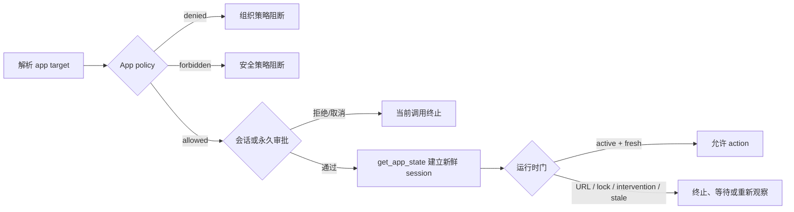

# App Policy、URL Policy 与错误状态机

> 运行态补充：service PID 恢复、native owner/client/idle lifecycle、Guardian
> connection-loss relock 和 PiP connection cleanup 见
> `16-service-process-lifecycle-and-retention.md`。

## 范围与取证边界

本章恢复当前 macOS Computer Use 的策略门、审批门和运行时错误状态机。证据来自：

- `@oai/sky@0.4.20` 的 `errors.js` 与 `computer-use-policy.js`；
- `SkyComputerUseService 26.710.1000387` 的 Mach-O 字符串和 Swift 符号；
- Electron `app.asar` 中的审批 UI、持久化模式和 store schema；
- `openai/codex` 提交 `9e552e9d15ba52bed7077d5357f3e18e330f8f38` 中的通用 MCP 审批与 locked-use requirements。

提取脚本只读程序包内的静态文件。它不读取审批 store 内容或路径元数据，不读取 URL
历史、浏览器历史、用户应用清单或 unified logs，不连接 `computeruse.sock`，也不执行
任何 UI action。

```bash
bash scripts/extract-policy-evidence.sh \
  --codex-source /path/to/openai-codex
node --test tests/policy-evidence.test.mjs
```

不传 `--codex-source` 时仍可完整提取 shipped Sky/native/Electron 证据，只把公开源码
交叉检查标为未执行。

脚本对 Mach-O 只运行一次 `strings`，再由一个 Node 进程在内存中判定所有 native
marker；不生成完整 `nm` 符号表。ASAR 的四个审批 marker 通过一次多-pattern `rg`
扫描收集。相同输入不写采集时间，因此输出 byte-identical。

输出先写到目标目录内的 mode `0600` 临时文件，JSON 完成后用同文件系统 `rename`
原子替换目标。并发 reader 只能看到旧的完整 JSON 或新的完整 JSON。

## 五层串联门



核心不变量：

1. `allowed` 只表示 app 可以进入审批，不表示可直接操作。
2. 每次都先检查当前 app policy，再考虑复用 session/always approval。
3. 持久审批只能省去后续提示，不能覆盖 `denied`、`forbidden`、URL block、锁屏、
   用户介入或 stale-element 检查。
4. action 只允许从 `active_observed` 状态发出；审批完成但尚未
   `get_app_state` 时仍是 `authorized_unobserved`。
5. 不明确的 target、URL 判定失败、元素身份不唯一都 fail closed。

## App Policy

shipped wrapper 对 `ComputerUseIPCAppPolicyResult.decision` 只处理三个值：

| 决策 | wrapper 行为 | 是否进入审批 | 是否执行 action |
|---|---|---:|---:|
| `allowed` | 使用 service 解析出的 canonical app path | 是 | 否，仍需审批与新鲜 session |
| `denied` | 报告被组织策略阻断 | 否 | 否 |
| `forbidden` | 报告因安全原因不允许 | 否 | 否 |

原生 provider 暴露 `allowed_bundle_ids`、`denied_bundle_ids` 和
`allow_persistent_approval` 字段，但静态证据没有恢复这些集合的实际成员。不能把
另一产品、旧构建或第三方实现的 blocklist 搬来补空白。

`appNotAllowed = -10006` 是 native server error，shipped MCP 文案把它解释为
“因安全原因不允许使用该 app”。组织级 `denied` 通常更早在 wrapper policy
分支终止，因此不能把所有 policy denial 都粗暴映射成 `-10006`。

## Session 与 Persistent Approval

当 policy 为 `allowed` 时，wrapper 请求 Computer Use 专用审批：

| policy 字段 | 可提供的持久化模式 |
|---|---|
| `allowPersistentApproval = false` | `session` |
| `allowPersistentApproval = true` | `session`, `always` |

Electron UI 对应：

- `Allow this conversation` -> `accept` + `persist = session`；
- `Always allow` -> `accept` + `persist = always`；
- deny -> `decline`。

原生 `AppApprovalStore` 同时有 `sessionApprovedBundleIdentifiers` 与
`persistentApprovals`。Electron 只证明 macOS store schema 为
`approvedBundleIdentifiers: string[]`；本实验从不打开真实 store。

永久写入失败存在独立 `appApprovalPersistenceUnavailable`/“could not persist”
错误路径。状态机按 fail closed 处理：用户选择 `always` 后若永久写入失败，不应静默
降级成 session approval 并继续 action。

公开 Codex 源码能交叉确认通用 MCP approval 支持 session 与 persistent 两种记忆，
但公开 requirements 当前只暴露 `allow_locked_computer_use`。native app allow/deny
集合不在该公开配置 schema 中。

## 关键运行时错误

`@oai/sky` 的完整 server code 范围是 `-10000` 到 `-10020`：

| code | 名称 | 状态语义 |
|---:|---|---|
| `-10000` | `senderProcessNotAuthenticated` | sender 身份失败，拒绝请求 |
| `-10001` | `couldNotGetRequestData` | IPC 请求不可解码 |
| `-10002` | `couldNotGetRequestTypeName` | 缺少请求类型 |
| `-10003` | `couldNotResolveRequestType` | 类型无法解析 |
| `-10004` | `unhandledEvent` | 未处理事件 |
| `-10005` | `unknownError` | 未分类 server error |
| `-10006` | `appNotAllowed` | native 安全策略拒绝 app |
| `-10007` | `runningApplicationNotFound` | 运行实例不存在 |
| `-10008` | `accessibilityError` | AX/动作错误 |
| `-10009` | `permissionsNotGranted` | TCC 权限未授予 |
| `-10010` | `invalidApp` | app identifier 无效 |
| `-10011` | `noActiveSession` | 必须先 `get_app_state` |
| `-10012` | `userStoppedSession` | 用户停止本 turn 的 app session |
| `-10013` | `incompatibleClientVersion` | client/server 版本不兼容 |
| `-10014` | `permissionsPending` | 权限 UI 尚未完成，可等待后重试 |
| `-10015` | `blockedURL` | 当前 application session 因 URL 被终止 |
| `-10016` | `userIntervened` | 用户正在操作或操作后必须重新观察 |
| `-10017` | `couldNotGetSenderPID` | 无法建立 sender identity |
| `-10018` | `ambiguousApp` | 同一 bundle identifier 对应多个 app |
| `-10019` | `couldNotGetBootstrapPort` | Apple Event/XPC bootstrap 失败 |
| `-10020` | `screenLocked` | 锁屏且自动解锁不可用或失败 |

### Native mapping switch

当前主switch：

```text
0x10015b01c
```

默认：

```text
0x10015b4e8-0x10015b508
tag 5
-10005 unknownError
```

确认映射：

```text
UIElementError.axError -> -10008
other UIElementError -> -10005
all RefetchableSkyshotAXTree.Error -> -10005
noWindowsAvailable / windowNotFound -> -10005
AppController.noCapturableWindow -> -10005
AppController.menuClickFailed -> -10005
OOP EventTargetingError -> -10005
userIntervened -> -10016
ambiguousApp -> -10018
lock AccessError -> -10020
```

因此 code 不能区分 missing stale、ambiguous stale 和 window targeting failure；
必须结合message。

`noCapturableWindow` 的 message 为：

```text
No capturable window found: <associated String>
```

`menuClickFailed` 的 message 为：

```text
Failed to click menu item
```

两个 OOP targeting error：

```text
elementPresumedOOPAndNotFound
elementIsOOPButExpectedToTargetAppAndNoEligibleParentElementWasFound
```

也走默认 `-10005`。当前二进制没有恢复到稳定的 case-specific 静态文案，因此不能
为它们猜测精确运行时 message。

### Permission result 与 permission exception

`-10009` 和 `-10014` 的直接来源是：

```text
ComputerUseIPCPermissionResult.denied  -> permissionsNotGranted
ComputerUseIPCPermissionResult.pending -> permissionsPending
```

另一个 native exception 类型：

```text
SystemSettingsPrivacyPermissionError
  requiresUserDragAndDrop
  userCancelled
```

不被主 error switch 按类型映射。若它原样冒泡，会落默认 `-10005`。
`userCancelled` 在一个上游分支中被显式 catch，但当前静态证据不能证明固定映射：

```text
requiresUserDragAndDrop -> -10014
userCancelled           -> -10009
```

因此不能把 permission result code 和这两个 exception case 一一绑定。

### `noActiveSession`

审批并不会自动建立可操作 session。若在 `authorized_unobserved` 直接 action，
server 返回 `-10011`，不执行动作。唯一已恢复的正常转移是：

```text
authorized_unobserved
  -- get_app_state succeeds -->
active_observed
```

### `blockedURL`

原生存在 `ComputerUseURLBlocklistCache`、`AuraSiteStatusURLPolicyChecker` 和明确的
session-stop 文案。`-10015` 不是普通 action failure：当前 session 已终止，即使用户
自行导航到该 URL 也不能在同一 session 继续尝试。

未发现嵌入二进制的默认域名数组。现有证据更符合“运行时 site-status policy +
TTL cache”，所以 fixture 中 `defaultBlockedUrls.entries` 必须保持空数组。

### `userIntervened`

原生状态包含：

- `UserInterruptedIntervention.requiresRequery`；
- `debounceDeadline` / `secondsRemaining`；
- `registerUserInterruptedIntervention`；
- `clearUserInterruptedInterventionAfterStateRequery`。

因此它有两个阶段：

```text
active_observed
  -- physical/user input -->
intervention_debounce
  -- debounce elapsed -->
reobserve_required
  -- get_app_state succeeds -->
active_observed
```

debounce 期间只能等待；之后也不能直接重放旧 action，必须先
`get_app_state`。这同时防止用户操作后继续使用旧 element index。

### `screenLocked`

`-10020` 阻止 action。若 managed policy、installer、guardian 和 thread binding
允许，服务可以尝试自动解锁；失败、缺少 thread ID 或检测到物理输入时都要求用户手动
解锁。解锁只清除了 lock gate，仍需重新观察后才能恢复到 `active_observed`。

### `ambiguousApp`

`-10018` 的直接文案说明：多个 app 共享同一 bundle identifier 时，必须改用 app
name 或完整 app path。不能选择第一个匹配项。

## Stale Element

stale element 没有独立的 `ServerErrorCode`。它位于 AX/action validation 层：

1. 元素仍有效 -> 继续；
2. 元素失效但能唯一 refetch 到等价元素 -> 可继续；
3. 找不到等价元素 -> 不执行 action，重新观察；
4. 旧树或新树中出现多个等价候选 -> 不执行 action，重新观察。

原生错误明确写出“multiple elements were found that match the criteria”，并有
`cannot guarantee uniqueness` 日志。这里的安全属性是 identity-preserving refetch，
不是“找一个看起来差不多的元素”。

## Forbidden 与 System Security Process

当前能确认：

- app policy 有 `forbidden` 决策；
- native 有 `ComputerUseAllowForbiddenTargets` 开关字符串；
- native 有 `systemSecurityTargetNotAllowed` 分类标记；
- action 层有
  “actions are not allowed for system security process” 拒绝路径。

当前不能确认：

- 默认 forbidden target 的完整列表；
- system security process 集合的完整成员；
- `ComputerUseAllowForbiddenTargets` 在 production 中的可用范围或是否仅用于开发。

因此这两类规则在 fixture 中都只记录“分类器/拒绝路径存在”，`entries` 保持空数组。
相邻字符串、哈希、单个 bundle identifier 或其他产品源码都不足以推导完整名单。

## Fail-Closed 转移摘要

| 事件 | 新状态 | 恢复条件 |
|---|---|---|
| `policy_denied` | `organization_policy_blocked` | 组织策略变化 |
| `policy_forbidden` | `safety_forbidden` | 无公开恢复路径 |
| approval decline/cancel | `current_call_denied` | 新的显式审批 |
| `noActiveSession` | `authorized_unobserved` | `get_app_state` |
| `blockedURL` | `blocked_url_terminal` | URL 允许后的新 session |
| `userStoppedSession` | `user_stopped_turn` | 下一 assistant turn |
| `userIntervened` | `intervention_debounce` / `reobserve_required` | 等待后 `get_app_state` |
| `screenLocked` | `screen_locked_blocked` | 解锁后 `get_app_state` |
| `ambiguousApp` | `ambiguous_target` | 更具体的 app selector |
| stale missing/ambiguous | `reobserve_required` | `get_app_state` |
| system security process | `system_security_target_blocked` | 无公开恢复路径 |

机器可读的精简证据和完整 transition 对象位于
`fixtures/policy/evidence.json`。测试锁定关键错误码、空名单边界和每个阻断态的
`no_action`/re-observation 要求。
