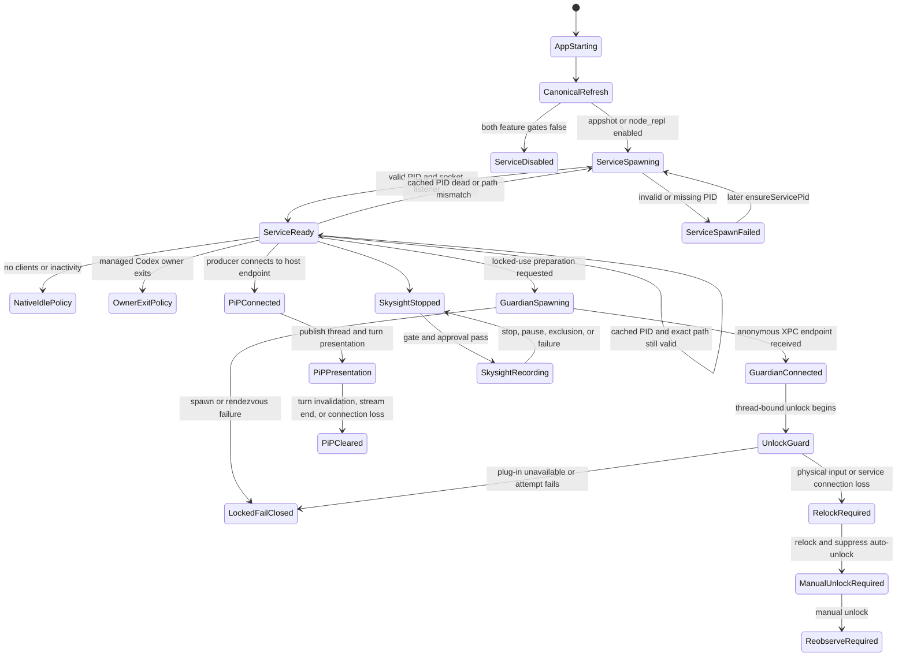

# Service Process, IPC, Upgrade, Guardian, And Retention

## Scope

This chapter extends the lifecycle, security, policy, observability, and real
experiment chapters with a live read-only snapshot of:

- process ownership and launchd registration;
- native spawning and service recovery;
- canonical bundle refresh and application upgrade ordering;
- ordinary Computer Use IPC, lock-screen Guardian XPC, authorization broker,
  and remote-hosted PiP;
- signing, entitlements, TCC, preferences, caches, analytics queue metadata,
  and temporary-file retention;
- unified-log schema and aggregate counts.

The snapshot was taken on 2026-07-12 against:

```text
ChatGPT                    26.707.51957 (build 5175)
Codex Computer Use         26.710.1000387 (build 1000387)
macOS                      26.5.2 arm64
```

This chapter is a dated read-only lifecycle snapshot. V7's current Desktop
identity is `26.707.61608 (5200)`, while the native Computer Use service hash
remains unchanged. Current build evidence is in
`fixtures/electron/evidence.json`; the process and retention conclusions below
remain scoped to the stated snapshot unless separately re-probed.

The investigation did not:

- connect to `computeruse.sock`;
- invoke the installer;
- write Authorization Services or TCC;
- restart or terminate any process;
- read screenshot pixels, AX text, approval contents, event JSONL, analytics
  payloads, URLs, prompt bodies, or network bodies;
- preserve raw unified-log records.

## Evidence Levels

| Level | Meaning |
|---|---|
| Confirmed live | Observed in current process, launchd, FD, filesystem, TCC, or aggregate log state |
| Confirmed static | Present in the exact signed binaries or selected Electron bundle code |
| High-confidence inference | Multiple independent observations support the conclusion |
| Unknown | The read-only evidence does not establish the value or transition |

## Current Process Tree

At the main snapshot:

```text
launchd / runningboard
└─ ChatGPT
   ├─ codex app-server
   │  └─ 56 node_repl processes across open Codex tasks
   ├─ SkyComputerUseService
   │  └─ CUALockScreenGuardian
   ├─ Electron helper and renderer processes
   └─ native sky.node loaded in the main process
```

The exact Computer Use chain was:

```text
ChatGPT                    PID 94159  started 15:17:30
├─ codex app-server        PID 94341  started 15:17:36
└─ SkyComputerUseService   PID 94559  started 15:17:42
   └─ Guardian             PID 81912  started 20:18:47
```

The Guardian start time matches the production lock-screen experiment. It was
not running at ChatGPT startup and remained alive after the failed locked-use
observation.

### launchd Boundary

Only ChatGPT is a submitted application job:

```text
application.com.openai.codex.<instance>
```

The service and Guardian appear under launchd only as unmanaged processes:

```text
com.apple.xpc.launchd.unmanaged.SkyComputerUseS.<pid>
com.apple.xpc.launchd.unmanaged.CUALockScreenGu.<pid>
```

No matching OpenAI Computer Use LaunchAgent, LaunchDaemon, or installed
SecurityAgent plug-in was found. Therefore:

1. launchd does not independently restart the service or Guardian;
2. ChatGPT and the native service own their recovery;
3. Locked Use installation is a separate privileged configuration, not the
   source of the ordinary service process.

## Spawn And Ownership

Electron's managed service class:

1. stores the canonical executable path;
2. enables the service when `appshotsEnabled || nodeReplEnabled`;
3. reuses a cached PID only if it is running and its executable path matches;
4. calls `spawnComputerUseService(path)` otherwise;
5. rejects an invalid returned PID.

The native `sky.node` addon imports `posix_spawn` and
`responsibility_spawnattrs_setdisclaim`. Its symbol table contains:

```text
SpawnComputerUseService
SpawnComputerUseServiceWorker.Execute
ComputerUseServiceProcessMatchesExecutablePath
```

The observed service nevertheless remains a direct child of ChatGPT. The
disclaimed responsibility attribute affects macOS process responsibility
accounting; it does not make the service a launchd job.

### What Electron Does Not Do

The selected manager code contains no explicit kill in:

```text
setEnabledFeatures
invalidateServicePid
dispose
```

Disabling both features stops future `ensureServicePid` calls but does not
directly terminate the current process in that class. The native binary has its
own lifecycle fields and hooks:

```text
lifecycleMode
inactivityTask
managedCodexOwnerExitSource
ComputerUseIPCServer.clientExitSources
terminatesWhenNoActiveIPCClients
shouldTerminateWhenNoClientsRemain
CodexComputerUseIdleTimeoutReached
```

This establishes native owner, client, and inactivity shutdown mechanisms.
The production values for the idle timeout and the two no-client termination
controls remain unknown.

## Installation And Upgrade Ordering

Three copies of the native app were present:

```text
source:
  $APP/Contents/Resources/plugins/openai-bundled/plugins/computer-use/

plugin cache:
  $HOME/.codex/plugins/cache/openai-bundled/computer-use/1.0.1000387/

canonical:
  $HOME/.codex/computer-use/Codex Computer Use.app
```

All three main executables had the same SHA-256:

```text
27b547d17a11f6f697ee62bfc20e5da6fab3f39848d40191c132b09ae8f68f58
```

The observed startup sequence was:

```text
15:17:30  ChatGPT starts
15:17:36  canonical service executable ctime
15:17:36  app-server starts
15:17:42  SkyComputerUseService starts
15:17:43  computeruse.sock is created
15:17:48  versioned plugin-cache root is created
```

This supports the following order:

```text
signed app source
  -> canonical refresh
  -> managed service spawn
  -> ordinary IPC listener
  -> remaining bundled marketplace/cache reconciliation
```

`ditto` preserves source mtimes. A canonical bundle mtime can therefore look
older than the refresh that produced it. Use ctime, executable hash, process
start time, socket creation time, and cache creation time together.

ChatGPT ships Sparkle update state and a public update-signing key. The exact
feed URL and update payload were not collected. The service has no separate
updater; a ChatGPT update supplies a new source bundle, and the next app
startup refreshes the canonical copy.

### Upgrade Recovery State

```text
new ChatGPT bundle installed
  -> next ChatGPT launch
  -> remove canonical target
  -> ditto signed source to canonical target
  -> enablement reconciliation
  -> spawn or reuse only exact-path service PID
```

Unknown:

- whether an in-place app update while ChatGPT is running asks the app to quit
  before replacement in every update mode;
- old plugin-cache version eviction policy;
- whether a path-mismatched old service is explicitly terminated or only
  abandoned for native owner/idle shutdown.

## IPC Topology

### Ordinary Computer Use

```text
node_repl trusted wrapper
  -> @oai/sky nativePipe
  -> $CUA_GROUP/IPC/computeruse.sock
  -> SkyComputerUseService
```

Current permissions:

```text
group container       0700
IPC directory         0700
socket lock file      0600
computeruse.sock      0600
```

The service held the listener. The collector never connected to it.

### Guardian XPC

The service spawns:

```text
CUALockScreenGuardian
  <Mach-bootstrap-rendezvous-name>
```

Static strings and symbols establish this one-time setup:

1. service creates a Mach bootstrap rendezvous;
2. Guardian looks up that rendezvous;
3. Guardian sends an anonymous XPC endpoint through it;
4. service builds a `CUALockScreenGuardianClient`;
5. commands bind unlock guards and leases to thread IDs;
6. physical input and connection loss trigger fail-closed cleanup.

The Guardian has no named Unix socket. It uses the anonymous XPC connection.

### Login Authorization Broker

The service owns:

```text
/tmp/com.openai.sky.CUAService/LockScreenLoginAuthorization.sock
```

When present in the filesystem, the socket mode was `0666`. The authorization
plug-in therefore validates:

- peer audit token;
- signing identifier;
- Team ID.

During the investigation, the pathname was later unlinked while the service
still held the listener FD and `netstat` still displayed the bound name. This
is a real lifecycle distinction:

```text
listener FD alive != pathname currently connectable
```

The directory mtime changed at 21:39:55, and an aggregate Guardian connection
end marker appeared one second later. The exact code path that unlinked the
pathname was not recovered, so the relationship is high-confidence inference,
not proof.

### Remote-hosted PiP

ChatGPT publishes a launchd dynamic endpoint:

```text
com.openai.codex.remote-hosted-pip-content
```

`sky.node` hosts the XPC presentation service. The native CUA service is the
producer. A two-hour aggregate found:

```text
RemoteHostedPIPContent records       518
generic presentation publishes       14
explicit Browser Use publishes        1
```

No presentation IDs, thread IDs, turn IDs, images, or message bodies were
stored. The count proves recent host activity, not that a presentation was
active at the final instant.

## Signing, Entitlements, And TCC

All inspected components passed strict code-sign verification and used Team ID
`2DC432GLL2`.

| Component | App Sandbox | App group | Keychain group | Current TCC row |
|---|---:|---:|---:|---|
| ChatGPT | yes | yes | yes | Accessibility and Screen Capture allowed |
| SkyComputerUseService | no | yes | yes | Accessibility and Screen Capture allowed |
| SkyComputerUseClient | no observed sandbox | yes | yes | none observed |
| Guardian | no entitlements observed | no | no | none observed |
| Installer | no entitlements observed | no | no | none observed |
| Authorization plug-in | no entitlements observed | no | no | not installed |

The service, not the Guardian, owns the ordinary TCC grants. The Guardian can
perform lock-screen coordination only through its signed relationship with the
service and the installed authorization mechanism.

Locked Use remained unavailable:

```text
embedded authorization plug-in   present and signed
installed plug-in                absent
authorizationdb mechanism        absent
effective managed requirement    unset
ready                            false
```

## Failure And Recovery State Machine



### Confirmed Recovery Rules

| Failure | Owner | Recovery |
|---|---|---|
| Managed service PID missing | Electron | next `ensureServicePid` spawns |
| PID executable path mismatch | Electron | cached PID rejected; new spawn |
| IPC sender identity failure | native service | request rejected |
| TCC pending | native service | wait and retry fresh request |
| TCC denied | native service | user grants permission, then fresh request |
| screen locked, no auto-unlock | native service | manual unlock, then `get_app_state` |
| Guardian spawn/rendezvous failure | native service | fail closed |
| physical input during guarded unlock | Guardian/service | relock, suppress until manual unlock |
| Guardian connection loss during unlock | Guardian | immediate relock and fail closed |
| PiP producer connection loss | ChatGPT host | discard connection and clear remote presentations |
| stale or ambiguous element | native service | no action; re-observe |

### Unknown Recovery Values

- service idle timeout duration;
- whether the current managed lifecycle sets
  `terminatesWhenNoActiveIPCClients`;
- Guardian idle or lease-free exit timeout;
- old path-mismatched service termination timing;
- retry backoff and maximum spawn attempts in Electron;
- PiP cleanup timeout value;
- Skysight segment deletion delay after stop.

## Unified Log Schema And Volume

Eight-hour aggregate for the service and Guardian:

```text
records                         92,196
SkyComputerUseService           92,038
CUALockScreenGuardian              158
```

Top subsystems:

```text
empty/default                   59,604
com.apple.coremedia             24,480
com.apple.xpc                    2,407
com.apple.TCC                    1,860
com.apple.network                1,851
inc.software.app                   551
com.apple.CFNetwork                427
com.apple.appleevents              310
```

Top product-relevant categories included:

```text
Computer Use                       88
Accessibility                     170
Screenshot Implementation          52
Computer Use Cursor                43
SystemFocusStealPreventer           34
Security                            12
```

The binary contains 95 `%{public}` OSLog format markers and no
`%{private}` marker in the simple string scan. This does not mean every log
contains private data, but it means raw unified logs must be treated as user
data. Public templates include errors, window geometry, lock-screen state, and
other operational fields.

The stored fixture contains only schema keys, subsystem/category counts, and
marker counts. It contains no raw `eventMessage` values.

## Network Boundary

Instantaneous `lsof -i` snapshots found no TCP or UDP FD for the service or
Guardian. This is not proof of no network activity:

- unified logs contain CFNetwork and network connection activity;
- `Cache.db` contains one URL-cache response/blob/receiver row;
- the service has Statsig and Datadog transport code;
- site-status policy checks and telemetry can use short-lived connections.

The correct conclusion is:

```text
no network FD at sampled instants
  + evidence of intermittent framework network activity
  + payload and destination not collected
```

## Data Retention And Cleanup

### Canonical And Cache Artifacts

| Artifact | Current state | Cleanup inference |
|---|---|---|
| canonical native app | persistent | replaced wholesale on refresh |
| versioned plugin cache | one current version | old-version eviction unknown |
| `computeruse.sock.lock` | persistent zero-byte file | survives service restarts |
| `computeruse.sock` | service-lifetime listener | recreated when service starts |
| authorization broker path | dynamically linked/unlinked | FD may outlive pathname |

### Screenshots

The production synthetic-app experiment established:

```text
one JPEG file per capture
old and new captures coexist during the app session
both removed after the target app session ends
```

At the current metadata snapshot:

```text
screenshot_* files        0
service-open screenshot   0
```

The exact cleanup owner is still unknown. Evidence supports app-session cleanup,
not immediate response cleanup.

### Skysight And Event Stream

Current metadata:

```text
Skysight segment files             0
service-open segment files         0
exact named Skysight log records   0 in the selected 8-hour query
```

The binary states that raw Skysight segments are ephemeral and not persisted.
It also exposes `SkysightClearHistoryScope` and `clearHistory`. The exact
deletion timing and any durable summary store remain unknown.

One generic file matching `events.jsonl`, `metadata.json`, or `session.json`
existed somewhere under the user temporary root. Its path and contents were not
read, and it cannot be attributed to CUA. It remains unknown evidence, not an
active Event Stream claim.

### PiP

PiP presentation state is held in ChatGPT and the native producer through XPC
objects. No dedicated PiP database or persistent presentation store was found.
Static methods clear or invalidate presentations on thread completion, turn
invalidation, stream end, host stop, or connection loss.

### Analytics Queue

`Analytics.db` metadata:

```text
file bytes                    598,016
analytics_event rows                0
distinct_id rows                    2
distinct_id_alias rows              0
journal mode                    delete
secure_delete                     FAST
auto_vacuum                incremental
page count                        146
freelist pages                    138
```

The event queue was empty, but identity rows persisted and most allocated pages
were on the freelist. The file had not shrunk. Without reading raw pages, this
investigation cannot determine whether deleted payload bytes remained
recoverable.

### Statsig, HTTP, And URL Cache

`com.openai.sky.CUAService.plist` contained only five top-level keys:

```text
2 NSStatusItem visibility booleans
Statsig cache-key mapping data
Statsig local storage data, about 403 KiB
Statsig stable ID, 36 characters
```

No values were copied.

Other persistent metadata:

```text
Cache.db URL-cache response rows       1
HTTP alt-services rows                 0
```

No cache body, URL, host, header, or analytics payload was queried.

## Read-only Reproduction Commands

### Process And launchd

```bash
ps -axo pid=,ppid=,pgid=,uid=,state=,lstart=,etime=,comm= |
  awk '{
    pid=$1; ppid=$2;
    $1=$2="";
    sub(/^[[:space:]]+/, "", $0);
    if ($0 ~ /SkyComputerUseService$/ ||
        $0 ~ /CUALockScreenGuardian$/ ||
        $0 == "/Applications/ChatGPT.app/Contents/MacOS/ChatGPT" ||
        $0 == "/Applications/ChatGPT.app/Contents/Resources/codex")
      print pid, ppid, $0
  }'

launchctl print "gui/$(id -u)" |
  rg -i -C 3 'application\.com\.openai\.codex|SkyComputerUseS|CUALockScreenGu|remote-hosted-pip'
```

Do not parse `$3` as the executable path: paths containing spaces are split by
`awk`.

### Socket Ownership

```bash
lsof -nP -U |
  awk 'NR == 1 || /computeruse\.sock|LockScreenLoginAuthorization\.sock/'

netstat -anv -f unix |
  awk '/computeruse\.sock|LockScreenLoginAuthorization\.sock/'

stat -f '%N %HT %Lp %u %B %m %c' \
  "$HOME/Library/Group Containers/2DC432GLL2.com.openai.sky.CUAService/IPC/"* \
  /tmp/com.openai.sky.CUAService 2>/dev/null
```

### Signatures And Entitlements

```bash
CU="$HOME/.codex/computer-use/Codex Computer Use.app"

codesign --verify --deep --strict "$CU"
codesign -d --verbose=4 "$CU" 2>&1 |
  rg '^(Identifier|TeamIdentifier|Authority|Timestamp|Runtime Version)='
codesign -d --entitlements :- "$CU" 2>/dev/null |
  plutil -convert xml1 -o - -
```

### TCC

```bash
sqlite3 -readonly -separator $'\t' \
  '/Library/Application Support/com.apple.TCC/TCC.db' \
  "select service,client,auth_value,auth_reason,flags,last_modified
     from access
    where client in (
      'com.openai.codex',
      'com.openai.sky.CUAService',
      'com.openai.sky.CUAService.guardian',
      'com.openai.sky.CUAService.cli'
    )
      and service in (
        'kTCCServiceAccessibility',
        'kTCCServiceScreenCapture',
        'kTCCServiceListenEvent',
        'kTCCServicePostEvent',
        'kTCCServiceAppleEvents'
      )
    order by client,service,last_modified;"
```

### Storage Schema And Counts

```bash
DB="$HOME/Library/Group Containers/2DC432GLL2.com.openai.sky.CUAService/Library/Application Support/Software/Analytics.db"

sqlite3 -readonly "$DB" \
  "select name,type from sqlite_master
    where type in ('table','index','trigger','view')
    order by type,name;"

sqlite3 -readonly "$DB" \
  "select count(*) from analytics_event;
   select count(*) from distinct_id;
   pragma secure_delete;
   pragma auto_vacuum;
   pragma journal_mode;
   pragma page_count;
   pragma freelist_count;"
```

These queries return only schema, row counts, and database pragmas.

### Aggregate-only Unified Logs

```bash
log show --last 30m --style ndjson --info --debug \
  --predicate 'process == "SkyComputerUseService" OR process == "CUALockScreenGuardian"' \
  2>/dev/null |
jq -sc '
  [.[] | select(has("timestamp"))] |
  {
    records: length,
    by_subsystem:
      ([.[] | .subsystem // "<none>"] |
       group_by(.) |
       map({key: .[0], count: length}) |
       sort_by(-.count)),
    by_category:
      ([.[] | .category // "<none>"] |
       group_by(.) |
       map({key: .[0], count: length}) |
       sort_by(-.count))
  }'
```

`log show --style ndjson` emits a final non-event object on this macOS build.
Always filter for `has("timestamp")` before counting.

## Collector Pitfalls Found During This Investigation

### zsh `path`

In zsh, `path` is tied to `PATH`. Using:

```bash
for path in ...
```

can replace command lookup inside the current shell. Use `item_path` or another
name.

### Executable Paths With Spaces

`ps ... | awk '$3 == ...'` is unsafe when the command path contains spaces.
Reconstruct the command from the remaining fields or query an exact PID.

### `ditto` And mtime

`ditto` can preserve source mtimes. mtime alone cannot prove refresh time.

### Unix Socket Path Versus Open FD

`test -S` can report absent after unlink while `lsof` and `netstat` still show
the live listener FD. Record both views.

### Instantaneous Network Sampling

No `lsof -i` row does not prove no networking. Compare FD snapshots with
CFNetwork logs and cache metadata.

### Tool Locations

Do not assume Homebrew tools such as `rg` live in `/usr/bin`. Resolve them with
`command -v rg` or invoke them through the current `PATH`.

### Log Query Cost

An eight-hour multi-process `log show` scan can take minutes. Use a narrow
process and lifecycle-marker predicate first, then expand only when aggregate
coverage requires it.

## Remaining Unknowns

1. Exact managed lifecycle mode string in the current production launch.
2. Service idle timeout and no-client shutdown values.
3. Guardian exit policy after all unlock guards and leases are released.
4. Exact broker pathname unlink trigger.
5. Current Skysight feature eligibility and durable summary store.
6. Current Event Stream recording state and exact session root.
7. Current PiP active presentation count without calling the private host API.
8. Telemetry destinations, payloads, batching interval, and successful send
   status.
9. Old plugin-cache version eviction policy.
10. Whether deleted Analytics DB payload bytes remain physically recoverable.
