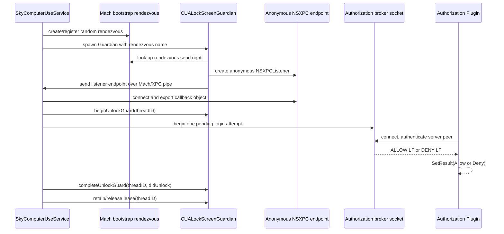
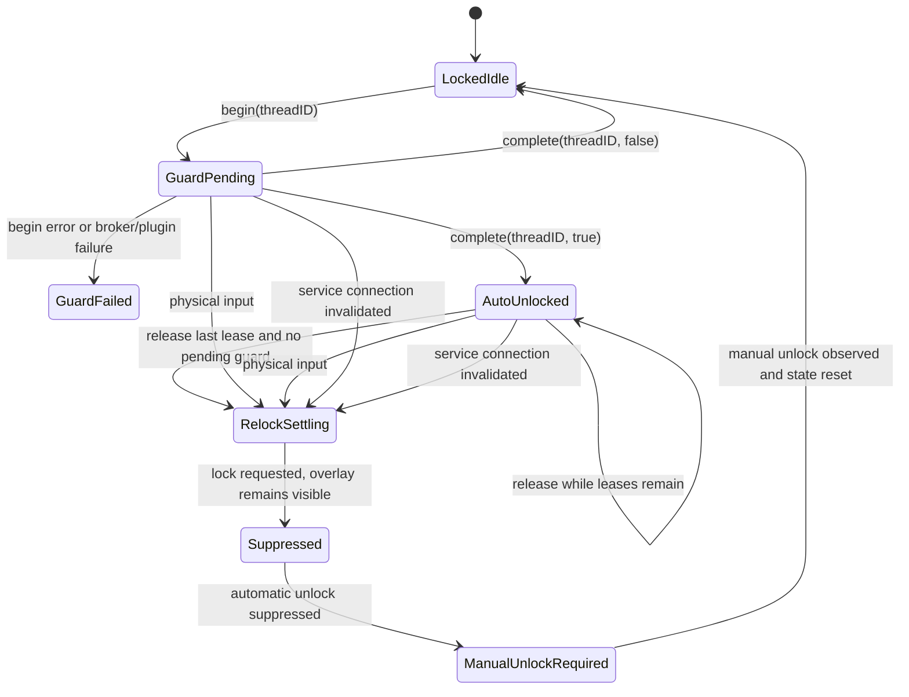

# Lock-Screen Guardian And Authorization Private Protocol

本报告只针对 Codex Computer Use build `26.710.1000387`，记录
`CUALockScreenGuardian`、Installer、Authorization Plugin 和
`SkyComputerUseService` 对应锁屏代码的静态协议与状态机。

调查时间：`2026-07-13T00:14:19+08:00`

## 1. 安全边界

本轮只执行了静态和只读检查：

- `file`
- `shasum`
- `dwarfdump --uuid`
- `codesign -d` / `codesign --verify`
- `plutil`
- `otool`
- `nm`
- `strings`
- 文件存在性和权限查询

明确未执行：

- 未启动 Installer app；
- 未启动 Installer helper；
- 未读写 `authorizationdb`；
- 未读写 TCC 数据库，未运行 `tccutil`；
- 未连接 Guardian XPC endpoint；
- 未连接 authorization broker socket；
- 未锁屏、解锁或提交登录尝试；
- 未 attach、注入、采样或调试任何进程；
- 未合成键盘、鼠标或其他输入；
- 未修改目标 app bundle、系统目录或配置。

因此，本文区分：

- 确认：可由当前二进制的符号、Objective-C protocol metadata、常量或反汇编直接证明；
- 高置信还原：由调用顺序、状态字段和多处字符串共同支持，但没有运行态消息抓包；
- 未知：静态证据不足，或本轮安全边界明确排除了验证手段。

## 2. 精确产物基线

缓存副本与 `~/.codex/computer-use` 副本逐字节一致。下表使用插件缓存副本：

| 产物 | Bundle ID | UUID | SHA-256 |
|---|---|---|---|
| `SkyComputerUseService` | `com.openai.sky.CUAService` | `9E40FA2F-FC6C-3EE2-824A-E4975CA022AD` | `27b547d17a11f6f697ee62bfc20e5da6fab3f39848d40191c132b09ae8f68f58` |
| `CUALockScreenGuardian` | `com.openai.sky.CUAService.guardian` | `75DAF041-1112-3E75-9C2C-1C74AF580EAA` | `d99b3d927b06677444a9b5de237e5470cb2289aa30676a21976ad8e32320c6bb` |
| Installer app | `com.openai.sky.CUAService.AuthorizationPluginInstaller` | `94BFC8C2-5D32-3696-B135-597322806B3E` | `6bf33f05476682af2f5b2876c99c8f13aa9b52d681a5861c005f3a4a0bf4db3f` |
| Installer helper | tool identifier with build UUID suffix | `BFC124F3-C74D-3A9C-8ED8-EFC9F53E0D21` | `c48c015ed8ff82a31b125699ca0884693d86b9812a0202d8b8dcc23412afecf0` |
| Authorization Plugin | `com.openai.sky.CUAService.AuthorizationPlugin` | `BFAC9C8B-CDEE-392F-8660-0233663B1B38` | `8abcf8373e6f3b734f905ce0e351df6291aa289252b2409761b2edc9881093d9` |

共同属性：

- arm64；
- minimum macOS `14.4`；
- SDK `26.1`；
- Hardened Runtime；
- Developer ID Application: OpenAI OpCo, LLC；
- Team ID `2DC432GLL2`；
- strict code-sign verification 通过。

Guardian、Installer app 和 Authorization Plugin 没有观察到额外 entitlement。
Installer helper 只有：

```text
com.apple.application-identifier =
2DC432GLL2.com.openai.sky.app.CodexComputerUseAuthorizationPluginInstallerTool
```

当前机器上未发现以下安装路径：

```text
/Library/Security/SecurityAgentPlugins/CodexComputerUseAuthorizationPlugin.bundle
/Library/Application Support/CodexComputerUseAuthorizationPlugin
```

这只证明文件未安装，不证明当前 `authorizationdb` 的内容；本轮没有读取
`authorizationdb`。

## 3. 总体拓扑



这里有两条完全不同的私有协议：

1. Guardian：Mach bootstrap 只负责交付匿名 `NSXPCListenerEndpoint`，后续是
   Objective-C `NSXPCConnection` 调用。
2. Authorization broker：Unix domain stream socket，服务端不读请求，只返回一个
   短 ASCII token。

两条协议都不是 protobuf，也不是 JSON。

## 4. Mach Bootstrap 与匿名 XPC

### 4.1 Rendezvous

服务端静态字符串和 helper symbols 包含：

```text
.lock-screen-guardian.
CUALockScreenGuardian.app
SAIMachBootstrapRendezvous
SAISendNSXPCListenerEndpointOverMachPort
SAIReceiveNSXPCListenerEndpointOverMachPort
xpc_dictionary_set_mach_send
xpc_pipe_create_from_port
xpc_pipe_receive
xpc_pipe_routine
xpc_pipe_routine_reply
```

确认流程：

1. 服务创建 Mach receive right；
2. 服务向 bootstrap namespace 注册一次性 rendezvous 名称；
3. 服务 spawn Guardian，并把 rendezvous 名称作为参数交给 Guardian；
4. Guardian 创建 anonymous `NSXPCListener`；
5. Guardian 经 Mach/XPC pipe 把 listener endpoint 交给服务；
6. 服务用 endpoint 建立 `NSXPCConnection`。

Guardian 启动时没有 rendezvous name，或 endpoint handoff 失败，会记录错误并终止，
不会退回 named socket 或其他传输。

### 4.2 XPC 协议候选

Objective-C protocol metadata 给出了完整 selector 集合和 ABI：

```objc
@protocol SAILockScreenGuardianXPCProtocol

- (void)beginUnlockGuardForThreadID:(NSString *)threadID
                          withReply:(void (^)(NSError *error))reply;

- (void)completeUnlockGuardForThreadID:(NSString *)threadID
                              didUnlock:(BOOL)didUnlock;

- (void)retainAutoUnlockedLeaseForThreadID:(NSString *)threadID;

- (void)releaseAutoUnlockedLeaseForThreadID:(NSString *)threadID;

@end

@protocol SAILockScreenGuardianClientXPCProtocol

- (void)lockScreenGuardianDetectedPhysicalInput;

@end
```

可用更紧凑的私有 IDL 表示：

```text
GuardianCommand =
  | BeginUnlockGuard { threadID: String } -> Error?
  | CompleteUnlockGuard { threadID: String, didUnlock: Bool }
  | RetainAutoUnlockedLease { threadID: String }
  | ReleaseAutoUnlockedLease { threadID: String }

GuardianEvent =
  | PhysicalInputDetected
```

确认属性：

- `BeginUnlockGuard` 是唯一带 reply block 的命令；
- 其余三个服务到 Guardian 的调用是 one-way update；
- Guardian 到服务只有一个无参数 callback；
- 消息里只有 `threadID`，没有 `turnID`、session ID、nonce、timestamp 或 lease ID；
- XPC 序列化由 Foundation/NSXPC 完成，不存在独立 protobuf schema 或 JSON envelope。

### 4.3 Connection lifecycle

Guardian 的 XPC session：

- 只保留一个 active connection；
- 配置 exported/remote interfaces；
- 注册 interruption 和 invalidation handlers；
- connection invalidation 进入 fail-closed cleanup；
- pending unlock 期间检测到输入时，Guardian 会先 callback 服务，然后主动 interrupt
  服务连接。

服务端 client 持有：

```text
outboundCommandQueue
callbackReceiver
physicalInputHandler
connectionLossHandler
activeUnlockTask
connection
```

这说明服务端对命令串行化，并把正在等待的 unlock guard completion 与连接生命周期绑定。

## 5. Guardian Peer Authentication

### 5.1 已确认

所有相关 bundle 都由 Team ID `2DC432GLL2` 签名。Guardian bundle 内还包含：

```text
Resources/CUALockScreenGuardian_Parent.coderequirement
```

其 plist 内容只有：

```text
team-identifier = 2DC432GLL2
```

该资源被 `CodeResources` seal 覆盖。

### 5.2 未确认

在 Guardian 的 lock-specific XPC accept path 中，没有恢复到以下显式检查：

- connection audit token -> `SecTaskCreateWithAuditToken`；
- peer signing identifier 比较；
- peer Team ID 比较；
- `SecCodeCheckValidity` 或 requirement evaluation。

`listener:shouldAcceptNewConnection:` 调用的 helper 确认会配置 XPC interfaces、handlers
并 activate connection，但该窗口内没有 `SecTask` / `SecCode` 调用。

Guardian 大型二进制确实导入了 `SecTask` / `SecCode` API，但这些 API 也被普通
Computer Use IPC sender authorization 等其他共享模块使用，不能据此归因到 Guardian
连接。

因此当前最稳妥的结论是：

- Guardian 通道依赖服务 spawn 的进程关系、随机 rendezvous 名称、Mach send right 和
  anonymous endpoint handoff，具有 capability-like 特征；
- Guardian 只接受第一条 active XPC connection；
- 本轮没有证明 Guardian 对服务做显式代码签名认证；
- 本轮也没有证明服务收到 endpoint 后对 Guardian 做显式代码签名认证；
- `CUALockScreenGuardian_Parent.coderequirement` 的运行时消费路径未知。

这不能写成“已确认双向签名认证”。

### 5.3 V6 定性：Parent coderequirement 不是 XPC auth

`CUALockScreenGuardian_Parent.coderequirement` 已确认是合法的：

```text
codesign --launch-constraint-parent
```

输入 plist。它只包含：

```text
team-identifier = 2DC432GLL2
```

但当前成品 Guardian 签名没有显示：

```text
Has Parent Launch Constraints
```

文件名在 Guardian、service 和 installer Mach-O 中也无运行时 loader 命中。
它被 `CodeResources` seal 只能证明资源完整性，不能证明签名阶段实际消费。

因此当前结论：

- 设计用途是约束直接启动 Guardian 的父进程；
- 若被正确嵌入，它在 `exec`/启动阶段生效；
- 它不配置 Guardian 的 XPC peer authentication；
- 当前成品没有证据表明该 parent launch constraint 已嵌入签名。

### 5.4 Guardian accept path

专用 `listener:shouldAcceptNewConnection:` 完整路径为：

```text
0x1000043d0 -> 0x100005b88
```

它：

1. 若已有 connection，拒绝新连接；
2. 配置 exported/remote interfaces；
3. 配置 interruption/invalidation handlers；
4. activate；
5. 保存第一条 connection。

该路径不读取 audit token，不调用 `SecCode*`、`SkyIPCRequirement` 或 team-id helper。

准确语义是：

```text
random rendezvous Mach capability
  + anonymous NSXPC endpoint
  + first-connection-wins
```

不是显式身份认证。

主 service 通过 `NSTask` 直接启动 Guardian，并把随机 rendezvous name 作为 argv。
这条启动链不经过 Apple-event bootstrap。

潜在边界：

- 能读取 Guardian argv 或获得 rendezvous capability 的同用户进程，理论上可能形成
  race；是否受 bootstrap namespace、send-right ownership 或通用 helper 的额外校验
  阻止，本轮未证明。

## 6. Authorization Broker Wire Protocol

### 6.1 Socket lifecycle

服务端类型：

```text
LockScreenLoginAuthorizationBroker
LockScreenLoginAuthorizationAttempt
LockScreenLoginAuthorizationSocketServer
```

固定路径：

```text
/tmp/com.openai.sky.CUAService/LockScreenLoginAuthorization.sock
```

静态 start path 确认：

- `AF_UNIX`；
- `SOCK_STREAM`；
- 先处理旧 pathname，再 bind；
- socket pathname `chmod(0666)`；
- `listen(..., 4)`；
- accept loop 由 dispatch source 驱动；
- stop 会 close listener 并 unlink pathname。

目录创建常量为 `0755`。因此 pathname 权限本身不构成授权边界。

### 6.2 无 request body

Authorization Plugin 的 `MechanismInvoke`：

1. 创建 Unix stream socket；
2. connect 固定 pathname；
3. 校验已连接服务端 peer；
4. 单次 `read(fd, buffer, 15)`；
5. 根据前五个字节决定 AuthorizationResult；
6. close；
7. 调用 Authorization Engine `SetResult`。

插件不会向 broker 写入任何 request bytes。

### 6.3 Response union

服务端 accept 后调用：

```swift
consumePendingLoginAuthorizationAttempt() -> Bool
```

然后返回：

```text
true  -> "ALLOW\n"
false -> "DENY\n"
```

精确 wire union：

```text
BrokerReply =
  | Allow  // 41 4c 4c 4f 57 0a
  | Deny   // 44 45 4e 59 0a
```

插件判定比完整 token 更宽：

- 读取长度至少 5；
- 前五字节必须精确为 ASCII `ALLOW`；
- 第六字节是否为 LF 不影响 allow；
- 空响应、短响应、`DENY`、乱码、read error、peer auth error 全部 Deny。

这是一条 fail-closed one-shot protocol，不是 protobuf、JSON、plist 或
length-prefixed framing。

### 6.4 Attempt 状态

Broker 只持有一个：

```text
activeAttempt: LockScreenLoginAuthorizationAttempt?
```

开始新 attempt 会撤销旧 attempt。静态字段和 raw state 操作支持以下 union：

```text
AttemptResolution =
  | consumed
  | revoked
  | timedOut
  | pending
```

高置信 raw-value 候选：

```text
0 = consumed
1 = revoked
2 = timedOut
3 = pending
```

直接确认的行为：

- 只有 `pending` 能被 `consumePendingLoginAuthorizationAttempt()` 消费；
- 消费是一次性的；
- 没有 pending attempt 时，任意连接都得到 `DENY\n`；
- controller 超时会记录未被插件消费；
- controller cleanup 会在插件消费前 revoke attempt；
- waiters 通过 checked continuation 等待 resolution。

## 7. Authorization Plugin Peer Authentication

插件使用：

```text
getsockopt(fd, SOL_LOCAL, LOCAL_PEERTOKEN, ...)
SecTaskCreateWithAuditToken
SecTaskCopySigningIdentifier
SecTaskCopyTeamIdentifier
```

要求：

```text
signing identifier = com.openai.sky.CUAService
Team ID            = 2DC432GLL2
peer token size    = 32 bytes
```

任一条件失败都返回 `kAuthorizationResultDeny`。

这条认证是：

- 客户端 Authorization Plugin 验证 broker 服务端；
- 不是 broker 验证连接它的客户端；
- 不是双向认证。

Broker 端没有观察到对 accepted client 执行 `LOCAL_PEERTOKEN`、audit token、PID、
signing ID 或 Team ID 检查。因为 broker 只在存在 pending attempt 时发送
`ALLOW\n`，任意本地进程理论上可以抢先消费这个 one-shot attempt。

安全影响：

- 未授权进程无法伪造 broker 服务端让真实插件通过，因为插件会验证服务签名；
- 但本地进程可能通过抢先连接造成 denial of service，消耗 pending attempt；
- 是否能在极窄窗口内把 `ALLOW\n` 用于其他目的没有意义，因为 token 不携带凭据，
  真正的 allow decision 发生在加载插件的 Authorization Engine 内；
- socket `0666` 是可用性风险，不是直接的权限提升证明。

## 8. Thread、Turn、Guard 和 Lease

### 8.1 Thread binding

服务侧 `LockScreenAutoUnlockCoordinator` 持有：

```text
activeThreadIDs
autoUnlockedThreadIDs
attemptsInCurrentLockedEpisode
suppressionState
proactiveUnlockTask
```

Guardian 侧 `LockScreenGuardianCoordinator` 持有：

```text
pendingUnlockThreadIDs
autoUnlockedThreadIDs
activeAutoUnlockOverlayAssertion
relockOverlaySettlingAssertion
relockOverlaySettleObservation
relockOverlaySettlingCompletions
```

确认语义：

- request 必须能关联 `threadID`，否则 `missingThreadID`；
- `beginUnlockGuard(threadID)` 把 thread 加入 pending set；
- `completeUnlockGuard(threadID, didUnlock)` 移除 pending；
- 成功解锁后 thread 进入 auto-unlocked set；
- `codexTurnEnded(threadID)` 使用 thread ID 回收本地状态并 release Guardian lease；
- Guardian XPC 没有 `turnID` 字段。

因此“turn guard”在 Guardian 私有协议里实际是 thread-bound lease。上层 turn end
事件只把对应 thread ID 传入回收路径。

### 8.2 Lease

Lease 是幂等 set membership，不是带 TTL 的租约对象：

```text
retain(threadID)  -> insert into autoUnlockedThreadIDs
release(threadID) -> remove from autoUnlockedThreadIDs
```

当 release 确实移除了最后一个 auto-unlocked thread，且 pending unlock set 也为空时，
Guardian 主动：

1. 重新锁屏；
2. 保持 overlay；
3. 等待 lock UI settle；
4. settle 完成后隐藏 overlay。

所以正常 turn end 的最后一个 lease release 也会 relock，不只物理输入和断连才 relock。

### 8.3 Heartbeat

Guardian 私有 protocol 没有 heartbeat selector、timestamp 或 TTL 字段。

二进制中的：

```text
Heartbeat
HeartbeatConfiguration
heartbeatTask
lastHeartbeatTime
Received heartbeat from peer
```

属于同一大型 binary 内的 MCP/network transport 代码，不属于
`SAILockScreenGuardianXPCProtocol`。

Guardian liveness 由以下机制承担：

- XPC interruption/invalidation；
- active connection ownership；
- pending guard completion；
- thread lease retain/release。

结论：不能把 Guardian lease 描述为 heartbeat lease。

## 9. Fail-Closed 状态机



### 9.1 Physical input

`SystemLockScreenPhysicalInputMonitor`：

- 监听系统事件流；
- 从 `NSEvent.CGEvent` 读取 event source PID；
- 比较 `currentProcessID`；
- source PID 等于 Guardian 自己时忽略；
- 其他 source PID 触发 callback；
- 日志记录 event type 和 source PID。

重要边界：

- 静态实现没有证明事件来自真实硬件；
- 它证明的是事件 source PID 不是 Guardian 自己；
- 其他进程生成的 synthetic event 也可能被归类为“physical input”；
- 这会造成 fail-closed relock，而不是绕过 relock。

确切 event mask 未恢复，因此不能断言覆盖了所有键盘、鼠标、触控板和特殊输入类型。

### 9.2 Physical input during pending guard

Guardian：

1. relock；
2. 保持 overlay；
3. callback `lockScreenGuardianDetectedPhysicalInput`；
4. pending unlock 时主动 interrupt 服务 XPC connection；
5. 服务进入 `suppressedUntilManualUnlock` / `waitingForManualUnlock`。

### 9.3 Connection loss

如果服务连接结束时存在 pending guard 或 auto-unlocked lease：

- Guardian 立即 fail closed；
- 清理 thread sets；
- relock；
- overlay 保持到 settle；
- 完成回调在 cleanup 后触发。

如果没有 active guarded state，静态证据不支持“任何空闲断连都锁屏”。

### 9.4 Attempt budget

每个 locked episode 有：

```text
attemptsInCurrentLockedEpisode
maxAttemptsPerLockedEpisode
```

达到预算后拒绝继续 auto-unlock。手动解锁和新的 locked episode 如何精确重置计数，
从状态字段和日志可高置信推断，但本轮没有恢复构造参数中的具体最大次数。

## 10. Relock 和 Overlay

Guardian 自己包含：

```text
SystemLockScreenController
SystemLockScreenMonitor
SystemLockScreenOverlayPresenter
SystemLockScreenPhysicalInputMonitor
```

relock path 调用 controller `lock()`，然后使用：

```text
observeLockScreenSettled(onSettled:)
relockOverlaySettlingAssertion
relockOverlaySettleObservation
relockOverlaySettlingCompletions
```

确认策略：

- relock 发起后 overlay 不立即消失；
- 先等待系统报告 lock UI settle；
- 若 settle callback 先于 “Mac reported as locked”，仍隐藏 overlay，避免桌面被永久遮挡；
- settle 完成后释放 assertion 和 completions。

controller `lock()` 的最终私有系统调用被编译进共享 helper，符号已 redacted；本轮没有
把它精确命名为某个公开或私有 API。只能确认 coordinator 调用了
`SystemLockScreenController.lock()`。

## 11. 多显示器 Overlay

`SystemLockScreenOverlayPresenter` 持有：

```text
windows: [NSWindow]
wallpaperMonitoringCancellables: [AnyCancellable]
screenObserver: NSObject?
cachedProfileImage: NSImage?
hasLoadedProfileImage: Bool
```

`show()` 的静态行为：

1. 订阅 `NSApplicationDidChangeScreenParametersNotification`；
2. 清理旧 windows 和 wallpaper subscriptions；
3. 枚举 `NSScreen.screens`；
4. 为每块 screen 创建独立 borderless `NSWindow`；
5. window frame 使用对应 screen frame；
6. window level 设置为 `CGShieldingWindowLevel() + 1`；
7. collection behavior 常量为 `0x111`；
8. window 忽略鼠标事件；
9. window 无阴影、opaque，并安装对应 overlay content；
10. 为每个 display 准备和持续更新 wallpaper capture。

`hide()`：

- 移除 screen observer；
- 取消 wallpaper monitoring；
- order out/close 全部 overlay windows；
- 清空 windows 和缓存状态。

多显示器边界：

- overlay 是 per-screen window array，不是单一主屏窗口；
- display topology 变化时会重建；
- wallpaper capture 失败是按 display 记录；
- display ID 缺失或消失有显式错误路径；
- 本轮没有运行外接显示器、镜像、Sidecar、虚拟显示器或睡眠唤醒场景，因此无法确认
  所有 topology race 的运行态结果。

## 12. Installer 静态能力

Installer app 导入：

```text
AuthorizationCreate
AuthorizationCopyRights
AuthorizationExecuteWithPrivileges
system.privilege.admin
```

它调用 bundled helper：

```text
CodexComputerUseAuthorizationPluginInstallerTool
  install|uninstall|status RESOURCE_DIR
```

Helper 静态能力：

- 复制 plugin 到
  `/Library/Security/SecurityAgentPlugins/CodexComputerUseAuthorizationPlugin.bundle`；
- 创建 `/Library/Application Support/CodexComputerUseAuthorizationPlugin`；
- 设置 root:wheel ownership 和文件权限；
- 调用 `AuthorizationRightGet` / `AuthorizationRightSet`；
- 调用 `/usr/bin/security authorizationdb`；
- 添加 mechanism `CodexComputerUseAuthorizationPlugin:allow`；
- 使用 `com.openai.sky.CUAService.AuthorizationPlugin.remote`；
- 备份原 screen saver / login rule；
- 写 `latest-backup-manifest.plist`；
- uninstall 时恢复 stock screen-unlock behavior。

Helper strings 还包含：

```text
evaluate-mechanisms
screenSaverRuleBackupPath
backup manifest is missing
recorded backup is missing
```

这说明 uninstall 依赖安装时备份，而不是盲目写死一个默认 rule。

本轮没有执行任何一条 installer/helper 命令，因此没有验证：

- 实际写入的完整 authorization rule；
- mechanism 的精确插入位置；
- backup manifest schema；
- status 输出格式；
- uninstall 在异常或部分安装状态下的恢复行为。

## 13. 消息协议结论

### 13.1 确认的 message union

```text
GuardianCommand =
  BeginUnlockGuard(threadID) -> Error?
  CompleteUnlockGuard(threadID, didUnlock)
  RetainAutoUnlockedLease(threadID)
  ReleaseAutoUnlockedLease(threadID)

GuardianEvent =
  PhysicalInputDetected

BrokerReply =
  "ALLOW\n"
  "DENY\n"

AttemptResolution =
  consumed
  revoked
  timedOut
  pending
```

### 13.2 明确排除

- Guardian private channel 不是 JSON；
- Guardian private channel 不是 protobuf；
- authorization broker 不是 JSON；
- authorization broker 不是 protobuf；
- Guardian XPC protocol 没有 `turnID`；
- Guardian XPC protocol 没有 heartbeat；
- broker 没有 request union；
- broker reply 不包含 thread ID、attempt ID、nonce、credential 或签名。

## 14. 明确未知

以下问题不能由本轮只读静态证据可靠回答：

1. rendezvous name 的精确随机生成算法和熵；
2. 同用户恶意进程能否稳定取得 rendezvous capability 并 race 首条连接；
3. 哪条构建/签名脚本生成 Parent constraint，以及为何成品未嵌入；
4. `BeginUnlockGuard` 返回的 NSError domain、code 和完整条件；
5. auto-unlock 最大尝试次数；
6. password field polling、submit、verification、settle 的具体时长；
7. physical input monitor 的完整 event mask；
8. synthetic event 的 source PID 在所有注入 API 下是否可靠；
9. controller `lock()` 最终使用的私有锁屏 API；
10. Authorization Plugin 在不同 macOS 版本 SecurityAgent 进程模型中的行为；
11. authorization rule 的完整安装后结构；
12. broker 被非插件客户端抢先消费时的真实重试策略；
13. 多显示器 hot-plug、镜像、Sidecar、虚拟显示器和 display sleep 的运行态 race；
14. service 或 Guardian crash 恰好发生在 `ALLOW\n` 已写出但 Authorization Engine 尚未
    `SetResult` 时的最终系统行为。

## 15. 安全结论

确认的强边界：

- 所有 shipped artifacts 有一致 Developer ID provenance；
- Authorization Plugin 严格校验 broker 服务的 signing ID 和 Team ID；
- 没有 pending attempt 时 broker 必定 Deny；
- attempt 是 one-shot；
- 物理输入和 guarded connection loss 都 fail closed；
- 最后一个 thread lease 正常释放也会 relock；
- relock 时 overlay 覆盖所有当前 displays，并保持到 lock UI settle。

确认的弱点或不对称：

- broker socket 是 `0666`；
- broker 不认证客户端，存在 one-shot attempt consumption DoS 面；
- Guardian lock-specific XPC path 未证明显式双向代码签名认证；
- Guardian “physical input” 是非自身 PID 事件，而不是硬件来源证明；
- Guardian lease 没有 heartbeat 或 TTL；
- thread ID 是唯一 lock-specific lifecycle key，XPC 不携带 turn ID。

不能据此声称：

- 任意本地进程可以解锁 Mac；
- broker socket 的 world-writable mode 直接导致提权；
- Guardian 通道完全没有任何通用 runtime authentication；
- Authorization Plugin 已安装或当前 authorization rule 已被修改；
- 多显示器和断连状态机已通过生产锁屏实验验证。

## 16. 复核入口

主要产物路径：

```text
~/.codex/plugins/cache/openai-bundled/computer-use/1.0.1000387/
  Codex Computer Use.app/Contents/MacOS/SkyComputerUseService
  Codex Computer Use.app/Contents/SharedSupport/CUALockScreenGuardian.app
  Codex Computer Use.app/Contents/SharedSupport/Codex Computer Use Installer.app
```

关键静态锚点：

```text
SAILockScreenGuardianXPCProtocol
SAILockScreenGuardianClientXPCProtocol
CUALockScreenGuardianXPCSession
LockScreenGuardianCoordinator
LockScreenAutoUnlockCoordinator
LockScreenLoginAuthorizationBroker
LockScreenLoginAuthorizationAttempt
LockScreenLoginAuthorizationSocketServer
SystemLockScreenOverlayPresenter
SystemLockScreenPhysicalInputMonitor
AuthorizationPluginCreate
CodexComputerUseMechanism
```

与较粗粒度生命周期调查的关系：

- `04-native-service-internals.md`：服务内 lock-screen 编排入口；
- `06-security-threat-model.md`：总体 threat model；
- `13-policy-error-state-machine.md`：上层 policy/error states；
- `16-service-process-lifecycle-and-retention.md`：进程、socket 和 XPC 生命周期。
