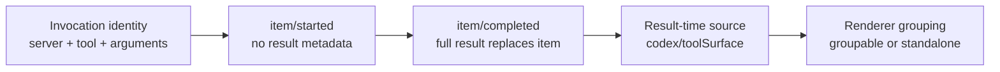
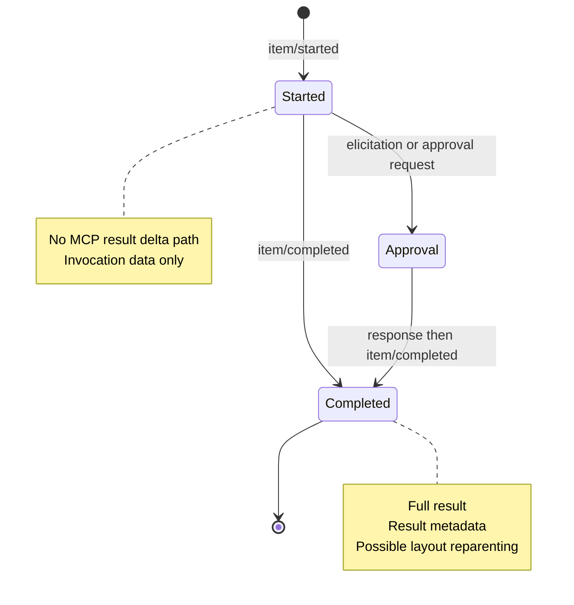

# Electron Presentation And MCP Event Contract

## Scope

This chapter pins how a model-emitted MCP call becomes a visible Computer Use
activity in the installed desktop app.

Original fixed artifacts:

```text
ChatGPT app: 26.707.51957 (5175)
app.asar SHA-256:
26708d5be316b43786ba00ea8581317426e44ff508e0d5cce40f53181582e027

Codex source:
rust-v0.144.0-alpha.4
```

V7 semantic collection also passes against current
`26.707.61608 (5200)`, app.asar SHA-256
`7cd7f277d4d4b6221eb2121fd36d2238c28f203875c62f8abd36f3f12898cb86`.
The collector now locates lifecycle, formatter, renderer, and conversation
roles by semantic markers instead of build-specific minified function names.
The un-suffixed fixture is current; the `-26.707.51957` fixture is historical.

The collector is read-only. It opens the ASAR, reads four exact Rust source
files, and evaluates a hermetic presentation model. It does not connect to
Computer Use or execute UI actions.

```bash
npm run collect:electron-presentation
node --test tests/electron-presentation-contract.test.mjs
```

Fixture:

```text
fixtures/electron/presentation-contract.json
```

## Three Identities

A visible MCP activity has three identities that are not established at the
same time.



1. Invocation identity is available at `item/started`.
2. `node_repl` Computer Use identity exists only after result metadata arrives.
3. The completed item is rebuilt and atomically replaces the started item.
4. The renderer may then move the item from an ordinary MCP group to a
   standalone Computer Use activity.

The source parser is:

```text
XSt({ resultMeta, serverName })
  if serverName != "node_repl" -> null
  parse resultMeta["codex/toolSurface"]
  return browserUse or computerUse source
```

Computer Use grouping is:

```text
source.kind == computerUse
  OR invocation.server == "computer-use"
    -> standalone
```

This is late binding. The started and completed layouts can differ without a
new tool invocation.

## Formatter Reachability

The direct Computer Use formatter is live code:

```text
ySt
  -> exported as p2
  -> imported as Fp
  -> vJ("computer-use")
  -> mJ
  -> LJ React MCP renderer
```

Key ASAR offsets are saved in the fixture. The current main anchors are:

```text
ySt                    2289458
FSt                    2301391
ySt as p2              8824958
p2 as Fp               7721 in the MCP renderer chunk
mJ                      711589
gJ                      712570
vJ                      712911
LJ                      715392
```

`FSt` contains explicit keys such as:

```text
click
drag
get_app_state
perform_secondary_action
press_key
scroll
set_value
type_text
```

It does not contain `js`.

## Node REPL Title Trust Channel

The renderer first calls:

```text
gJ({ toolArguments, toolName })
```

If the normalized tool name is `js`, `gJ` reads only:

```text
arguments.title
```

The title is whitespace-normalized and truncated to 80 characters. It does not
read or parse:

```text
arguments.code
structuredContent
content
result metadata
```

Therefore:

```text
node_repl.js
  title = "Clicking in Finder"
    -> visible title is "Clicking in Finder"

node_repl.js
  code = "await sky.click(...)"
  no title
    -> generic "Js" label
```

The visible action text is a declaration by the model/tool caller. It is not an
execution-layer witness that a click, scroll, or type operation occurred.

`codex/toolSurface` changes identity, icon, native-app association, and
standalone grouping. It does not derive an action verb from JavaScript.

## Failure Presentation Mismatch

`UCt` sets:

```text
completed =
  item.status != inProgress
  OR turn.status != inProgress
```

This means `completed` is a lifecycle bit, not a success bit.

`mJ` passes both `completed` and `toolResult` to a formatter, but `ySt` accepts
no result argument and chooses active/completed labels only from `completed`.

Consequently, a direct legacy call can have:

```text
server = computer-use
tool = click
result = error
completed = true
visible label = "Clicked in Finder"
```

The error is still visible in expanded content, but the collapsed title is
success-sounding. The hermetic behavior case is pinned in the fixture.

Current `node_repl.js` Computer Use avoids this specific `Clicked` formatter
because its server is `node_repl`; its declared title can still be misleading
for the separate reason described above.

## Event State Machine



The desktop has delta queues for:

- agent text;
- plans;
- reasoning;
- command output.

It has no `item/mcpToolCall/delta` path. MCP results arrive as complete
`item/completed` replacements.

## Progress Black Hole

The app-server protocol defines:

```text
item/mcpToolCall/progress
```

with:

```text
threadId
turnId
itemId
message
```

However, the current RMCP handler only logs `notifications/progress`. It does
not emit an app-server `McpToolCallProgress` notification.

Even if one is externally produced, Electron handles it as:

```text
find existing mcpToolCall item
log "Ignoring mcpToolCall progress message"
do not mutate state
```

Thus progress is currently lost twice:

1. no ordinary RMCP producer into the app-server event;
2. renderer state explicitly ignores the event.

## Elicitation Correlation Gap

The app-server request schema contains:

```text
threadId
turnId?
serverName
request ID
elicitation body
```

It has no MCP tool item ID. The source contains a TODO to expose one once core
can correlate the request.

Core stores pending elicitation state by:

```text
serverName + requestId
```

The conversation renderer separately derives a suppression key:

```text
generic/form/url       -> elicitation.serverName
mcpToolCall            -> approval.connector_id
connectorAuth          -> connector.connector_id
```

While an elicitation is pending, it filters unfinished MCP calls whose
`invocation.server` equals that key.

For the direct Computer Use surface:

```text
connector_id = "computer-use"
```

so one pending Computer Use elicitation can hide multiple unfinished direct
`computer-use` calls. The UI cannot identify only the initiating call because
the protocol does not supply its item ID.

The current `node_repl` wrapper uses the same connector ID for approval, but
its invocation server is `node_repl`, so this exact server-key filter does not
hide the `node_repl.js` item.

## One MiB Interaction

This chapter composes with
`18-v5-dynamic-edge-cases.md`:

```text
CallToolResult <= 1 MiB
  -> result meta retained
  -> node_repl completed item gains Computer Use source
  -> standalone identity migration can occur

CallToolResult > 1 MiB
  -> result meta cleared
  -> no Computer Use source
  -> item stays ordinary node_repl
```

The 1 MiB limit belongs to the app-server event copy. It is independent of the
native Sky pipe's 8 MiB frame limit.

## Reproduction Boundary

Confirmed by source extraction and hermetic behavior models:

- formatter reachability;
- title-only `node_repl.js` label path;
- result-time identity and grouping;
- direct failure label mismatch;
- no MCP result delta;
- progress double discard;
- elicitation item-ID gap and key-based suppression.

Not yet a production DOM capture:

- the exact visual animation during result-time reparenting;
- a live direct `computer-use` failure card showing `Clicked`;
- a live same-server parallel elicitation suppression case.

Those require an isolated app-server/renderer harness or a temporary direct
mock MCP configuration. They are not required to establish the current code
path, but would upgrade the last three items from source-backed behavior to
rendered runtime evidence.
