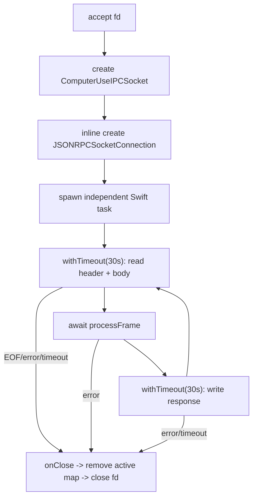

# Native Socket Server Concurrency

## Fixed Artifact

```text
SkyComputerUseService 26.710.1000387
UUID 9E40FA2F-FC6C-3EE2-824A-E4975CA022AD
SHA-256 27b547d17a11f6f697ee62bfc20e5da6fab3f39848d40191c132b09ae8f68f58
```

Machine fixture:

```text
fixtures/native/socket-server.json
```

Test:

```bash
node --test tests/native-socket-server.test.mjs
```

The fixture records static reverse-engineering evidence. It does not connect to
the production socket.

## Connection Object

```text
type descriptor    0x100dabefc
metadata accessor  0x1001477fc
class metadata     0x100fa9dd0
instance size      0x50 bytes
```

The ordinary initializer vtable slot points to `swift_deletedMethodError`.
The accept loop allocates and initializes the object inline:

```text
0x100151f78-0x100151ffc
```

Layout:

```text
+0x10  ComputerUseIPCSocket
+0x18  maximumFrameSize
+0x20  processFrame function
+0x28  processFrame context
+0x30  ioTimeout Duration
+0x38  ioTimeout storage
+0x40  onClose function
+0x48  onClose context
```

## Limits

```text
maximum frame = 0x00800000 = 8 MiB
comparison    = greater-than
exact 8 MiB  = accepted

I/O timeout   = 30 seconds
```

The same timeout covers:

- reading the 4-byte header and payload;
- writing the response header and payload.

It does not wrap `processFrame`. Request deadlines inside the Computer Use
handler are a separate mechanism.

The socket server admits at most:

```text
16 concurrent connections
```

The seventeenth is rejected after the active-count check.

## Per-Connection Loop



Key addresses:

```text
connection task       0x100149540 -> 0x100146178
read timeout          0x1001462f4
processFrame await    0x1001463c4-0x100146418
write timeout         0x1001464fc-0x1001465d8
frame reader          0x100160300
frame writer          0x1001606e4
terminal close        0x1001474c0
active map removal    0x100152b64
```

## Concurrency

Single connection:

```text
strict read -> process -> write
```

The next frame is not read until the previous response write completes.
Pipelined requests cannot execute concurrently on one connection.

Multiple connections:

```text
one independent unstructured Swift task per accepted connection
```

Up to 16 connections can concurrently execute `processFrame`.

This is distinct from the JavaScript client's one-in-flight promise queue. One
client connection is serial, but separate clients or node_repl processes can
reach native processing concurrently through separate connections.

## Oversize Behavior

Inbound payload length greater than 8 MiB:

```text
read header
reject before body allocation/read
do not call processFrame
do not write JSON-RPC error
close connection
```

Handler-encoded response greater than 8 MiB:

```json
{
  "error": {
    "code": -32002,
    "message": "Response exceeds maximum frame size"
  }
}
```

The low-level writer also rechecks the cap. A custom oversized Data result
fails before writing a frame and closes the connection.

## Retention And Stop

```text
ComputerUseIPCServer
  -> strongly owns JSONRPC socket server

active map
  -> strongly owns connection tasks

task
  -> strongly owns connection

onClose
  -> weakly captures outer owner
```

The weak capture avoids:

```text
server -> map -> task -> connection -> onClose -> server
```

`stop()` clears the listener task, calls `shutdown(fd, SHUT_RDWR)` on active
entries, and releases the collection.

## Independent Behavior Harness

The private class cannot be directly instantiated because its initializer is
deleted. A faithful independent harness should reproduce the state machine
with:

```text
socketpair(AF_UNIX, SOCK_STREAM, 0)
```

without binding or connecting to the production path.

Recommended tests:

1. Write two frames, block first `processFrame`, assert second has not entered.
2. Use two socketpairs, assert both handlers can reach a barrier concurrently.
3. Send only an `8 MiB + 1` header and assert immediate close with zero handler
   calls.
4. Verify exact 8 MiB is accepted.
5. Inject a fake clock and cross the 30-second read/write boundary.
6. Admit 17 fake connections and assert the seventeenth is rejected.
