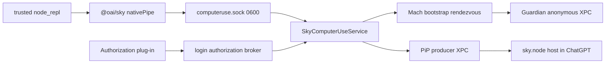
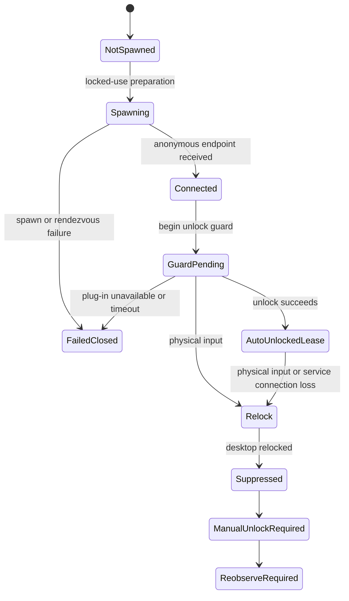
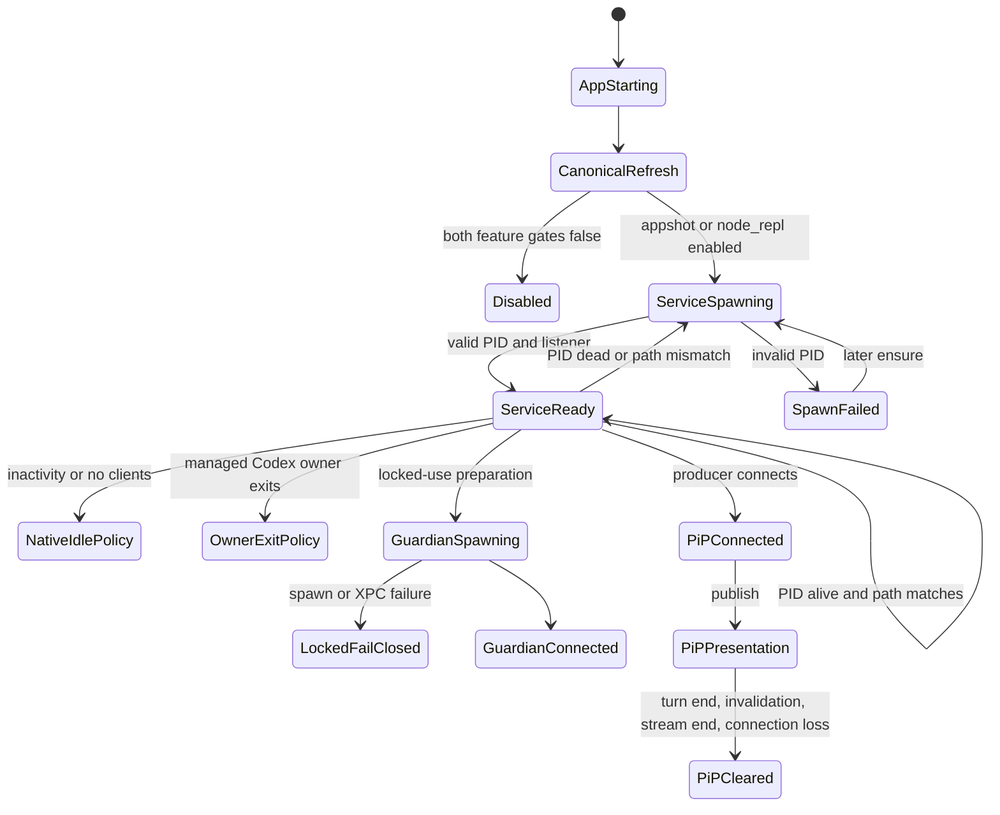

# Codex App Computer Use Service 只读深挖

## 0. 调查边界

本报告继续前三版和动态 V4，但只调查真实 service 的操作系统层：

```text
进程树
launchd / runningboard
native spawn 与 recovery
canonical 安装和升级刷新
普通 IPC / Guardian XPC / authorization broker / PiP
codesign / entitlements / TCC
锁屏 fail-closed
unified log schema 与聚合
Skysight / Event Stream / telemetry 生命周期
数据留存与清理
```

固定版本：

```text
ChatGPT                    26.707.51957 (5175)
Codex Computer Use         26.710.1000387 (1000387)
macOS                      26.5.2 arm64
```

本轮没有：

- 连接 production `computeruse.sock`；
- 调用 Computer Use action；
- 调用 Installer；
- 修改 TCC 或 authorizationdb；
- 重启、终止或杀死进程；
- 读取截图像素、AX 文本、审批列表、Event Stream JSONL；
- 读取 analytics payload、URL、header 或网络 body；
- 保存 raw unified log。

机器可读证据：

```text
codex-computer-use-lab/fixtures/service-lifecycle/latest.json
```

完整英文证据章节和复现命令：

```text
codex-computer-use-lab/docs/16-service-process-lifecycle-and-retention.md
```

## 1. 核心结论

1. 普通 Computer Use 没有独立 launchd daemon。
2. ChatGPT 直接拉起 `SkyComputerUseService`。
3. Sky service 按需拉起 `CUALockScreenGuardian`。
4. Electron 负责 PID/path 检查和按需 spawn，native 负责 owner/client/idle shutdown。
5. Guardian 走 Mach bootstrap rendezvous + anonymous XPC，不走 broker Unix socket。
6. authorization broker pathname 可以先 unlink，而 listener FD 继续存在。
7. PiP 是独立 XPC presentation channel，最近两小时确有 publish 活动。
8. Skysight/Event Stream 当前没有活动正证据，但不能据此判断 disabled。
9. Analytics event queue 当前为 0 行，但 identity、Statsig cache 和 DB allocation 持久。
10. 所有恢复路径都应区分“重新连接/重拉进程”和“重新观察 UI 状态”。

## 2. 完整进程树

主快照：

```text
launchd / runningboard
└─ ChatGPT
   ├─ codex app-server
   │  └─ node_repl processes
   ├─ SkyComputerUseService
   │  └─ CUALockScreenGuardian
   ├─ Electron helper / renderer
   └─ sky.node loaded by Electron main
```

Computer Use owner 链：

| Process | PID | PPID | Start |
|---|---:|---:|---|
| ChatGPT | 94159 | 1 | 15:17:30 |
| codex app-server | 94341 | 94159 | 15:17:36 |
| SkyComputerUseService | 94559 | 94159 | 15:17:42 |
| CUALockScreenGuardian | 81912 | 94559 | 20:18:47 |

Guardian 的启动时间与 production 锁屏实验一致。它不是 App 启动时常驻，而是
锁屏路径首次需要时出现；锁屏请求 fail closed 后仍然留存。

app-server 快照下有 56 个 `node_repl`，这是当时所有打开 Codex task 的总量，不是
单个 Computer Use session 的固定开销。

## 3. launchd 边界

ChatGPT：

```text
type        Submitted
managed_by  runningboard
bundle id   com.openai.codex
state       running
```

Sky service 与 Guardian：

```text
com.apple.xpc.launchd.unmanaged.SkyComputerUseS.<pid>
com.apple.xpc.launchd.unmanaged.CUALockScreenGu.<pid>
```

本机没有发现：

```text
Computer Use LaunchAgent
Computer Use LaunchDaemon
installed Computer Use SecurityAgent plug-in
```

因此：

```text
launchd 管 ChatGPT
ChatGPT 管 Sky service
Sky service 管 Guardian
```

launchd 不会作为独立 service supervisor 自动重启 Sky service。

## 4. Electron spawn

Electron managed service class：

```text
enabled = appshotsEnabled || nodeReplEnabled

ensureServicePid:
  if cached PID alive and executable path matches
    reuse
  else
    spawnComputerUseService(canonicalExecutable)
```

`sky.node` 静态确认：

```text
SpawnComputerUseService
SpawnComputerUseServiceWorker.Execute
ComputerUseServiceProcessMatchesExecutablePath
posix_spawn
responsibility_spawnattrs_setdisclaim
```

service 的 PPID 仍是 ChatGPT。`responsibility_spawnattrs_setdisclaim` 不是
daemonization，只影响 macOS responsibility accounting。

## 5. shutdown owner

Electron selected class 中：

```text
setEnabledFeatures
invalidateServicePid
dispose
```

没有显式 kill。

native service 自身包含：

```text
lifecycleMode
inactivityTask
managedCodexOwnerExitSource
ComputerUseIPCServer.clientExitSources
terminatesWhenNoActiveIPCClients
shouldTerminateWhenNoClientsRemain
CodexComputerUseIdleTimeoutReached
```

所以真实 shutdown 是双层：

```text
Electron:
  cache PID
  validate PID/path
  ensure spawn

Native:
  watch managed Codex owner
  watch IPC clients
  apply inactivity policy
```

当前 unknown：

- production lifecycle mode；
- idle timeout 秒数；
- no-client termination 布尔值；
- Guardian 在没有 guard/lease 时的退出超时。

## 6. 安装和升级

三份 native App：

```text
source:
  /Applications/ChatGPT.app/Contents/Resources/
  plugins/openai-bundled/plugins/computer-use/Codex Computer Use.app

cache:
  ~/.codex/plugins/cache/openai-bundled/computer-use/
  1.0.1000387/Codex Computer Use.app

canonical:
  ~/.codex/computer-use/Codex Computer Use.app
```

三份 main executable SHA-256：

```text
27b547d17a11f6f697ee62bfc20e5da6fab3f39848d40191c132b09ae8f68f58
```

启动时序：

```text
15:17:30  ChatGPT starts
15:17:36  canonical executable ctime
15:17:36  app-server starts
15:17:42  Sky service starts
15:17:43  computeruse.sock is created
15:17:48  plugin-cache root is created
```

高可信顺序：

```text
signed source
  -> canonical refresh
  -> managed service spawn
  -> ordinary IPC listener
  -> remaining marketplace/cache reconciliation
```

canonical refresh：

```text
rm canonical target
ditto --noqtn source canonical
```

`ditto` 保留 source mtime，所以不能只用 mtime 判断 refresh。必须组合：

- ctime；
- birth time；
- executable hash；
- process start time；
- socket creation time；
- cache creation time。

ChatGPT 有 Sparkle update state 和 public update signing key。Sky service 没有独立
updater。新 native bundle 由 ChatGPT update 带入，并在下次 App 启动刷新 canonical。

unknown：

- App 运行中被更新时，各 update mode 是否都先要求 App 退出；
-旧 plugin-cache version 的淘汰策略；
- path-mismatched old service 是被显式终止，还是等待 native owner/idle policy。

## 7. IPC 总图



### 7.1 Ordinary Computer Use socket

```text
group container       0700
IPC directory         0700
socket lock file      0600
computeruse.sock      0600
```

listener 由 Sky service 持有。

本轮只运行 `stat`、`lsof`、`netstat`，没有 connect 或 write。

### 7.2 Guardian XPC

service 启动 Guardian 时传入：

```text
2DC432GLL2.com.openai.sky.CUAService.lock-screen-guardian.<uuid>
```

链路：

```text
service creates Mach rendezvous
  -> Guardian looks it up
  -> Guardian sends anonymous XPC endpoint
  -> service creates CUALockScreenGuardianClient
```

thread-bound 方法：

```text
beginUnlockGuard
completeUnlockGuard
retainAutoUnlockedLease
releaseAutoUnlockedLease
```

Guardian 没有 named Unix socket。

### 7.3 Login authorization broker

service listener：

```text
/tmp/com.openai.sky.CUAService/LockScreenLoginAuthorization.sock
```

pathname 存在时 mode 为 `0666`。因此 embedded authorization plug-in 必须检查：

```text
peer audit token
peer signing identifier
peer Team ID
```

本轮还观察到：

```text
test -S / stat     pathname absent
lsof / netstat     listener FD still alive
```

这表示：

```text
filesystem pathname lifecycle
!=
already-open listener FD lifecycle
```

pathname unlink 的精确触发条件 unknown。

### 7.4 PiP XPC

ChatGPT launchd job 暴露：

```text
com.openai.codex.remote-hosted-pip-content
```

host：

```text
sky.node / Electron main
```

producer：

```text
SkyComputerUseService
```

presentation 绑定：

```text
presentation ID
thread ID
turn ID
context ID
operation ID
fence
```

最近两小时聚合：

```text
RemoteHostedPIPContent records       518
generic presentation publishes       14
explicit Browser Use publishes        1
```

这确认 PiP host/publish 生命周期近期活动过；最终瞬间 active presentation count
仍然 unknown。

## 8. codesign 与 entitlements

所有检查组件：

- strict `codesign --verify --deep --strict` 通过；
- Team ID `2DC432GLL2`；
- Developer ID signature；
- Hardened Runtime。

矩阵：

| Component | App Sandbox | App group | Keychain group |
|---|---:|---:|---:|
| ChatGPT | yes | yes | yes |
| Sky service | no | yes | yes |
| Sky client | no observed | yes | yes |
| Guardian | no entitlement keys observed | no | no |
| Installer | no entitlement keys observed | no | no |
| Authorization plug-in | no entitlement keys observed | no | no |

Sky service 是 unsandboxed native capability owner。

## 9. TCC

系统 TCC read-only exact-client query：

| Client | Accessibility | Screen Capture |
|---|---:|---:|
| `com.openai.codex` | allowed | allowed |
| `com.openai.sky.CUAService` | allowed | allowed |
| Guardian | no row observed | no row observed |
| Sky client | no row observed | no row observed |

service，而不是 Guardian，持有普通 CUA 的 TCC grant。

没有 TCC row 不等于 code path 不存在，只能写 `not observed`。

## 10. Locked Use readiness

```text
embedded authorization plug-in   present
embedded plug-in signature       valid
installed plug-in                absent
authorizationdb reference        absent
effective managed requirement    unset
ready                            false
```

Guardian process 存在，不等于自动解锁能力已安装。

普通 service、Guardian、authorization plug-in 是三层不同状态：

```text
service running
guardian connected
privileged unlock unavailable
```

## 11. Guardian fail-closed 状态机



静态明确：

```text
physical input during guarded unlock
  -> interrupt connection
  -> relock
  -> suppress automatic unlock until manual unlock

service connection loss during guarded unlock
  -> immediate relock
  -> fail closed
```

production 锁屏实验已经确认：

```text
screen locked
  -> -10020
  -> no AX
  -> no screenshot
  -> no action
```

恢复必须：

```text
manual unlock
  -> get_app_state
  -> fresh action
```

不是重放旧 action。

## 12. 故障恢复状态机



恢复表：

| Failure | Immediate effect | Recovery |
|---|---|---|
| cached PID dead | cache invalid | next ensure respawns |
| executable path mismatch | reject PID | spawn canonical executable |
| invalid spawn PID | manager error | later ensure |
| IPC sender auth failure | reject request | valid authorized client |
| TCC pending | no action | wait, fresh request |
| TCC denied | no action | grant, fresh request |
| no active session | no action | `get_app_state` |
| screen locked | no observation/action | unlock, `get_app_state` |
| Guardian spawn/XPC failure | no auto-unlock | manual unlock |
| physical input during unlock | relock and suppress | manual unlock |
| Guardian connection loss | relock | manual unlock |
| stale/ambiguous element | no action | re-observe |
| PiP connection loss | clear remote presentations | reconnect/re-publish |
| Skysight stop/pause/exclusion | capture stops | explicit allowed start |

## 13. unified log schema

8 小时 service + Guardian，过滤 NDJSON 尾部非事件对象后：

```text
total events                 92,196
SkyComputerUseService        92,038
CUALockScreenGuardian           158
```

top subsystem：

```text
empty/default                59,604
com.apple.coremedia          24,480
com.apple.xpc                 2,407
com.apple.TCC                 1,860
com.apple.network             1,851
inc.software.app                551
com.apple.CFNetwork             427
com.apple.appleevents           310
```

selected categories：

```text
Computer Use                    88
Accessibility                  170
Screenshot Implementation       52
Computer Use Cursor             43
SystemFocusStealPreventer        34
Security                         12
```

NDJSON event schema keys：

```text
timestamp
processID
processImagePath
subsystem
category
messageType
eventMessage
activityIdentifier
threadID
traceID
senderImagePath
source
```

Mach-O 简单 format scan：

```text
%{public} markers    95
%{private} markers    0
```

这不表示每条日志都包含隐私，但表示 raw logs 必须按用户数据处理。

本轮 fixture 不保存 `eventMessage`。

## 14. unified log 取证陷阱

### 14.1 NDJSON trailer

当前 macOS 的 `log show --style ndjson` 末尾有一个没有 `timestamp` 的元对象。

必须：

```jq
[.[] | select(has("timestamp"))]
```

再做 count。

### 14.2 查询成本

8 小时、多进程、全文 marker scan 可能需要数分钟。

优先：

```text
single process
short time window
log predicate filters exact lifecycle marker
```

再扩展到 subsystem/category aggregate。

## 15. network

瞬时 `lsof -i`：

```text
Sky service TCP/UDP FD   0
Guardian TCP/UDP FD      0
```

但同时存在：

- `com.apple.network` / CFNetwork logs；
- URL Cache DB row；
- Statsig client；
- Datadog transport；
- site-status policy checker。

准确结论：

```text
no network FD at sampled instants
  + intermittent network framework evidence
  + destination/body not collected
```

不能写成“Sky service 不联网”。

## 16. screenshot 留存

production synthetic-app 实验已经确认：

```text
capture A -> JPEG A
capture B -> JPEG B
A and B coexist during app session
target app session ends
A and B are removed
```

当前快照：

```text
screenshot_* files      0
service-open files      0
```

清理时点是 app-session end，而不是 response 后立即删除。

精确 cleanup owner 仍 unknown。

## 17. Skysight / Event Stream

当前：

```text
Skysight segment files             0
service-open segment files         0
exact named Skysight log events    0
exact named Event Stream events    0
```

只能判断：

```text
not observed in selected snapshot
```

不能判断 disabled。

binary 明确：

```text
raw event stream segments
ephemeral; not persisted
SkysightClearHistoryScope
clearHistory
```

unknown：

- current feature eligibility；
- current recording；
- exact Event Stream session root；
- Skysight durable summary store；
- segment deletion delay。

临时目录存在 1 个通用 `events.jsonl` / `metadata.json` / `session.json` 命名文件。
本轮没有读取其路径和内容，不能归因给 CUA。

## 18. PiP 留存

没有发现 dedicated PiP DB。

静态 lifecycle：

```text
publish presentation
prepare operation
complete operation
complete thread
invalidate turn
will end stream
invalidate presentation
discard connection
clear remote presentations
```

高可信模型：

```text
in-memory presentation objects
  + remote layer XPC
  + connection/thread/turn cleanup
```

## 19. Analytics DB

路径：

```text
~/Library/Group Containers/
2DC432GLL2.com.openai.sky.CUAService/
Library/Application Support/Software/Analytics.db
```

schema：

```text
analytics_event(id TEXT, timestamp TEXT, payload BLOB)
distinct_id(distinct_id TEXT)
distinct_id_alias(distinct_id TEXT, alias TEXT)
```

只读 row count：

```text
analytics_event        0
distinct_id            2
distinct_id_alias      0
```

metadata：

```text
file bytes             598,016
journal mode           delete
secure_delete          FAST
auto_vacuum            incremental
page count             146
freelist pages         138
```

结论：

1. 当前 event queue 为空。
2. identity rows 持久。
3. 大部分 page 已进入 freelist。
4. DB 文件没有立即缩小。
5. 未读取 raw page，无法判断已删除 payload 是否可恢复。

## 20. Statsig / URL Cache / HTTP Storage

`com.openai.sky.CUAService.plist` 只枚举 key/type/size：

```text
NSStatusItem booleans                  2
Statsig cache-key mapping data         77 bytes
Statsig local storage data        412,859 bytes
Statsig stable ID                      36 chars
```

没有复制值。

URL Cache：

```text
response rows       1
blob rows           1
receiver rows       1
```

HTTP Storage：

```text
alt_services rows   0
```

没有读取 URL、host、header、cache body 或 analytics payload。

## 21. 文件和目录权限

```text
CUA group container       0700
IPC directory             0700
ordinary socket           0600
ordinary lock file        0600
user TMPDIR               0700
Analytics Software dir    0755
CUA cache dir             0755
CUA HTTP storage dir      0755
```

cache/DB 文件通常为 `0644`，但父目录位于用户 home 下。它们不是 group container
级别的 owner-only mode，需要把 home ACL/ownership 纳入完整本地威胁模型。

## 22. 数据留存与清理总表

| Artifact | Current retention | Cleanup |
|---|---|---|
| canonical native app | durable | whole-target replacement on refresh |
| versioned plugin cache | durable | old-version eviction unknown |
| ordinary socket lock file | durable, zero bytes | survives observed starts |
| ordinary socket | service lifetime | recreated on service start |
| broker pathname | dynamic | may unlink before listener FD closes |
| screenshot JPEG | app session | removed after target app session end |
| Skysight raw segment | ephemeral by static contract | exact delay unknown |
| Event Stream session | temporary | exact root and delay unknown |
| PiP presentation | in memory/XPC | turn/thread/connection cleanup |
| Analytics events | local queue | current queue empty |
| Analytics identity | durable | deletion policy unknown |
| Statsig local storage | durable preference data | cleanup policy unknown |
| URL cache | durable cache | system/Foundation policy |

## 23. 可复现只读命令

### 23.1 Process tree

```bash
ps -axo pid=,ppid=,pgid=,uid=,state=,lstart=,etime=,comm= |
  awk '{
    pid=$1; ppid=$2;
    $1=$2="";
    sub(/^[[:space:]]+/, "", $0);
    if ($0 ~ /SkyComputerUseService$/ ||
        $0 ~ /CUALockScreenGuardian$/ ||
        $0 == "/Applications/ChatGPT.app/Contents/MacOS/ChatGPT" ||
        $0 == "/Applications/ChatGPT.app/Contents/Resources/codex")
      print pid, ppid, $0
  }'
```

不能直接使用 `$3` 作为 executable path，因为 App path 含空格。

### 23.2 launchd

```bash
launchctl print "gui/$(id -u)" |
  rg -i -C 3 \
  'application\.com\.openai\.codex|SkyComputerUseS|CUALockScreenGu|remote-hosted-pip'
```

### 23.3 Unix sockets

```bash
lsof -nP -U |
  awk 'NR == 1 || /computeruse\.sock|LockScreenLoginAuthorization\.sock/'

netstat -anv -f unix |
  awk '/computeruse\.sock|LockScreenLoginAuthorization\.sock/'

stat -f '%N %HT %Lp %u %B %m %c' \
  "$HOME/Library/Group Containers/2DC432GLL2.com.openai.sky.CUAService/IPC/"* \
  /tmp/com.openai.sky.CUAService 2>/dev/null
```

### 23.4 codesign / entitlements

```bash
CU="$HOME/.codex/computer-use/Codex Computer Use.app"

codesign --verify --deep --strict "$CU"
codesign -d --verbose=4 "$CU" 2>&1 |
  rg '^(Identifier|TeamIdentifier|Authority|Timestamp|Runtime Version)='
codesign -d --entitlements :- "$CU" 2>/dev/null |
  plutil -convert xml1 -o - -
```

### 23.5 TCC

```bash
sqlite3 -readonly -separator $'\t' \
  '/Library/Application Support/com.apple.TCC/TCC.db' \
  "select service,client,auth_value,auth_reason,flags,last_modified
     from access
    where client in (
      'com.openai.codex',
      'com.openai.sky.CUAService',
      'com.openai.sky.CUAService.guardian',
      'com.openai.sky.CUAService.cli'
    )
      and service in (
        'kTCCServiceAccessibility',
        'kTCCServiceScreenCapture',
        'kTCCServiceListenEvent',
        'kTCCServicePostEvent',
        'kTCCServiceAppleEvents'
      )
    order by client,service,last_modified;"
```

### 23.6 Analytics schema/count

```bash
DB="$HOME/Library/Group Containers/2DC432GLL2.com.openai.sky.CUAService/Library/Application Support/Software/Analytics.db"

sqlite3 -readonly "$DB" \
  "select name,type from sqlite_master
    where type in ('table','index','trigger','view')
    order by type,name;"

sqlite3 -readonly "$DB" \
  "select count(*) from analytics_event;
   select count(*) from distinct_id;
   pragma secure_delete;
   pragma auto_vacuum;
   pragma journal_mode;
   pragma page_count;
   pragma freelist_count;"
```

### 23.7 Aggregate-only logs

```bash
log show --last 30m --style ndjson --info --debug \
  --predicate \
  'process == "SkyComputerUseService" OR process == "CUALockScreenGuardian"' \
  2>/dev/null |
jq -sc '
  [.[] | select(has("timestamp"))] |
  {
    records: length,
    by_subsystem:
      ([.[] | .subsystem // "<none>"] |
       group_by(.) |
       map({key: .[0], count: length}) |
       sort_by(-.count)),
    by_category:
      ([.[] | .category // "<none>"] |
       group_by(.) |
       map({key: .[0], count: length}) |
       sort_by(-.count))
  }'
```

## 24. 采集器陷阱

### 24.1 zsh `path`

zsh 中 `path` 与 `PATH` 绑定。

不要：

```bash
for path in ...
```

应使用：

```bash
for item_path in ...
```

### 24.2 Homebrew tool path

不要假设：

```text
/usr/bin/rg
```

应使用：

```bash
command -v rg
```

### 24.3 `ps` path with spaces

`Codex Computer Use.app` 含空格。`awk '$3 == path'` 会误判。

### 24.4 `ditto` mtime

mtime 可能来自 source，不等于 refresh time。

### 24.5 socket name vs FD

`test -S` absent 不等于 listener FD 已关闭。

### 24.6 instantaneous network

`lsof -i` 采样为 0 不等于历史无连接。

## 25. Unknown

1. current managed lifecycle mode；
2. service idle timeout；
3. no-client termination policy；
4. Guardian idle exit policy；
5. broker pathname unlink trigger；
6. current Skysight eligibility；
7. Skysight durable summary store；
8. current Event Stream recording；
9. exact Event Stream session root；
10. final PiP active presentation count；
11. telemetry destination、payload、batch interval、send result；
12. old plugin-cache eviction policy；
13. deleted Analytics payload recoverability。

## 26. 最终判断

当前本机 Computer Use 的真实 service architecture 是：

```text
ChatGPT Electron supervisor
  -> canonical native service
  -> owner-only ordinary IPC
  -> unsandboxed TCC capability boundary
  -> on-demand Guardian anonymous XPC
  -> optional privileged authorization plug-in
  -> independent PiP XPC presentation
  -> independent Skysight/Event Stream lifecycle
  -> persistent telemetry/cache plane
```

最关键的工程边界：

- App process 存活不等于 service PID 正常；
- service PID 正常不等于 active app session 存在；
- Guardian 存活不等于 Locked Use ready；
- socket pathname 不等于 listener FD；
- PiP publish 不等于最终瞬间 active；
- `not observed` 不等于 disabled；
- analytics queue empty 不等于 telemetry state 已清空；
-任何进程/IPC 恢复之后，UI action 仍必须重新 `get_app_state`。

