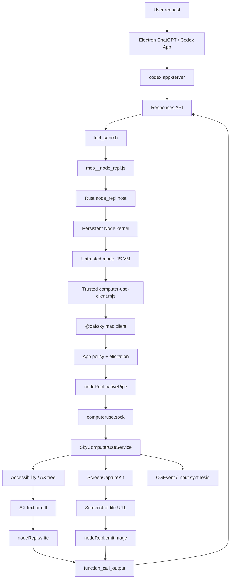
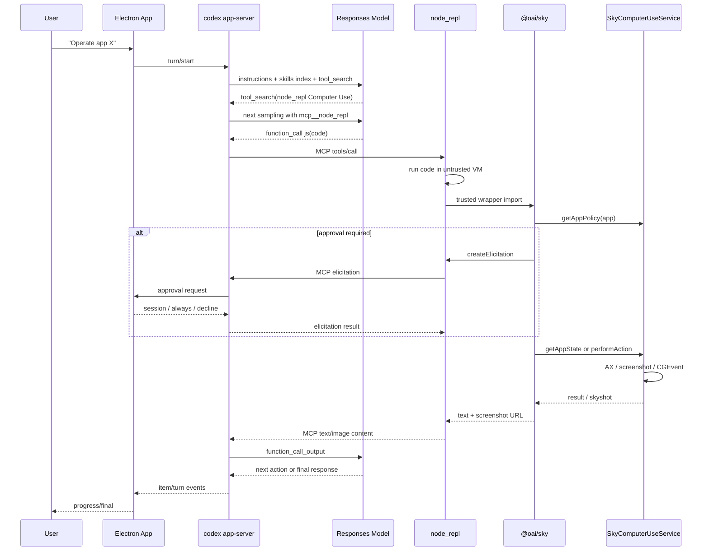

# Codex App Computer Use 全链路逆向

调查日期：2026-07-12  
调查环境：macOS，本机 Codex App / ChatGPT App  
主要对象：`/Applications/ChatGPT.app`、`~/.codex/computer-use`、`cua_node`、`@oai/sky`、`codex app-server`

## 0. 结论摘要

本机当前 Codex App 的 Computer Use 不是一个简单的“模型直接输出坐标，然后 App 点击”的系统，也没有使用 Responses API 公开的 `type: "computer"` / `computer_call` 协议。

它实际采用下面这条主链：

```text
用户请求
  -> Electron ChatGPT/Codex App
  -> codex app-server
  -> Responses API 模型采样
  -> 模型调用 tool_search
  -> 延迟暴露 mcp__node_repl.js
  -> 模型输出普通 function_call，参数是一段 JavaScript
  -> node_repl Rust MCP server
  -> 持久化、隔离的 Node.js kernel
  -> 可信 computer-use-client.mjs
  -> @oai/sky mac client
  -> nodeRepl.nativePipe 特权桥
  -> 4-byte length-prefixed JSON-RPC 2.0
  -> computeruse.sock
  -> SkyComputerUseService
  -> macOS Accessibility + ScreenCaptureKit + CGEvent
  -> AX 文本/diff 与截图 URL
  -> nodeRepl.write / nodeRepl.emitImage
  -> function_call_output
  -> 下一轮模型采样
```

一句话概括：

> 模型看到的是一个受控 JavaScript 工具宿主；JavaScript 通过可信插件代码获得有限的本机桥接能力；真正的桌面观察和输入执行发生在独立签名的原生 `SkyComputerUseService` 中。

### 最重要的六个判断

1. **模型输入里没有原生 `computer` tool。**  
   当前本机真实 Responses 请求使用 `tool_choice: "auto"`，Computer Use 通过 deferred MCP `node_repl` 被按需加载。

2. **当前主路径不是 legacy Computer Use MCP。**  
   `SkyComputerUseClient mcp` 仍随插件分发，但本机 `config.toml` 中 `mcp_servers.computer-use.enabled = false`；活跃路径是 `node_repl + @oai/sky`。

3. **语义定位优先，像素定位兜底。**  
   `get_app_state` 返回 AX tree 和元素索引。`click`、`set_value`、`select_text`、secondary AX action 等可以按元素执行；只有缺少可用 AX 目标时才退到截图坐标。

4. **安全控制是多层的。**  
   模型确认策略、trusted/untrusted Node VM、逐应用审批、组织策略、执行层 app/URL denylist、socket peer 鉴权、macOS TCC、锁屏和用户物理介入检测彼此独立。

5. **动作成功不自动等于任务成功。**  
   普通动作 API 返回 `void`；模型必须重新调用 `get_app_state`，根据新的 AX tree/diff 或截图判断是否生效。

6. **本地协议与公开 Responses Computer Use API 是两套设计。**  
   公开 API 使用 `computer_call.actions[] -> computer_call_output screenshot`；Codex App 本地路径使用普通 `function_call(js) -> function_call_output`。

## 1. 证据等级

本文使用四级证据，避免把存在于二进制中的备用代码误写成当前主路径。

| 等级 | 定义 | 例子 |
|---|---|---|
| A | 本机运行态直接确认 | `ps`、`lsof`、真实 Responses POST、实际动态调用 |
| B | 本机分发源码/协议直接确认 | `@oai/sky` JavaScript、skill、plugin manifest、生成 schema |
| C | 与安装二进制精确版本匹配的开源源码 | `rust-v0.144.0-alpha.4` / commit `049586f...` |
| D | 二进制符号、字符串、framework 和行为推断 | Swift 类名、错误文本、未触发备用分支 |

文中的“确认”主要来自 A/B/C；仅由 D 支撑的内容会明确写成“存在实现迹象”或“推断”。

## 2. 本机版本与组件

### 2.1 App 壳

| 项目 | 值 |
|---|---|
| App 路径 | `/Applications/ChatGPT.app` |
| Bundle ID | `com.openai.codex` |
| App 版本 | `26.707.51957` |
| Build | `5175` |
| Chromium | `150.0.7871.115` |
| Electron ASAR | `/Applications/ChatGPT.app/Contents/Resources/app.asar` |

虽然文件名和显示名为 ChatGPT，但 Bundle ID、URL scheme、分类和内部资源都表明这是当前 Codex 桌面 App 壳。

### 2.2 内嵌 Codex

| 项目 | 值 |
|---|---|
| 二进制 | `/Applications/ChatGPT.app/Contents/Resources/codex` |
| 版本 | `codex-cli 0.144.0-alpha.4` |
| 匹配 tag | `rust-v0.144.0-alpha.4` |
| 匹配 commit | `049586f41571e74b44c841868bca3a2233214a71` |

当前主进程启动命令：

```text
/Applications/ChatGPT.app/Contents/Resources/codex
  -c features.code_mode_host=true
  app-server
  --analytics-default-enabled
```

`--analytics-default-enabled` 只控制第一方宿主的 analytics 默认值，不是 Computer Use 权限开关。

### 2.3 Computer Use 插件和原生服务

| 项目 | 值 |
|---|---|
| 插件版本 | `1.0.1000387` |
| 原生 App 版本 | `26.710.1000387` |
| Bundle ID | `com.openai.sky.CUAService` |
| 主二进制 | `~/.codex/computer-use/Codex Computer Use.app/Contents/MacOS/SkyComputerUseService` |
| SHA-256 | `27b547d17a11f6f697ee62bfc20e5da6fab3f39848d40191c132b09ae8f68f58` |

原生服务：

- arm64；
- 最低 macOS 14.4；
- Developer ID 签名；
- 已公证；
- Hardened Runtime；
- `LSUIElement = true`，无 Dock 图标；
- 没有 App Sandbox entitlement；
- 有 OpenAI app group 和 keychain group。

服务有独立 Sparkle 更新 feed，因此 Computer Use 是独立版本和独立更新节奏的组件，不要求与 Electron App 使用同一版本号。

### 2.4 `cua_node`

| 项目 | 值 |
|---|---|
| 根目录 | `/Applications/ChatGPT.app/Contents/Resources/cua_node` |
| Node | `v24.14.0` |
| node_repl | `20260707.2` |
| runtime archive | `cua-node-0.0.3-20260708050802-66a5641b5362-pr-1103797-darwin-arm64.tar.gz` |
| `@oai/sky` | `/Applications/ChatGPT.app/Contents/Resources/cua_node/lib/node_modules/@oai/sky` |

## 3. 进程拓扑

2026-07-12 18:08:30 +0800 的运行快照：

```text
launchd / RunningBoard
└─ ChatGPT PID 94159
   ├─ codex app-server PID 94341
   │  ├─ node_repl ×54
   │  ├─ @playwright/mcp ×54
   │  └─ tavily-mcp ×54
   └─ SkyComputerUseService PID 94559
```

数量是瞬时值；取证期间 `node_repl` 从 42 增到 54。可以确认：

- Electron 直接启动 app-server；
- Electron 直接启动 `SkyComputerUseService`；
- 每个活跃任务/运行时可能派生自己的一套 stdio MCP 子进程；
- `node_repl` 是 app-server 子进程，不是 Sky 服务子进程；
- Sky 服务没有 TCP/UDP listener；
- `node_repl` 自身没有直接持有 `computeruse.sock`；
- socket 连接由 `node_repl` Rust host 的特权桥代为创建。

这解释了为什么只看 `lsof node_repl` 会误以为它没有与 Computer Use 通信。

## 4. Electron 到 app-server

### 4.1 Electron 静态入口

ASAR 内主要入口：

```text
.vite/build/early-bootstrap.js
.vite/build/bootstrap-DIX4vlqR.js
.vite/build/main-BHxSB3aK.js
.vite/build/preload.js
webview/index.html
webview/assets/computer-use-settings-CDg_JYdq.js
```

主窗口启用：

```text
contextIsolation: true
nodeIntegration: false
```

preload 只暴露受控 `electronBridge`，renderer 不直接获得 Node。

### 4.2 app-server transport

本地默认是 stdio，不是 daemon：

```text
ChatGPT stdin/stdout/stderr socketpair
  <-> codex app-server FD 0/1/2
```

app-server stdio 协议：

- 每行一个 JSON；
- stdout 每个 JSON 后追加换行；
- 是 JSON-RPC-like 协议；
- 外层 app-server wire **省略** `"jsonrpc": "2.0"`。

初始化：

```json
{"id":1,"method":"initialize","params":{"clientInfo":{},"capabilities":{}}}
{"method":"initialized"}
```

核心生命周期：

```text
thread/start or thread/resume
  -> turn/start
  -> thread/started
  -> thread/status/changed
  -> turn/started
  -> item/started
  -> item/*/delta or item/*/progress
  -> item/completed
  -> turn/completed
  -> thread/status/changed
```

可选 daemon 路径使用：

```text
$CODEX_HOME/app-server-control/app-server-control.sock
```

但本次运行实例没有走 daemon。

## 5. 模型输入：Computer Use 如何进入 prompt

### 5.1 初始工具表

本机真实 Responses POST 证明，初始请求包含：

- core function tools；
- `tool_search`；
- web search；
-部分 namespace tools。

没有：

```json
{"type":"computer"}
```

也没有直接暴露：

```text
click
get_app_state
type_text
```

### 5.2 Skill 注入

Computer Use 插件的实际 skill：

```text
~/.codex/plugins/cache/openai-bundled/computer-use/1.0.1000387/
  skills/computer-use/SKILL.md
```

插件 manifest：

```json
{
  "name": "computer-use",
  "version": "1.0.1000387",
  "bundledContentVariant": "node-repl"
}
```

模型初始上下文只获得 skill 的：

- 名称；
- 简介；
- 文件定位器。

skill 正文要求：

1. 通过 `node_repl` 操作；
2. 加载插件 wrapper；
3. 不直接 import `@oai/sky`；
4. 每次 fresh Node session 初始化一次；
5. 动作后重新读取状态。

### 5.3 Deferred tool discovery

`node_repl` 是 deferred MCP。典型过程：

```text
模型判断需要桌面操作
  -> tool_search("node_repl ... Computer Use")
  -> 下一次模型请求临时加入 node_repl namespace
  -> 模型获得 js / js_reset / js_add_node_module_dir
```

暴露面：

```text
mcp__node_repl.js({ code, title?, timeout_ms? })
mcp__node_repl.js_reset()
mcp__node_repl.js_add_node_module_dir({ path })
```

Computer Use 的十个动作仍然不是顶层模型工具。它们是 JS 对象 `sky` 的方法。

## 6. 模型输出与工具调用

模型输出是普通 Responses function call，概念形态如下：

```json
{
  "type": "function_call",
  "namespace": "mcp__node_repl",
  "name": "js",
  "arguments": {
    "code": "await sky.get_app_state(...)"
  }
}
```

它不是：

```json
{
  "type": "computer_call",
  "actions": []
}
```

app-server 处理路径：

```text
Responses SSE response.output_item.done
  -> ResponseItem::FunctionCall
  -> ToolRouter
  -> MCP connection manager
  -> node_repl tools/call
  -> MCP result
  -> mcpToolCall item
  -> function_call_output
  -> 下一轮 Responses input
```

## 7. `node_repl`：受控 JavaScript 宿主

### 7.1 不是普通 Node shell

`node_repl` 是 Rust 编写的 MCP stdio server。首次 `js` 调用时：

1. 启动打包的 Node 24.14.0；
2. 加载内嵌 `kernel.js`；
3. 通过 JSONL 与 Node kernel 通信；
4. 在同一工具会话内持久化 top-level binding。

### 7.2 untrusted VM 与 trusted VM

模型写的 cell 默认在 **untrusted VM context**。

公开给模型代码的能力包括：

```text
nodeRepl.write
nodeRepl.emitImage
nodeRepl.setResponseMeta
nodeRepl.requestMeta
nodeRepl.cwd
nodeRepl.homeDir
nodeRepl.tmpDir
```

隐藏的 trusted-only 能力包括：

```text
nodeRepl.nativePipe
nodeRepl.createElicitation
nodeRepl.withSuspendedTimeout
nodeRepl.launchServices
完整 nodeRepl.env
```

普通模型代码不能直接取得这些对象。

可信模块由：

- 可信路径；
- 可信 source hash；
- canonicalized module path

决定。可信模块进入 trusted VM 后，才会获得 privileged bridge。

### 7.3 进程与协议保护

`node_repl` 明确禁止直接 import：

```text
process
node:process
```

理由是 Rust host 与 Node child 目前通过 stdio 通信；原始 `process.stdout`/`stdin` 可破坏协议。

此外还包括：

- 模块解析限制；
- `.js` / `.mjs` 本地文件限制；
- Node builtin denylist；
- package resolution 必须落在允许的 `node_modules` root；
- trusted/untrusted module cache 分离；
- JS timeout 和 kernel reset；
- async error 后 kernel 终止/重置。

### 7.4 当前可信根风险

本机配置：

```toml
NODE_REPL_TRUSTED_CODE_PATHS = "/Users/haoqing/.codex"
```

这意味着 `~/.codex` 下被动态 import 的代码可能获得 trusted capabilities。

这是当前设计中最值得关注的本地攻击面之一：

- project 内普通代码不自动可信；
- 但任何能写入 `~/.codex` 的主体，理论上可能植入后续被 import 的可信 JS；
- 依赖文件权限、Codex sandbox、用户确认、插件签名/来源管理共同约束。

更稳健的设计应尽量把 trusted root 收窄到：

```text
特定 plugin version root
特定文件 hash
只读 app bundle runtime
```

而不是整个 `~/.codex`。

## 8. 插件 wrapper

入口：

```text
~/.codex/plugins/cache/openai-bundled/computer-use/1.0.1000387/
  scripts/computer-use-client.mjs
```

wrapper 做四件事：

1. 从 `NODE_REPL_NODE_MODULE_DIRS` 找 `@oai/sky`；
2. 精确加载 mac target 的 `create_client.js`；
3. 调用 `create_client({ target: "mac" })`；
4. 将冻结的 client 挂到 `globalThis.sky`。

它使用：

```js
Symbol.for("openai.computer-use.runtime")
```

缓存 runtime，避免同一个 Node session 重复初始化。

### 8.1 模型可见 API

```ts
type Sky = {
  list_apps(): Promise<App[]>;
  get_app_state(args): Promise<AppState>;
  click(args): Promise<void>;
  drag(args): Promise<void>;
  perform_secondary_action(args): Promise<void>;
  press_key(args): Promise<void>;
  scroll(args): Promise<void>;
  select_text(args): Promise<void>;
  set_value(args): Promise<void>;
  type_text(args): Promise<void>;
}
```

没有暴露：

- 任意 socket；
- 任意 Apple Event；
- 任意 CGEvent；
- 任意 XPC；
- 原生服务管理接口。

## 9. 每次动作前的应用政策

所有面向 app 的动作都经过：

```text
withComputerUsePolicy(toolName, input, callback)
```

流程：

```text
验证 input 是普通数据对象
  -> 提取 app
  -> getAppPolicy(app)
  -> 将目标 bundle id 写入 response meta
  -> 判断 allowed / denied / forbidden
  -> 如需要，createElicitation 请求用户授权
  -> 把 display name 解析为 canonical app path / bundle id
  -> 冻结参数
  -> 暂停 JS tool timeout
  -> 执行动作
```

### 9.1 三种 app policy 结果

```text
allowed
  -> 允许继续

denied
  -> 组织策略阻止

forbidden
  -> 产品安全硬阻止
```

本次动态验证：

```text
get_app_state({ app: "com.openai.codex" })
```

执行层返回：

```text
Computer Use is not allowed to use the app
'com.openai.codex' for safety reasons.
```

因此“不能控制 Codex 自身”不是仅靠提示词，而是执行链中的硬限制。

### 9.2 逐应用授权

授权请求 metadata 包括：

```text
codex_approval_kind = mcp_tool_call
connector_id = computer-use
connector_name = Computer Use
tool_params.app = bundle id
riskLevel
warning subtitle
persist = session or [session, always]
```

UI 对应：

```text
允许此对话
始终允许
```

持久批准由 Electron 管理：

```text
~/Library/Group Containers/
  2DC432GLL2.com.openai.sky.CUAService/
  Library/Application Support/Software/
  ComputerUseAppApprovals.json
```

当前取证快照中该文件不存在，说明本机当时没有落盘的 always-allow 列表，或尚未写入。

### 9.3 参数冻结的意义

policy wrapper：

- 要求 `app` 是 plain data property；
- 拒绝 getter/accessor；
- 复制 property descriptor；
- 将 canonical app path 替换回参数；
- `Object.freeze` 最终输入。

这降低了：

- getter side effect；
- app 参数审批后被替换；
- prototype/accessor 注入；
- approval target 与执行 target 不一致。

## 10. `@oai/sky` mac client

关键源码：

```text
/Applications/ChatGPT.app/Contents/Resources/cua_node/lib/node_modules/
  @oai/sky/dist/project/cua/sky_js/src/targets/mac/
```

### 10.1 API 版本

默认：

```text
CodexComputerUseIPC-2
```

每个 transport 首先发送 `ping`，服务端版本必须完全匹配，否则报 incompatible client version。

### 10.2 请求类型

```text
ComputerUseIPCAppPolicyRequest
ComputerUseIPCAppGetSkyshotRequest
ComputerUseIPCListAppsRequest
ComputerUseIPCAppPerformActionRequest
ComputerUseIPCAppStartRequest
```

### 10.3 动作编码

元素点击：

```json
{
  "click": {
    "at": {"elementID": {"_0": "42"}},
    "clickCount": 1,
    "mouseButton": 0
  }
}
```

坐标点击：

```json
{
  "click": {
    "at": {"coordinate": {"_0": [100, 200]}},
    "clickCount": 1,
    "mouseButton": 0
  }
}
```

其他动作：

```text
drag
performSecondaryAction
pressKey
scroll
setValue
selectText
type
```

输入校验在 JS client 就开始执行：

- 坐标必须 finite；
- element index 必须 integer；
- scroll pages 必须 `> 0`；
- key 不能为空；
- mouse button 和 direction 必须在枚举中。

## 11. Native pipe

### 11.1 Socket

```text
~/Library/Group Containers/
  2DC432GLL2.com.openai.sky.CUAService/
  IPC/computeruse.sock
```

权限：

```text
Group Container  drwx------
IPC directory    drwx------
socket           srw-------
lock file        -rw-------
```

### 11.2 启动与重连

client 的策略：

1. 先尝试连接，预算约 250 ms；
2. 如果不存在，通过 trusted host bridge 请求 `ensureService`；
3. host 可以：
   - 通过 host-services pipe 确保服务；
   - 或用 LaunchServices 打开 CUA App；
4. 再尝试连接，预算约 5 s；
5. `ping` 版本握手；
6. 建立可复用 transport。

服务路径解析顺序：

```text
SKY_CUA_SERVICE_PATH
CODEX_HOME/computer-use/Codex Computer Use.app
bundle id com.openai.sky.CUAService
```

本机当前：

```toml
SKY_CUA_SERVICE_PATH =
"~/.codex/plugins/cache/openai-bundled/computer-use/
  1.0.1000387/Codex Computer Use.app"
```

### 11.3 Framing

每个 frame：

```text
4-byte little-endian unsigned length
+ UTF-8 JSON payload
```

最大：

```text
8 MiB
```

内部 JSON-RPC：

```json
{
  "id": 1,
  "jsonrpc": "2.0",
  "method": "request",
  "params": {}
}
```

注意：这里是真正带 `"jsonrpc": "2.0"` 的协议，与 app-server 外层 stdio wire 不同。

### 11.4 请求 envelope

```json
{
  "clientApiVersion": "CodexComputerUseIPC-2",
  "codexTurnMetadata": {},
  "deadlineUnixMilliseconds": 0,
  "requestType": "ComputerUseIPC...",
  "request": {}
}
```

`codexTurnMetadata` 默认来自：

```text
nodeRepl.requestMeta["x-codex-turn-metadata"]
```

这把原生 Computer Use session 与 Codex thread/turn 关联起来。

### 11.5 串行化

同一 `MacNativePipeTransport` 的请求通过 promise chain 串行执行，而不是并发写入 socket。

默认 request timeout：

```text
120 s
```

用户审批期间使用 `withSuspendedTimeout`，避免“用户正在决定”消耗 JS tool timeout。

## 12. 原生 `SkyComputerUseService`

### 12.1 混合执行架构

从链接 framework、符号、运行采样和返回行为确认，它组合了：

```text
Accessibility
  -> AX tree、元素动作、值、选择、焦点、窗口事件

ScreenCaptureKit
  -> 窗口截图、连续流、PiP

CoreGraphics / CGEvent
  -> 鼠标、键盘、坐标拖拽、按 PID 投递

AppKit / RunningApplication
  -> 应用启动、激活、窗口管理
```

它不是：

- 纯 screenshot + pixel click；
- 纯 AppleScript；
- 纯 AX action；
- 浏览器 DOM/CDP harness。

### 12.2 Accessibility 层

存在的能力：

- 应用、窗口、控件语义树；
- element ID；
- focused window / focused element；
- frontmost app；
- window ordering；
- layout changed；
- element invalidation；
- refetch stale element；
- settable value；
- secondary AX action；
- text marker/range；
- page scroll AX actions；
- synthetic focus enforcement；
- focus steal prevention。

元素失效时，错误文本要求重新获取状态。部分实现还会尝试按上下文重新定位元素；出现多个匹配时 fail closed。

### 12.3 截图层

确认链接和符号：

```text
SCScreenshotManager
SCStream
SCShareableContent
SCWindow
SCContentFilter
CGWindowList*
```

支持迹象：

- 单窗口/多窗口 capture；
- 主窗口裁剪；
- transient UI；
- 阴影和透明度；
- point-resolution normalization；
- JPEG 压缩；
- screenshot file URL；
- PiP continuous stream。

另有 `captureScreenshotWithSkyLight` 备用实现迹象，但没有确认它是当前正常路径。

### 12.4 输入层

确认存在：

- element AX action；
- `CGEvent` 鼠标和键盘；
- mouse move/down/up；
- click count；
- 左/右/中键；
- xdotool 风格 key syntax；
- Unicode text；
- per-PID event posting；
- window activation；
- virtual cursor animation。

当前 TCC 未发现独立 Input Monitoring/Post Event 记录，但服务已获得 Accessibility；不能仅凭这一点断言所有 event tap/recording 分支均活跃。

### 12.5 UI settle

skill 明确说明：

- 动作后 runtime 一般自动等待约 1 秒；
- 如果检测到 loading indicator 或状态变化，可追加等待，最多约 5 秒；
- 然后再捕获状态。

原生符号中也存在：

```text
needsUISettleBeforeSkyshot
window/AX observer
layout invalidation
loading state
```

因此它不是固定 sleep，而是固定基础等待加状态观察的组合。

## 13. 状态返回

### 13.1 `get_app_state`

模型侧结构：

```ts
type AppState = {
  app: string;
  screenshot: null | { url: string };
  text: string;
}
```

`text` 是：

- 首次完整 AX tree；
- 后续 AX diff；
- 或累计 diff；
- 无变化提示。

`disableDiff: true` 强制完整树。

### 13.2 App-specific instructions

服务可返回 `appSpecificInstructions`。

wrapper 会在第一次看到某 app 时拼接：

```xml
<app_specific_instructions>
...
</app_specific_instructions>
AX TREE
```

同一个 Node client session 中只注入一次。Numbers 被显式排除，不注入该前缀。

内置 app instructions 包括：

```text
Slack
Notion
Spotify
iPhone Mirroring
Apple Music
Numbers
Clock
```

这些提示用于修正特定 App 的 AX 怪异行为和交互语义。

### 13.3 AX diff 的价值

AX diff 同时解决：

- token 成本；
- 模型注意力；
- stale element；
- 动作后变化定位。

代价是模型必须遵守：

```text
每次状态更新后重新派生 element_index
不要复用旧 index
```

## 14. 截图如何回到模型

服务返回：

```text
screenshot.url
```

当前 skill 声明本环境通常是：

```text
file://...
```

模型如果只调用 `nodeRepl.write(state.text)`，只会看到 AX 文本，不会自动看到截图像素。

需要显式：

```js
const fs = await import("node:fs/promises");
const { fileURLToPath } = await import("node:url");

await nodeRepl.emitImage({
  bytes: await fs.readFile(fileURLToPath(state.screenshot.url)),
  mimeType: "image/png",
});
```

回传链：

```text
local screenshot file
  -> trusted/untrusted Node reads bytes
  -> nodeRepl.emitImage
  -> kernel normalizes image
  -> data URL / MCP image content
  -> app-server FunctionCallOutputContentItem::InputImage
  -> Responses function_call_output
  -> 下一轮模型视觉输入
```

支持 PNG/JPEG/WebP。

文档存在漂移：

- 当前 skill 说 `file://`；
- 一些 `.d.ts` 注释写 data URL；
- 实际 wrapper 将 URL 当不透明字符串，只验证非空。

运行态和当前 skill 应优先于旧注释。

## 15. 动作结果与反馈闭环

普通动作：

```text
click
type_text
press_key
...
```

成功返回：

```text
Promise<void>
```

因此本地协议没有公开：

```text
ok
observed DOM mutation
focus changed
value changed
semantic success score
```

模型的闭环是：

```text
读取状态
  -> 选择 AX element 或 coordinate
  -> 执行动作
  -> 再读取状态
  -> 检查 AX diff / screenshot
  -> 决定继续、重试或换策略
```

这点与某些自建 CUA harness 的“动作返回 observable effect”设计不同。

## 16. 安全与审批分层

### 16.1 第 1 层：模型行为政策

Computer Use skill 规定高风险 UI 动作的确认时机，包括：

- 删除；
- 创建账号/密钥；
- 对外发送消息；
- 上传文件；
- 敏感数据传输；
- 金融交易；
- 安装软件；
- 修改系统安全设置；
- 医疗行为；
- CAPTCHA；
- 密码修改最终提交。

这层依赖模型遵循政策。

### 16.2 第 2 层：Node VM 隔离

模型代码默认无：

- native pipe；
- launch services；
- elicitation；
-完整环境变量。

只有可信模块获得这些能力。

### 16.3 第 3 层：逐应用政策

`getAppPolicy` 决定：

```text
allowed / denied / forbidden
```

未批准时通过 MCP elicitation 请求：

```text
session / always
```

### 16.4 第 4 层：app-server 通用审批

app-server 自身还有：

```text
approvalPolicy
sandbox policy
named permissions profile
approvalsReviewer
MCP tool approval
MCP elicitation
```

Computer Use app approval与 shell sandbox approval 是两套不同系统。

即使 shell `approval_policy = never`，Computer Use 仍可发起逐应用授权。

### 16.5 第 5 层：组织与管理策略

公开 Codex 配置有：

```toml
[computer_use]
allow_locked_computer_use = false
```

组织策略还可导致 app policy `denied`。

### 16.6 第 6 层：原生硬阻止

二进制和动态验证确认存在：

- app not allowed；
- blocked URL；
- system security process；
- self-control block；
- user stopped session；
- user intervened；
- screen locked；
- no active session；
- ambiguous app；
- invalid/stale element。

### 16.7 第 7 层：IPC 鉴权

Unix socket：

- owner；
- directory mode；
- socket mode；
- lock file；
- file type；
- path staleness；
- peer token/PID；
- sender identity。

Apple Event/XPC 路径还验证：

- sender audit token；
- responsible/parent process；
- signing identifier；
- Team ID；
-一次性 Mach right。

### 16.8 第 8 层：macOS TCC

本机确认：

```text
com.openai.sky.CUAService
  Accessibility: allowed
  Screen Recording: allowed
```

服务权限窗口也主要请求这两项。

## 17. 锁屏 Computer Use

bundle 包含：

```text
CUALockScreenGuardian.app
CodexComputerUseAuthorizationPlugin.bundle
CodexComputerUseAuthorizationPluginInstallerTool
```

可选架构：

```text
active Codex thread
  -> lock detected
  -> one-shot authorization attempt
  -> SecurityAgent plugin asks CUA service
  -> service validates peer identity
  -> guardian monitors physical input/session loss
  -> fail closed / re-lock
```

锁屏授权 socket：

```text
/tmp/com.openai.sky.CUAService/LockScreenLoginAuthorization.sock
```

虽然 socket mode 可为 `0666`，authorization plugin 会读取 peer audit token 并验证：

```text
signing identifier = com.openai.sky.CUAService
Team ID = 2DC432GLL2
```

### 当前机器状态

```text
Codex Computer Use Installer status -> OK: not-installed
system.login.screensaver -> psso-screensaver
```

因此当前机器不能使用 CUA 自动解锁分支。

## 18. App UI 和持久设置

Electron settings 页面包含：

- Any App Computer Use 插件安装/启用；
- Google Chrome 独立控制；
- Excel/PowerPoint document control；
- Always-allowed apps；
- foreground/background click sound；
- Picture-in-picture；
- Always hide PiP；
- Locked Computer Use；
- Computer Use 插件不可用状态。

这再次证明：

```text
Computer Use
Browser Use
Chrome extension
Document Control
```

是四种不同 capability，不应混成一个“万能浏览器/桌面工具”。

## 19. Legacy MCP 入口

插件仍包含：

```json
{
  "mcpServers": {
    "computer-use": {
      "command": "./Codex Computer Use.app/.../SkyComputerUseClient",
      "args": ["mcp"]
    }
  }
}
```

`SkyComputerUseClient` 支持：

```text
cua mcp
cua event-stream mcp
cua skysight mcp
cua turn-ended
```

但当前配置：

```toml
[mcp_servers.computer-use]
enabled = false
```

因此：

- legacy MCP 是随包分发的兼容入口；
- 当前模型主链使用 `node_repl` variant；
- 两者最终都可汇聚到 `SkyComputerUseService`；
- 两者客户端 transport 不完全相同。

## 20. Dynamic tools 不是当前 CUA 主链

app-server 另有 `dynamicTools` 通道：

```text
模型 function call
  -> dynamicToolCall item
  -> app-server 反向 item/tool/call
  -> Electron/renderer handler
  -> contentItems + success
  -> function_call_output
```

但当前 CUA 不走这条链。

证据：

1. 本机真实模型请求中 CUA 通过 `mcp__node_repl`；
2. `node_repl` 是 MCP tool；
3. app-server dynamic namespace 保留/限制了 `computer` 名称；
4. 当前调用记录是 `mcpToolCall` / function call output，不是 `dynamicToolCall`。

## 21. 与公开 Responses Computer Use API 的对照

### 21.1 公开 API

截至 2026-07-12，公开 Responses API 形态：

```json
{
  "tools": [{"type": "computer"}]
}
```

模型返回：

```json
{
  "type": "computer_call",
  "call_id": "...",
  "actions": [
    {"type": "click", "x": 405, "y": 157}
  ],
  "pending_safety_checks": []
}
```

客户端：

1. 顺序执行 `actions[]`；
2. 捕获新截图；
3. 回传 `computer_call_output`；
4. 继续 `previous_response_id`。

### 21.2 本地 Codex App

```text
skill
  -> tool_search
  -> function_call node_repl.js
  -> JS calls sky.*
  -> native service
  -> function_call_output text/image
```

### 21.3 关键差异

| 维度 | 公开 API | Codex App 本地 |
|---|---|---|
| 模型工具 | `type: computer` | 普通 function/MCP call |
| 动作 schema | `actions[]` | JS `sky.*` |
| 定位 | screenshot coordinate | AX element + coordinate |
| 状态回传 | screenshot | AX text/diff + optional screenshot |
| 执行器 | 客户实现 | OpenAI 本机原生服务 |
| app approval | 不规定具体 UI | 本地逐应用 elicitation |
| native OS policy | 客户负责 | Sky service 负责 |

不能用公开 API schema 反推本地 IPC。

## 22. 性能设计

### 22.1 Deferred tool

不在每轮初始工具表中展开整个 Node/browser/CUA namespace，降低：

- prompt token；
- schema 干扰；
-模型工具选择负担。

### 22.2 持久 Node kernel

好处：

- `sky` 只初始化一次；
- app-specific instruction 去重；
-模块和客户端连接复用；
-变量跨 call 保留。

风险：

- state 泄漏；
- stale binding；
- kernel crash 后恢复复杂；
-每个活跃任务都有进程成本。

### 22.3 AX diff

降低状态回传 token，但增加 stale-index discipline。

### 22.4 Native pipe 串行请求

简化：

- app state ordering；
-输入动作排序；
- deadline/error correlation。

代价是同一个 client 无法高吞吐并发执行动作。

### 22.5 当前进程开销

现场快照有 54 组：

```text
node_repl
playwright MCP
tavily MCP
```

这不是 CUA 独有问题，而是 thread-scoped deferred MCP 生命周期带来的整体资源开销。空闲回收、thread close 和 socket cleanup 是值得继续测量的方向。

## 23. 隐私与持久化面

### 23.1 Codex 日志

```text
~/.codex/logs_2.sqlite
```

取证时约 747 MB，包含：

- Responses request body；
- SSE event；
- tool arguments；
- thread/turn metadata。

这是高敏感数据源，不应全文导出或无筛选共享。

### 23.2 Rollout

```text
~/.codex/sessions/YYYY/MM/DD/*.jsonl
```

记录：

- function call；
- function output；
- model message；
-工具执行；
-状态。

### 23.3 CUA 本地状态

确认存在：

```text
Analytics.db
URL cache
HTTP storage
ComputerUseAppApprovals.json（按需）
```

CUA 打开的部分 Chromium/LevelDB FD 与 ChatGPT 完全相同，是启动继承，不能据此断言 CUA 主动读取浏览器数据。

### 23.4 Skysight / Event Stream

bundle 包含：

- Event Stream；
- Skysight；
- Record & Replay；
-本地 JSONL 和记忆 summarizer。

它们有记录 app/window、mouse、keyboard、selection 和 AX 变化的代码路径，但本次没有确认当前账户启用了这些功能。

## 24. Prompt injection 边界

AX tree、网页文本、聊天消息、文档内容都会进入模型上下文。

原生服务可以阻止：

-敏感 app；
-敏感 URL；
-未批准 app；
-锁屏；
-非认证 client。

但它无法判断屏幕文本是不是 prompt injection。

这仍依赖：

-系统/skill 指令；
-把第三方内容视为不可信；
-高风险动作确认；
-专用 connector/tool 优先；
-执行前重新确认用户意图。

App-specific instructions 来自签名 bundle，可信度高于普通屏幕内容；AX tree 本身必须保持 untrusted。

## 25. 主要攻击面和工程风险

### 25.1 Trusted code root 过宽

当前 `NODE_REPL_TRUSTED_CODE_PATHS = ~/.codex`。

风险：

-能写该目录的代码可能成为 privileged module；
-恶意插件 cache、错误同步或本地工具链污染可能扩大影响；
-danger-full-access 任务具有写入该目录的能力。

建议：

-按 plugin version root allowlist；
-hash pin wrapper；
-对 trusted import 做 signature/provenance 校验；
-禁止普通项目任务修改 trusted runtime root。

### 25.2 AX tree prompt injection

语义文本比截图更容易直接影响模型。

建议：

-显式包裹为 untrusted observation；
-在模型层区分 system guidance 与 observed UI text；
-对高风险动作绑定用户原始意图，而不是页面指令。

### 25.3 Persistent app approval

`always` 允许减少摩擦，但增加未来任务的权限范围。

建议：

-在设置中清晰列出 bundle id、display name、风险；
-定期清理；
-高风险 app 禁止 persistent allow；
-组织策略优先级高于本地 allowlist。

### 25.4 Action success 语义较弱

动作只返回 `void`。

风险：

-点击落空；
-焦点错误；
-重复提交；
-模型误以为成功。

建议：

-每个高影响动作后强制 state refresh；
-增加可选 effect summary；
-对发送/删除/交易使用二阶段 verification。

### 25.5 Coordinate/scale mismatch

截图可能经过 point normalization、裁剪、压缩。

建议：

-优先 element index；
-坐标必须绑定 screenshot revision/id；
-跨屏幕和 Retina 情况做 contract tests；
-拒绝对 stale screenshot 使用 coordinate。

### 25.6 MCP 进程增殖

每个 task 可能创建多套 MCP server。

建议：

-测量 idle TTL；
-按 capability lazy spawn；
-task close 后确认回收；
-避免无关 MCP 默认预热。

## 26. 当前确认的错误码

`@oai/sky` mac client 暴露：

| code | 名称 |
|---:|---|
| -10000 | `senderProcessNotAuthenticated` |
| -10001 | `couldNotGetRequestData` |
| -10002 | `couldNotGetRequestTypeName` |
| -10003 | `couldNotResolveRequestType` |
| -10004 | `unhandledEvent` |
| -10005 | `unknownError` |
| -10006 | `appNotAllowed` |
| -10007 | `runningApplicationNotFound` |
| -10008 | `accessibilityError` |
| -10009 | `permissionsNotGranted` |
| -10010 | `invalidApp` |
| -10011 | `noActiveSession` |
| -10012 | `userStoppedSession` |
| -10013 | `incompatibleClientVersion` |
| -10014 | `permissionsPending` |
| -10015 | `blockedURL` |
| -10016 | `userIntervened` |
| -10017 | `couldNotGetSenderPID` |
| -10018 | `ambiguousApp` |
| -10019 | `couldNotGetBootstrapPort` |
| -10020 | `screenLocked` |

这些错误显示执行层明确建模了：

-身份；
-权限；
-应用解析；
-URL 安全；
-session；
-用户停止/介入；
-锁屏；
-版本兼容。

## 27. 已确认、推断与未知

### 27.1 已确认

- 当前主链是 deferred `node_repl`；
- 模型没有使用 Responses `computer_call`；
- legacy Computer Use MCP 当前 disabled；
- `@oai/sky` 使用 `CodexComputerUseIPC-2`；
- native pipe 是 4-byte LE length + JSON-RPC 2.0；
- socket 路径和权限；
- app policy 和 elicitation；
- self-app 被硬阻止；
- AX element 和 coordinate 两种动作路径；
- ScreenCaptureKit 和 CGEvent/Accessibility 混合实现；
- screenshot 通过 `emitImage` 变成模型图片输入；
-当前 TCC 有 Accessibility 和 Screen Recording；
-锁屏 authorization plugin 当前未安装。

### 27.2 高可信推断

- Node 主链不需要每次走 XPC；XPC 更可能服务 legacy client、捕获和内部展示路径；
-原生服务根据 turn metadata 维护 thread-scoped session；
-动作后等待由基础 settle + AX/window/loading observer 共同实现；
-app-specific instructions 与 AX tree 在服务层组装后返回。

### 27.3 未完全恢复

- native Swift 每种 AX role 的具体定位算法；
- coordinate 的精确 point/pixel/Retina 转换；
-默认 forbidden app 完整名单；
-blocked URL 完整规则；
-每个动作失败后的内部 fallback 顺序；
-截图临时文件生命周期；
-PiP 与主动作 session 的完整状态机；
-Skysight 当前账户是否启用；
-训练数据 opt-in 的实际上传路径；
-锁屏自动解锁安装后的真实成功率和边界。

## 28. 推荐的后续动态实验

后续若要继续到“行为级逆向”，建议使用单独 macOS 测试用户和专用测试 App。

### 实验 1：AX element contract

构造测试窗口：

- button；
- text field；
- slider；
- checkbox；
-menu；
-scroll view。

逐项记录：

```text
AX tree
element index
action request
AX diff
screenshot
native logs
```

### 实验 2：stale element

1. 获取 state；
2. 改变 UI hierarchy；
3. 使用旧 element index；
4. 观察 refetch、ambiguous 和 invalidation 行为。

### 实验 3：Retina/多显示器

覆盖：

- 1x/2x scale；
-负屏幕 origin；
-跨 display；
-窗口移动；
-截图裁剪；
-coordinate click。

### 实验 4：用户介入

在动作执行期间人工移动鼠标/键盘，验证：

```text
userIntervened
session cancellation
recovery boundary
```

### 实验 5：权限撤销

在测试用户下分别撤销：

- Accessibility；
- Screen Recording。

验证：

```text
permissionsPending
permissionsNotGranted
permission UI
retry behavior
```

### 实验 6：task lifecycle

创建/关闭空任务，测量：

- node_repl spawn；
- MCP prewarm；
- idle TTL；
- process cleanup；
-残留 socket。

### 实验 7：逐应用审批

测试：

- session approval；
- always approval；
-删除持久 allow；
-组织 deny；
-forbidden app。

## 29. 复现命令

```bash
# 版本
'/Applications/ChatGPT.app/Contents/Resources/codex' --version
plutil -p /Applications/ChatGPT.app/Contents/Info.plist

# 功能状态
'/Applications/ChatGPT.app/Contents/Resources/codex' features list

# 进程
ps -axo pid,ppid,etime,command |
  rg 'ChatGPT|codex.*app-server|SkyComputerUseService|node_repl'

# Socket
lsof -nP -U |
  rg 'computeruse.sock|codex-ipc|LockScreenLoginAuthorization.sock'

# 原生签名
codesign -d --entitlements :- --verbose=4 \
  "$HOME/.codex/computer-use/Codex Computer Use.app"

# App-server schema
codex app-server generate-json-schema --experimental --out /tmp/codex-schema
codex app-server generate-ts --experimental --out /tmp/codex-ts

# 精确版本源码
git clone --depth 1 --branch rust-v0.144.0-alpha.4 \
  https://github.com/openai/codex.git /tmp/openai-codex-0.144

# 插件
sed -n '1,260p' \
  "$HOME/.codex/plugins/cache/openai-bundled/computer-use/1.0.1000387/skills/computer-use/SKILL.md"

# @oai/sky
rg -n 'CodexComputerUseIPC|ComputerUseIPC' \
  /Applications/ChatGPT.app/Contents/Resources/cua_node/lib/node_modules/@oai/sky

# 锁屏插件状态
"$HOME/.codex/computer-use/Codex Computer Use.app/Contents/SharedSupport/"\
"Codex Computer Use Installer.app/Contents/MacOS/Codex Computer Use Installer" status
```

## 30. 关键本地证据索引

### App / Electron

```text
/Applications/ChatGPT.app/Contents/Info.plist
/Applications/ChatGPT.app/Contents/Resources/app.asar
/tmp/codex-current-asar/
```

### Codex / app-server

```text
/Applications/ChatGPT.app/Contents/Resources/codex
/private/tmp/openai-codex-rust-v0.144.0-alpha.4/
/private/tmp/codex-app-server-schema.aTvFpZ/
```

### Computer Use plugin

```text
~/.codex/plugins/cache/openai-bundled/computer-use/1.0.1000387/
  .codex-plugin/plugin.json
  .codex-plugin/computer-use-node-repl.md
  .mcp.json
  skills/computer-use/SKILL.md
  scripts/computer-use-client.mjs
```

### Node runtime

```text
/Applications/ChatGPT.app/Contents/Resources/cua_node/
  manifest.json
  bin/node
  bin/node_repl
  lib/node_modules/@oai/sky/
```

### Native service

```text
~/.codex/computer-use/Codex Computer Use.app/
  Contents/MacOS/SkyComputerUseService
  Contents/SharedSupport/SkyComputerUseClient.app
  Contents/SharedSupport/CUALockScreenGuardian.app
  Contents/SharedSupport/Codex Computer Use Installer.app
```

### Runtime state

```text
~/.codex/config.toml
~/.codex/logs_2.sqlite
~/.codex/state_5.sqlite
~/.codex/sessions/
~/Library/Group Containers/2DC432GLL2.com.openai.sky.CUAService/
```

## 31. 公开资料

- [OpenAI Computer Use API guide](https://developers.openai.com/api/docs/guides/tools-computer-use)
- [Codex / ChatGPT Computer Use](https://learn.chatgpt.com/docs/computer-use)
- [Built-in Browser](https://learn.chatgpt.com/docs/browser?surface=app)
- [Chrome extension](https://learn.chatgpt.com/docs/chrome-extension)
- [Codex changelog](https://developers.openai.com/codex/changelog/)
- [OpenAI Codex source](https://github.com/openai/codex)
- [OpenAI Python computer action schema](https://github.com/openai/openai-python/blob/main/src/openai/types/responses/computer_action.py)
- [Official CUA sample app](https://github.com/openai/openai-cua-sample-app)

## 32. 最终架构图



## 33. 完整时序



