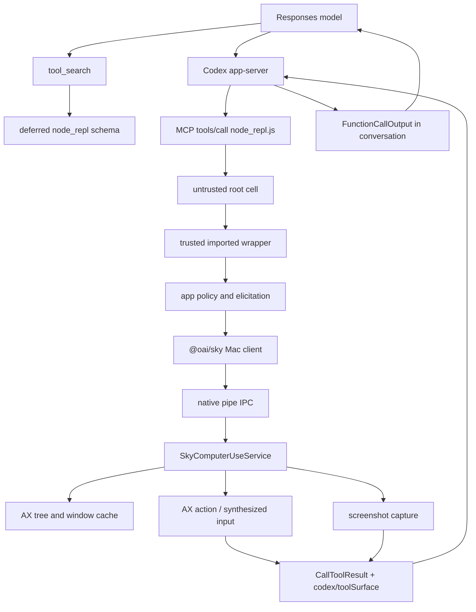

# Codex App Computer Use 全链路逆向 V4

## 0. 本版结论

V4 把前三版尚未动态确认的核心路径跑通，并把模型工具调用、trusted
`node_repl`、`@oai/sky`、native pipe、Swift service、AX tree、截图、真实输入和
oracle闭环放到同一条证据链中。

当前本机固定版本：

| Artifact | Version / SHA-256 |
|---|---|
| ChatGPT/Codex App | `26.707.51957 (5175)` |
| Codex CLI / app-server | `0.144.0-alpha.4` |
| Computer Use bundle | `26.710.1000387` |
| `SkyComputerUseService` | `27b547d17a11f6f697ee62bfc20e5da6fab3f39848d40191c132b09ae8f68f58` |
| Computer Use wrapper | `6d25aa7656feac858f3a3bdaea5bcbab0dbfd426c9de8e6931ce90c399ee8e4f` |
| Final synthetic App | `b28e40159780b14b1905c686ff205878bc54749e9a92243370616a7eac3db76d` |

最终 production fixture：

```text
/Users/haoqing/Documents/Learning/codex-computer-use-lab/
fixtures/real-cua/runner-final-semantic-matrix-v2.json
```

结果：

```text
15 scenarios
15 pass
108 production-call postflight checks
persistent approval store before = absent
persistent approval store after  = absent
```

已动态确认的 action：

```text
get_app_state full
get_app_state diff
click by element index
click by screenshot coordinate
set_value
type_text
select_text
press_key
perform_secondary_action
scroll
drag
modal open/close
stale-index unique refetch
same-name controls selected by distinct accessibility ID
```

仍未自动执行：

```text
window move across displays
screen lock/unlock automation
authorization plug-in installation
TCC modification
persistent app approval
userIntervened injection
ambiguous app identity
blocked URL mutation
```

## 1. 证据等级

本报告使用四级证据：

| 级别 | 含义 |
|---|---|
| D1 | production service动态请求 + synthetic oracle + before/after state |
| D2 | 本机固定二进制、bundle JS、Rust源码或系统元数据直接证据 |
| D3 | hermetic fake socket/wrapper fixture或测试合同 |
| U | 当前仍未知，不能从相邻事实补全 |

报告中的“确认”默认指 D1或D2。“推断”会显式标注。

## 2. 完整主链



关键边界：

1. Computer Use skill本身只提供说明，不注册模型工具。
2. `node_repl` schema通过 deferred MCP tool exposure进入模型上下文。
3. 普通 cell在 untrusted realm，只有受信任 dynamic import能使用 native
   bridge和 elicitation。
4. wrapper先做 app policy与审批，再把 canonical app path交给 Sky。
5. Sky把 action转成 private IPC union。
6. native service负责锁屏、窗口、AX、截图和输入。
7. MCP result的 `_meta["codex/toolSurface"]` 让 Electron在结果阶段识别这是
   Computer Use。

## 3. 模型如何看到 `node_repl`

### 3.1 Deferred exposure

Codex core把 deferred MCP tools放进 `deferred_tools`，初始 Responses请求不直接
携带 `node_repl.js` schema。模型先调用 `tool_search`，BM25返回
`LoadableToolSpec`：

```text
namespace: mcp__node_repl
tools:
  js
  js_reset
  js_add_node_module_dir
defer_loading: true
```

因此：

```text
Computer Use skill
  != model function schema

tool_search_output
  == node_repl schema进入后续模型上下文的实际点
```

对应本机源码：

```text
/private/tmp/openai-codex-rust-v0.144.0-alpha.4/
codex-rs/core/src/mcp_tool_exposure.rs
codex-rs/core/src/tools/handlers/tool_search.rs
```

### 3.2 app-server与MCP identity

模型输出：

```text
FunctionCall
  namespace = mcp__node_repl
  name      = js
  call_id   = ...
```

Rust `McpHandler`保留 raw identity：

```text
server = node_repl
tool   = js
```

并通过 `McpConnectionManager::call_tool` 发出 MCP `tools/call`。

请求 `_meta` 至少包含：

```text
progressToken
threadId
x-codex-turn-metadata:
  session_id
  thread_id
  turn_id
  model
  reasoning_effort
  sandbox
  turn_started_at_unix_ms
```

`node_repl` 把整个 `_meta` 深冻结为 `nodeRepl.requestMeta`。Sky只取
`x-codex-turn-metadata` 作为 native `codexMetadata`；顶层 `threadId` 是另一条
并行 identity。

## 4. node_repl信任模型

### 4.1 两个 realm

```text
root cell
  untrusted

canonical trusted path / trusted source hash
  trusted imported module
```

root cell可以：

- 写普通 JS；
-持久化 binding；
- dynamic import；
-调用已安装的普通 package；
-通过 `nodeRepl.write` 返回文本；
-通过 `nodeRepl.emitImage` 返回图片。

root cell不能直接拿到：

- native pipe；
- elicitation；
- launch services；
- suspended timeout。

### 4.2 Path trust比单一 hash更宽

当前产品 runtime同时配置：

```text
NODE_REPL_TRUSTED_CODE_PATHS=~/.codex
```

因此 wrapper进入 trusted realm不只靠 source hash。V3 runner固定 wrapper
SHA-256 是实验室自己的 fail-closed约束，不等价于产品 runtime只信任该 hash。

这意味着：

```text
runner hash pin
  = 实验 provenance / 防漂移

product trusted realm
  = canonical path trust OR source trust
```

## 5. Wrapper policy与TOCTOU

wrapper入口：

```text
/Users/haoqing/.codex/plugins/cache/openai-bundled/computer-use/
1.0.1000387/scripts/computer-use-client.mjs
```

它加载：

```text
@oai/sky/dist/project/cua/sky_js/src/targets/mac/create_client.js
```

### 5.1 Policy-first

每次 operation先发：

```text
ComputerUseIPCAppPolicyRequest
```

返回：

```text
appPath
bundleIdentifier
displayName
risk
```

审批绑定：

```text
bundleIdentifier
```

实际执行绑定：

```text
canonical appPath
```

### 5.2 输入快照

wrapper在第一次 `await` 前按 property descriptor复制输入并冻结。带 getter的
参数被拒绝，防止：

```text
approval看到 A
await期间 getter变化
execution实际变成 B
```

### 5.3 Tool surface late binding

wrapper设置：

```js
nodeRepl.setResponseMeta({
  "codex/toolSurface": {
    kind: "computerUse",
    app: { kind: "appId", appId: bundleIdentifier }
  }
})
```

Electron不是在 function call开始时就知道目标 app，而是在 result `_meta`
回来后识别 Computer Use。

## 6. `@oai/sky`真实 JS映射

本机随包版本：

```text
@oai/sky 0.4.20
```

路径：

```text
/Applications/ChatGPT.app/Contents/Resources/cua_node/lib/node_modules/
@oai/sky/dist/project/cua/sky_js/src/targets/mac/
```

### 6.1 Request type

```text
ComputerUseIPCAppPolicyRequest
ComputerUseIPCAppGetSkyshotRequest
ComputerUseIPCListAppsRequest
ComputerUseIPCAppPerformActionRequest
ComputerUseIPCAppStartRequest
```

### 6.2 Action union

```text
click:
  at.elementID or at.coordinate[x,y]
  clickCount
  mouseButton

drag:
  from[x,y]
  to[x,y]

performSecondaryAction:
  action
  elementID

pressKey:
  _0 = key

scroll:
  at.elementID
  direction
  pages

setValue:
  elementID
  value

selectText:
  elementID
  text
  prefix
  suffix
  selection

type:
  _0 = text
```

### 6.3 JS字段映射

```text
element_index -> elementIndex -> String(elementIndex)
direction     -> up/down/left/right
pages         -> finite number > 0
from_x        -> fromX
key           -> pressKey._0
```

因此 scroll失败不能归因于 JS丢失 `element_index`。最终 wire仍包含：

```json
{
  "scroll": {
    "at": {"elementID": {"_0": "26"}},
    "direction": "down",
    "pages": 1
  }
}
```

## 7. Native service

固定 artifact：

```text
bundle: com.openai.sky.CUAService
version: 26.710.1000387
UUID: 9E40FA2F-FC6C-3EE2-824A-E4975CA022AD
SHA-256: 27b547d17a11f6f697ee62bfc20e5da6fab3f39848d40191c132b09ae8f68f58
```

bundle内没有 `Contents/Frameworks`。ComputerUse、AccessibilitySupport、
SlimCore等 Swift模块直接编入主二进制。本机没有 UUID匹配的 production dSYM。

## 8. `get_app_state`

已恢复的 settle-first路径：

```text
GetSkyshotRequest.handle              0x100136904
  -> updateSkyshotSettlingIfNeeded
  -> [needsUISettleBeforeSkyshot]
       waitForUIToSettle(0.25s)       0x10064a280
  -> updateSkyshot                    0x10006ebe4
```

直接位置：

```text
0x100137050 -> 0x100071748
0x10007185c -> 0x10064a280
0x1000718cc -> 0x10006ebe4
0x100071964 -> 0x10006ebe4
```

settle helper读取并清零状态。因此 action后的 capture不是无条件sleep。

### 8.1 Full tree

最终主窗口 full state约为：

```text
2.5 KiB AX text
JPEG screenshot
768 x 838 pixels
```

截图尺寸和 AppKit window frame不是相同概念。窗口外框、capture rect和像素尺寸
必须分别记录。

### 8.2 Diff protocol

真实 diff示例：

```text
The following is a diff from the previous accessibility tree ...
~ 34 text Description: CUA Lab Diff Revision 1,
  Value: CUA Lab Diff Revision 1 CUA Lab Runtime State,
  ID: cua.lab.diff-status
The focused UI element is 2 button CUA Lab Reset, ID: cua.lab.reset
```

协议：

```text
~ changed
+ added
removed elements summarized by ID range
```

业务状态变化不一定产生 AX diff。早期 button计数只写入 AX排除的 oracle view，
diff正确返回 no change。只有修改 AX可见 label后，diff才出现 `~` 行。

## 9. PerformAction分发

request continuation分支：

| Action | Controller entry |
|---|---:|
| element click | `0x1000747bc` |
| set value | `0x100078104` |
| select text | `0x10007b42c` |
| coordinate click | `0x10007f44c` |
| secondary action | `0x10007619c` |
| scroll | `0x1000807e8` |

element click：

```text
click(elementID)               0x1000747bc
  -> prepareToInteract         0x100072880
       -> refetchElementIfNeeded(id, validate=true)
                                  0x1001b1eb0
       -> positionElement      0x100072fec
  -> indirect click helper
  -> waitForUIToSettle
  -> updateSkyshot
```

`sendClick`命名入口：

```text
0x10063fca8
```

click到 `sendClick` 之间仍是匿名 async helper，不能写成 direct branch。

## 10. Stale/refetch动态证明

实验时序：

```text
state A:
  target index = 21

capture index 21
click hierarchy mutation
do not call get_app_state
insert decoy before replacement target

old index 21 action
fresh state B:
  replacement target index = 22
```

结果：

```text
old-index action returned success
replacement target count = 1
decoy count = 0
fresh target index = 22
```

这动态证明 action不是裸数字重放，而是：

```text
element ID
  -> stale detection
  -> unique refetch
  -> replacement element
```

原生 error family：

```text
invalidElementID
elementAmbiguousBeforeRefetch
elementAmbiguousAfterRefetch
elementNoLongerValidAfterRefetch
```

这些 error没有各自独立 IPC code。最终可能落入 `-10008` 或通用 `-10005`，
静态证据尚不能逐项唯一映射。

## 11. Scroll的双阶段实现

### 11.1 Element阶段

PerformAction scroll branch：

```text
0x100130b80 -> prepareToInteract
0x10013172c -> UIElementProtocol.frame
0x1001317dc -> UIElementProtocol.clickablePoint
0x1001318bc -> pages/direction to delta
0x10013190c -> AppController.scroll
```

若有 clickable point：

```text
0x100131a78 -> moveMouse
0x100131b9c -> AppController.scroll
```

滚动量：

```text
amount = round(
  pages * max(vertical ? elementHeight : elementWidth, 100)
)

down -> deltaY = +amount
up   -> deltaY = -amount
```

最终 synthetic scroll area高度小于100，所以：

```text
pages = 1
offset = 0 -> 100
```

### 11.2 Window阶段

`AppController.scroll`：

```text
0x100080940 -> orderedWindows()
0x10008096c -> target(forMouseEventAt:with:)
0x100080a40 -> SynthesizedEvent.scroll
0x100080b00 -> SynthesizedEvent.send
```

`target(forMouseEventAt:with:)`：

```asm
ldr x9, [x0, #0x10]   ; windows.count
cbz x9, noWindowsAvailable
```

空数组时抛：

```text
noWindowsAvailable
```

它没有独立 IPC code，外层表现为：

```text
Computer Use server error -10005: noWindowsAvailable
```

### 11.3 `get_app_state`不保证刷新 `_windows`

`orderedWindows()`只读取 controller `_windows` cache。`get_app_state`可以成功
获取 focused context、AX tree和 screenshot，但没有命名 direct branch证明它会
刷新 `_windows`。

因此：

```text
AX tree available
AXMainWindow available
AXFocusedWindow available
CGWindow available

仍可能:
controller._windows = empty
scroll -> noWindowsAvailable
```

这是 service结构上的脆弱点。

### 11.4 Synthetic App A/B

实验暴露了三层 AppKit错误：

1. 给 content view强制 `setAccessibilityElement(true)`：
   - application `AXWindows=[]`；
   - tree capture和普通 click仍可能成功；
   - scroll在 orderedWindows失败。
2. 恢复标准 window hierarchy：
   - service scroll返回成功；
   -非 flipped document的视觉 down方向无位移。
3. 使用 flipped document：
   - `direction=down, pages=1`；
   - offset `0 -> 100`。

此外，文本/键盘交互后 synthetic reset必须重新：

```text
makeFirstResponder(nil)
makeKeyAndOrderFront(nil)
NSApp.activate(...)
```

否则标准 `AXWindows`可能再次为空。

## 12. AppKit fixture错误清单

### 12.1 Generic NSControl

错误：

```swift
control.setAccessibilityElement(true)
```

结果：

```text
button   -> unknown
checkbox -> unknown
native press semantics lost
```

checkbox action可以“返回成功但无效果”。

### 12.2 Override `setAccessibilityValue`

错误：

```swift
override func setAccessibilityValue(...)
```

即使内部调用 `super`，production value path仍可返回：

```text
AXError.cannotComplete
```

移除 override后：

```text
native text field role preserved
set_value succeeds
textDidChange observes final value
```

### 12.3 Generic window/content container

错误：

```text
NSWindow custom AX wrapper
contentView.setAccessibilityElement(true)
```

可切断标准 AppKit hierarchy和 `AXWindows`。

最终原则：

```text
leaf controls:
  identifier + label
  preserve native role/action

window and containers:
  preserve AppKit hierarchy

synthetic identity:
  visible fixed heading
```

## 13. Input行为矩阵

最终 D1结果：

| Scenario | Input | Observable effect |
|---|---|---|
| button | element `5` | count `0 -> 1` |
| set value | element `7` | exact string |
| type text | focused field | exact string |
| press key | `Tab` | focus set-value -> type-text |
| select text | element `11` | selected `target` |
| checkbox | element `13` | false -> true |
| secondary | element `15`, `Increment` | 25 -> 26 |
| scroll | element `26`, down 1 page | 0 -> 100 |
| modal | element `22`, modal element `1` | false -> true -> false |
| stale | old element `21` | replacement hit, decoy untouched |
| same-name | distinct ID, element `24` | second selected |
| coordinate | `(664,352)` | click count `0 -> 1` |
| drag | `(64,504) -> (342,504)` | x `42 -> 326` |

Coordinate和drag点均来自当前 synthetic layout oracle，并在同一次 fresh screenshot
后验证：

```text
0 <= x < screenshot.width
0 <= y < screenshot.height
```

不是历史坐标重放。

## 14. Screenshot

production service返回：

```text
file:// local URL
JPEG / JFIF
```

不是 skill旧示例里固定假设的 PNG。

已观察生命周期：

```text
successive capture:
  old file remains

target App stops:
  session screenshots cleaned after delay
```

lab默认只记录：

- normalized URL；
- magic-byte format；
- width/height；
- byte count；
- SHA-256。

除非显式 `copyScreenshots`，不持久化像素。

## 15. Approval与安全闭环

每次 execute前要求：

```text
ComputerUseAppApprovals.json absent
```

每个：

```text
list_apps
get_app_state
action
```

之后重新检查 metadata。

最终矩阵：

```text
108 checks
before absent
after absent
```

runner：

-不读 approval内容；
-不删除 approval文件；
-文件出现时立即 fail closed；
-只允许固定 synthetic bundle；
-拒绝 path/app override；
-拒绝 symlink target；
-固定 wrapper path/hash；
-只允许 fixture目录输出；
-不复制 screenshot，除非显式 flag。

## 16. Service进程、升级与IPC生命周期

当前进程树：

```text
launchd / runningboard
└─ ChatGPT Electron main
   ├─ codex app-server
   │  └─ node_repl processes
   └─ SkyComputerUseService
      └─ CUALockScreenGuardian
```

本轮快照：

```text
ChatGPT                  PID 94159
codex app-server         PID 94341
SkyComputerUseService    PID 94559
CUALockScreenGuardian    PID 81912
```

service和guardian在launchd中是 unmanaged process，不是独立OpenAI
LaunchAgent/LaunchDaemon。Electron manager：

1. 保存 canonical executable path；
2. 仅在 `appshotsEnabled || nodeReplEnabled` 时确保service；
3. 复用 cached PID前检查进程存活且 executable path完全匹配；
4. 否则通过 `sky.node` spawn；
5. 校验返回PID。

`sky.node`使用：

```text
posix_spawn
responsibility_spawnattrs_setdisclaim
```

responsibility disclaim不等于交给launchd托管，实际service仍是Electron main的
直接子进程。

### 16.1 三份bundle与refresh顺序

本机存在：

```text
source:
  ChatGPT.app/Contents/Resources/plugins/.../computer-use

plugin cache:
  ~/.codex/plugins/cache/openai-bundled/computer-use/1.0.1000387

canonical:
  ~/.codex/computer-use/Codex Computer Use.app
```

三份主二进制SHA一致。

观察到的启动顺序：

```text
ChatGPT start
  -> canonical refresh
  -> app-server start
  -> Sky service spawn
  -> computeruse.sock listen
  -> plugin cache materialization complete
```

`ditto`保留source mtime，因此判断refresh不能只看mtime，应组合：

- ctime；
- executable hash；
- process start time；
- socket creation time；
- cache root creation time。

service没有独立updater。ChatGPT更新带入新source bundle，下次App启动刷新canonical
copy。

### 16.2 普通IPC

```text
trusted wrapper
  -> @oai/sky nativePipe
  -> group container IPC/computeruse.sock
  -> SkyComputerUseService
```

权限：

```text
group container   0700
IPC directory     0700
socket lock       0600
computeruse.sock  0600
```

### 16.3 Guardian与Authorization broker

Guardian不是普通socket client。service创建Mach bootstrap rendezvous，Guardian
回传anonymous XPC endpoint，随后使用thread-bound unlock guard/lease。

已确认fail-closed触发：

- physical input；
- XPC connection loss；
-插件不可用；
- unlock attempt失败。

login Authorization broker路径：

```text
/tmp/com.openai.sky.CUAService/LockScreenLoginAuthorization.sock
```

pathname可被unlink而listener FD仍存活，因此：

```text
FD alive != pathname connectable
```

当pathname存在时mode为 `0666`，安全依赖peer：

- audit token；
- signing identifier；
- Team ID。

当前Locked Use：

```text
embedded plug-in signed = true
installed plug-in       = false
authorizationdb entry   = false
managed requirement     = unset
ready                   = false
```

### 16.4 PiP

Electron发布dynamic endpoint：

```text
com.openai.codex.remote-hosted-pip-content
```

host在Electron main，producer在Sky service，传输是XPC remote layer
presentation。聚合日志可证明近期publish activity，不能证明最终时刻仍有active
presentation。

### 16.5 TCC与entitlements

| Component | Sandbox | Accessibility | Screen Capture |
|---|---:|---:|---:|
| ChatGPT | yes | allowed | allowed |
| Sky service | no | allowed | allowed |
| Guardian | no entitlement keys observed | no row | no row |

普通TCC能力由Sky service持有，不是Guardian。

### 16.6 Retention

确认：

- canonical App持久存在，以whole-target replacement刷新；
- ordinary socket lock file跨已观察service start存在；
- production screenshot在target App session结束后被清理；
- PiP未发现dedicated persistent store；
- Skysight存在clear-history API和ephemeral segment描述；
- analytics数据库使用DELETE journal、FAST secure-delete、incremental
  auto-vacuum。

未知：

- exact screenshot cleanup owner；
- old plugin cache eviction；
- Skysight durable summary store；
- Event Stream exact root/current recording；
- analytics deleted payload recoverability；
- service idle timeout和no-client termination的当前值。

本轮没有读取raw log、analytics payload、URL、event JSONL、network body或截图像素。

完整聚合证据：

```text
codex-computer-use-lab/docs/16-service-process-lifecycle-and-retention.md
codex-computer-use-lab/fixtures/service-lifecycle/latest.json
```

## 17. UI生命周期

canonical app-server事件：

```text
item/started
optional mcpServer/elicitation/request
serverRequest/resolved
item/completed
```

`McpToolCall`：

```text
id
server
tool
status
arguments
appContext
pluginId
result
error
durationMs
```

当前 elicitation request没有对应 MCP item ID；源码有 TODO，因此 approval card和
tool item不能直接按 item ID关联。

`item/mcpToolCall/progress` schema存在，但当前主链未找到稳定 producer；renderer
也只记录 debug。

## 18. 公开文档与本地私有实现

公开资料能支持的只有产品和平台能力：

- Codex App Computer Use使用 Screen Recording、Accessibility和逐应用审批；
- Locked Use使用 Authorization Plug-in；
-模型支持 computer tool、custom harness和 code-execution/REPL harness；
- Apple AX提供 role/action/value；
- ScreenCaptureKit提供截图；
- CoreGraphics提供显示器和事件能力。

公开资料没有证明：

```text
tool_search -> node_repl
trusted import realm
@oai/sky
private native pipe
exact request union
element index format
AX diff text protocol
stale refetch algorithm
window cache
exact error mapping
```

这些是本机私有实现证据。

外部来源索引：

- `https://developers.openai.com/codex/app/computer-use`
- `https://developers.openai.com/api/docs/guides/tools-computer-use`
- Apple `AXUIElement`
- Apple `CGDisplayBounds`
- Apple `NSScreen.backingScaleFactor`
- Apple `SCScreenshotManager`
- Apple `CGEvent`

本轮官方 Codex manual helper因响应缺少 `x-content-sha256`校验头失败，因此没有把
未校验 manual cache当作证据。

## 19. Reproduction

### 19.1 Hermetic与只读层

```bash
cd codex-computer-use-lab
npm run reproduce
```

包括：

- model surface；
- app-server；
- node_repl；
- fake Sky wire；
- wrapper policy；
- test App build；
- display geometry；
- native symbols/callgraph；
- Electron extraction；
- policy/observability/security；
- dry-run；
- secret scan；
- tests。

### 19.2 Production matrix

先：

```bash
cd codex-computer-use-lab
bash test-app/stop.sh
bash test-app/build.sh
bash test-app/launch.sh
```

然后在 Computer Use-enabled `node_repl`：

```js
var lab = await import(
  "/Users/haoqing/Documents/Learning/codex-computer-use-lab/" +
  "scripts/real-cua-lab-runner.mjs"
);

var result = await lab.runRealCuaLab({
  execute: true,
  scenarioIds: [
    "full-state",
    "diff",
    "button-click",
    "set-value",
    "type-text",
    "press-key",
    "select-text",
    "checkbox",
    "slider-secondary-action",
    "scroll",
    "modal",
    "dynamic-hierarchy-stale-element",
    "ambiguous-same-name",
    "coordinate-click",
    "drag-target"
  ],
  outputPath:
    "/Users/haoqing/Documents/Learning/codex-computer-use-lab/" +
    "fixtures/real-cua/runner-final-semantic-matrix-v2.json"
});

nodeRepl.write(JSON.stringify(result, null, 2));
```

### 19.3 Native static analysis

```bash
cd codex-computer-use-lab
bash scripts/native-symbol-map.sh
bash scripts/native-callgraph.sh
node --test tests/native-callgraph.test.mjs
```

## 20. 剩余可挖点

还有，尚未挖完。

高价值剩余项：

1. `window-move` 与多显示器真实 action；
2. coordinate action与 screenshot revision的原生绑定；
3. `_windows` cache完整填充/失效/通知状态机；
4. AXPress、synthetic click、CGEvent click的精确选择条件；
5. `userIntervened`动态状态；
6. ambiguous app动态状态；
7. blocked URL动态状态；
8. lock guardian心跳与 authorization plug-in协议；
9. Appshot、PiP、Skysight、Event Stream是否共享 capture；
10. screenshot tempfile完整清理时机；
11. progress event为何没有 producer；
12. elicitation与 tool item缺少 item ID关联；
13. result截断时 `_meta["codex/toolSurface"]` 丢失的 UI影响；
14. native stale error到 IPC code的逐项映射；
15.多窗口 scroll是否错误命中 cursor所在窗口。

不应自动挖：

-密码或 loginwindow自动输入；
-安装 Authorization Plug-in；
-修改 TCC/authorizationdb；
-创建 persistent approval；
-对真实用户 App做副作用动作；
-自动制造物理 user intervention；
-删除 production screenshot临时文件。

## 21. 最终判断

Codex App Computer Use不是“模型直接看屏幕并点坐标”。当前本机实现是：

```text
deferred MCP tool schema
  -> persistent node_repl
  -> trusted wrapper realm
  -> app policy + per-app approval
  -> @oai/sky request adapter
  -> private native pipe
  -> Swift service
  -> lock/window/AX/screenshot/input state machines
  -> structured MCP result
  -> model re-observation
```

它的优点：

- policy、approval、native capability分层；
- canonical app target；
- stale element unique refetch；
- action后 settle与 fresh observation；
- AX与截图并用；
-锁屏先 fail closed；
-持久 approval可独立审计。

它的脆弱点：

- trusted path范围比单一 wrapper hash更宽；
- UI只在 result阶段 late-bind Computer Use身份；
- elicitation没有 item ID；
- progress链近似空壳；
- `_windows` cache与 AX tree capture分离；
- `noWindowsAvailable` 被映射成含混 `-10005`；
- AppKit generic AX包装很容易破坏 native role/window语义；
- coordinate API没有对模型显式暴露 screenshot revision token。

V4已经把核心执行链从“静态推断”推进到“同一 production service、同一 synthetic
binary、同一 wrapper下的15场景动态闭环”。剩余工作主要集中在多窗口、多显示器、
锁屏插件、缓存失效和UI观测性，而不是基本 action是否真实存在。
